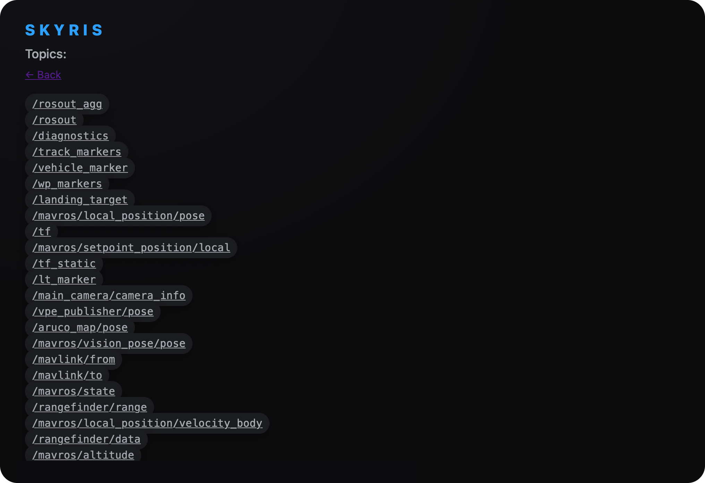

# ROS-система в Веб-интерфейсе

The Robot Operating System (ROS) — это набор программных библиотек и инструментов, помогающих создавать приложения для роботов.

> **Hint** для того чтобы увидеть список  всех ros пакетов доступных в этом приложении перейдите в браузере по пути http://10.42.0.1:8000

Пункт View Topics позволяет увидеть список всех доступных топиков

Пункт View Image Topics (web_video_server) позволяет увидеть [просмотр изображений с камер](obsidian://open?vault=Obsidian%20Vault&file=%D0%A0%D0%B0%D0%B1%D0%BE%D1%82%D0%B0%20%D1%81%20OrangePi%205%20Pro%2F%D0%9F%D1%80%D0%BE%D1%81%D0%BC%D0%BE%D1%82%D1%80%20%D0%B8%D0%B7%D0%BE%D0%B1%D1%80%D0%B0%D0%B6%D0%B5%D0%BD%D0%B8%D0%B9%20%D1%81%20%D0%BA%D0%B0%D0%BC%D0%B5%D1%80), детекцию аруко меток, а также детекцию объектов используя нейронные сети. 

