# Настройка пульта в QGroundControl

1. Подключитесь к полетному контролёру через WIFI/USB с включенным пультом управления
2. Убедитесь что приемник и пульт правильно настроены и подключены к друг другу 
3. Во вкладке "Parameters" найдите параметр `RC_INPUT_PROTO` 
4. Установите значение `RC_INPUT_PROTO` в соответствии с протоколом вашего приемника

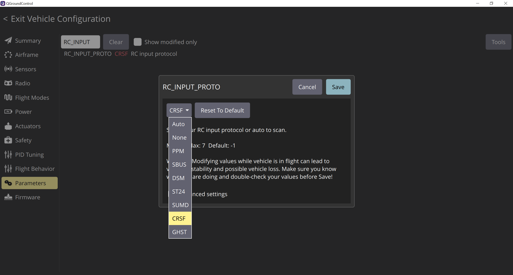 
 После чего у вас должен отобразиться монитор каналов справа на экране во вкладке `Radio`

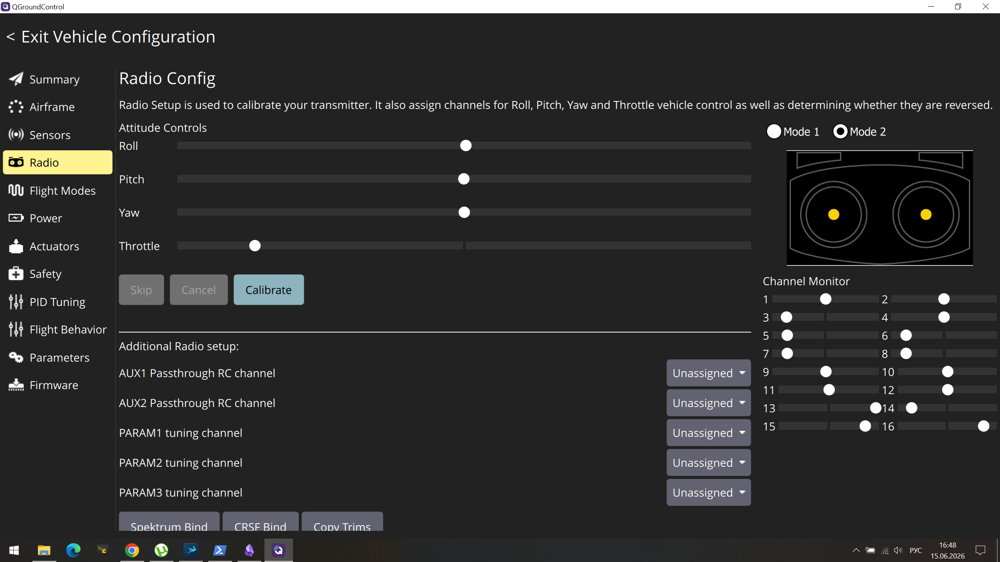 
Пример отображения вкладки с правильно подключенным приемником
## Калибровка пульта

Во вкладке `Radio` нажмите на кнопку "Calibrate" и произведите дальнейшую настройку следуя инструкциям на экране

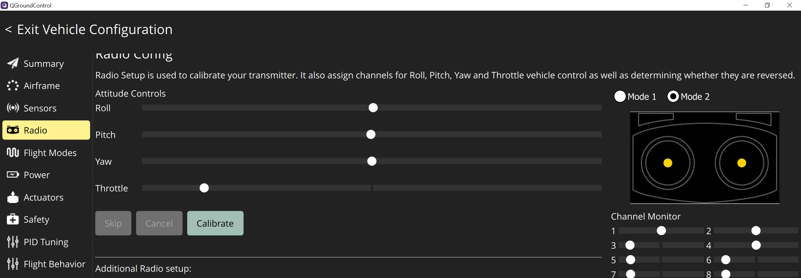 

Переведите ваши тримы и сабтримы в нулевое положение, и нажмие "Ok"

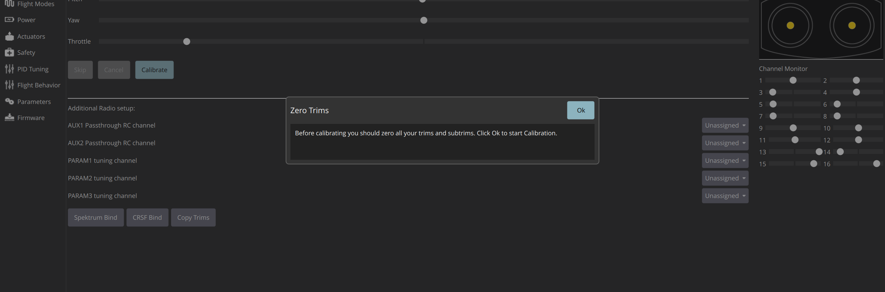 

Переведите в нижнее положение стик газа, так как это показано на изображении справа
убедитесь, что у вас отключено питание моторов или отсутствуют пропеллеры.

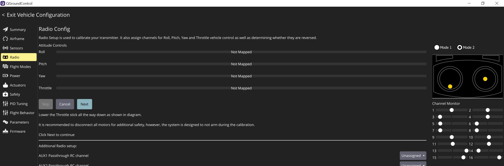 

Продолжите настройку, двигая стики так как это показано на изображении справа, при установке стика в правильное положение нужно подождать, чтобы изображение сменилось на другое 

<dir>
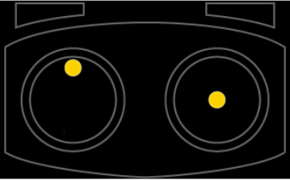 
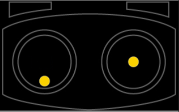 
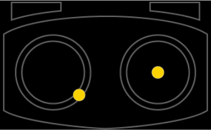 
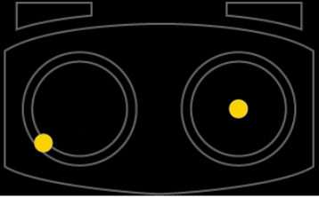 
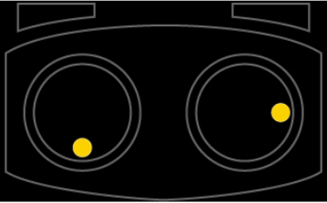 
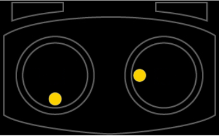 
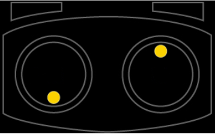 
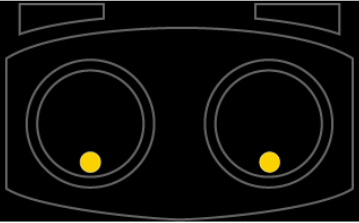 
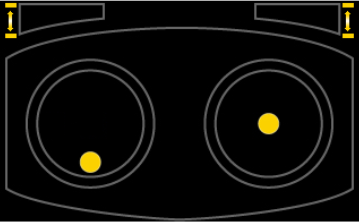 
</dir>
На последнем изображении по переключайте в крайние положения те тумблера что вы назначили

После настройки у вас высветиться вот такое сообщение, нажмите "Next" и на этом калибровка пульта окончена
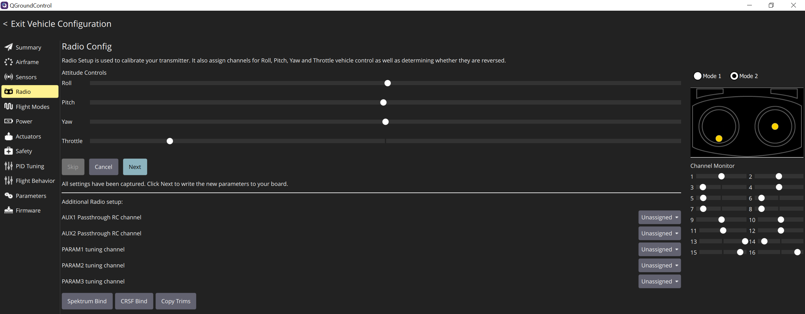 