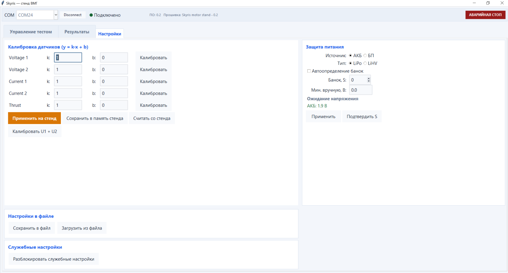

## Страница Настройки

На этой странице можно откалибровать датчики, настроить защиту питания и сохранить конфигурацию стенда.

<div class="img-figure">
  
</div>
### Калибровка датчиков

Калибровка использует линейную зависимость:

```text
y = k × x + b
```

Коэффициент `k` отвечает за масштаб измерения, а `b` — за смещение нулевой точки. Настройки доступны отдельно для напряжения и тока обоих каналов, а также для датчика тяги.

Коэффициенты можно ввести вручную или рассчитать автоматически по эталонным значениям. Кнопка «Калибровать» запускает настройку выбранного датчика. Для одновременной калибровки двух каналов напряжения предусмотрена кнопка «Калибровать U1 + U2». 

### Настройки в файле

- **Сохранить в файл** — записать калибровки и защиту питания в `.ini`.

- **Загрузить из файла** — восстановить настройки из `.ini`.

> **Подсказка** Файл на компьютере не заменяет запись калибровок в память стенда.

### Защита питания

В режиме АКБ программа контролирует напряжение аккумулятора и блокирует запуск при его разряде. В режиме БП контроль разряда отключается, поскольку предполагается использование лабораторного источника питания.

Для аккумулятора необходимо выбрать тип LiPo или LiHV. Количество банок можно определить автоматически либо задать вручную в поле «Банок, S». Автоматически найденное значение рекомендуется проверить и зафиксировать кнопкой «Подтвердить S».

Минимальное допустимое напряжение можно указать вручную. Если в этом поле оставить `0`, программа рассчитает порог автоматически из значения 3,5 В на банку. Кнопка «Применить» активирует выбранные параметры защиты.

### Служебные настройки

Этот раздел предназначен для администратора или специалиста, отвечающего за безопасность стенда. Здесь можно запретить игнорирование открытой двери, установить обязательный минимальный порог напряжения и заблокировать изменение пользовательских настроек.

## Сохранение результатов

Каждое завершённое испытание сохраняется в отдельной папке:

```text
results/<название>_<дата>/
```

В ней сохраняются исходные измерения в Excel, усреднённый отчёт, файл `data.csv` для повторного просмотра и файл `meta.json` с параметрами оборудования, испытания и аккумулятора.

Если испытание было остановлено вручную или из-за аварийной ситуации, уже полученные измерения также сохраняются, если программа успела принять данные со стенда.
