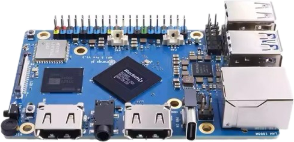

# OrangePi 5 Pro

**Orangepi 5 pro** –  это компактный одноплатный компьютер на мощном процессоре Rockchip RK 3588S, предназначенный для разработки: высокопроизводительных вычислений, приложений AIoT, таких как искусственный интеллект и умный дом. Orangepi 5 pro входит в комплекты программируемого квадрокоптера Technic. Далее OrangePi 5 Pro будет называться OPi

# Характеристики

OPi оснащён 8-ядерным процессором Rockchip RK3588S (4 ядра A76 + 4 ядра A55) с частотой до 2.4 ГГц и графикой ARM Mali-G610, поддерживающей OpenGL, OpenCL и Vulkan.  
Есть встроенный NPU с производительностью до 6 TOPS для задач ИИ и 4/8/16 ГБ LPDDR5 памяти. Поддерживается вывод до 8K, накопители eMMC или SPI Flash, Wi-Fi 5, Bluetooth 5.0 и BLE.

Плата имеет множество интерфейсов: HDMI, GPIO, USB 2.0/3.1, аудиоразъём 3.5 мм, гигабитный LAN с поддержкой PoE+ (через HAT), а также слот M.2 M-key для NVMe или SATA SSD.

Размеры — 89×56×1.6 мм. Устройство подходит для ИИ, edge-вычислений, AR/VR, облачных сервисов, умного дома и других AIoT-приложений.  
Поддерживаются ОС:  Orange Pi OS, Ubuntu, Android 12, Debian и другие.

