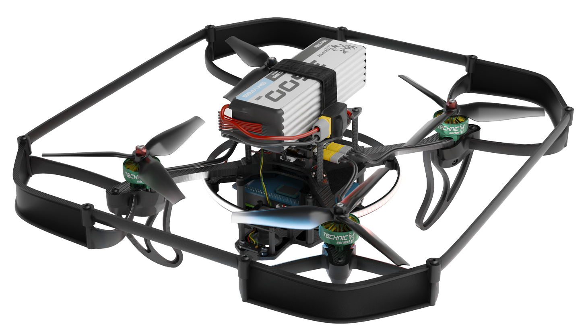
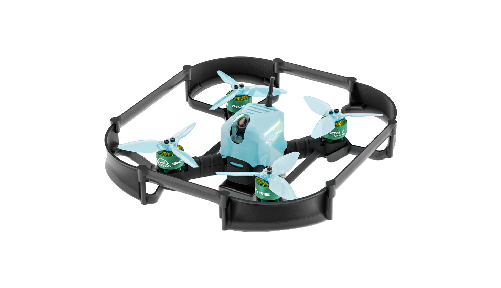

  <main>
    

      <a class="big-card" href="technic6S/">
        

          

            
Техник 6S

          

          

            
          

        

      </a>

      <a class="big-card" href="pilotfpv/">
        

          

            
Пилот FPV

          

          

            
          

        

      </a>

    

  </main>

