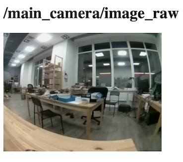

# Просмотр изображений с камер

Для просмотра изображений с камер (или других ROS-топиков) можно воспользоваться [rviz](rviz.md), rqt, или смотреть их через браузер, используя web_video_server.

См. подробнее про [использование rqt](rviz.md).

## Просмотр через браузер

Для просмотра видеострима нужно [подключиться к Wi-Fi](obsidian://open?vault=Obsidian%20Vault&file=%D0%9F%D0%BE%D0%B4%D0%BA%D0%BB%D1%8E%D1%87%D0%B5%D0%BD%D0%B8%D0%B5%20%D0%BA%20Technic%20%D0%BF%D0%BE%20Wi-Fi) Technic \(`technic-xxxx`\), перейти на страницу [http://10.42.0.1:8080/](http://10.42.0.1:8080/) и выбрать топик.



Если передача картинки работает слишком медленно, можно ускорить ее, указав тип передаваемых данных `mjpeg` и меняя GET-параметр `quality` (от 1 до 100), который отвечает за сжатие видеострима, например:

http://10.42.0.1:8080/stream_viewer?topic=/main_camera/image_raw&type=mjpeg&quality=1

По URL выше будет доступен стрим с основной камеры в минимальном возможном качестве.

Также доступны параметры `width`, `height` и другие. Подробнее о `web_video_server`: http://wiki.ros.org/web_video_server.

## Просмотр через rqt_image_view

Для просмотра изображений через инструменты rqt необходим компьютер с установленной Ubuntu 20.04 и [ROS Noetic](http://wiki.ros.org/noetic/Installation/Ubuntu).

[Подключитесь к Wi-Fi сети Technic](obsidian://open?vault=Obsidian%20Vault&file=%D0%9F%D0%BE%D0%B4%D0%BA%D0%BB%D1%8E%D1%87%D0%B5%D0%BD%D0%B8%D0%B5%20%D0%BA%20Technic%20%D0%BF%D0%BE%20Wi-Fi) и запустите `rqt_image_view` с указанием его IP-адреса:

```bash
ROS_MASTER_URI=http://10.42.0.1:11311 rqt_image_view
```

Выберите топик для просмотра, например, `/main_camera/image_raw`


Для снижения нагрузки на сеть и уменьшения задержки используйте сжатый вариант топика – `/main_camera/image_raw/compressed`.

Для изменения настроек сжатия используйте rqt-плагин Dynamic Reconfigure. 


См. [подробнее об rviz и rqt](rviz.md).
