# 

> Все инструкции по настройке носят рекомендательный характер. Вы можете использовать свои настройки или [скачать](https://disk.yandex.ru/d/__4K2z0MjHYXkg) готовый конфигурационный файл. 

## ШАГ 1. Настройка регулятора 4в1

### 1.1 Устновка BLHeliSuite32

Скачайте и установите приложение BLHeliSuite32 с Gitghub.  
Ссылка для скачивания BLHeliSuite32: https://github.com/bitdump/BLHeli/releases

### 1.2 Подключение регулятора 4в1 на ПК

Запустите BLHeliSuite32

Подключите АКБ к Регулятору 4в1  
Подключите полетный контроллер к ПК используя кабель USB

Нажмите кнопку “Connect”

Нажмите кнопку “Check”

Программа BLHeli_32 определит модель Регулятора, версию прошивки и каждый из 4-х каналов

Измените значение PWM Frequency High с 24kHz на 48kHz  
Измените значение PWM Frequency Low с 24kHz на 48kHz

После успешной заливки параметров вы увидите окно “Multiple ESC Write seccessfull”

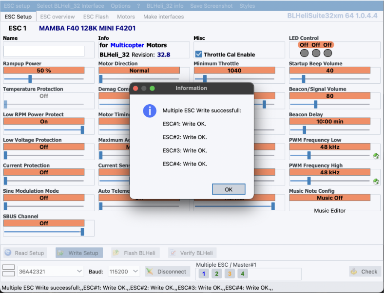

Перейдите в раздел “ESC overview” и убедитесь, что параметры “ESC Frequency” записались во все 4 регулятора

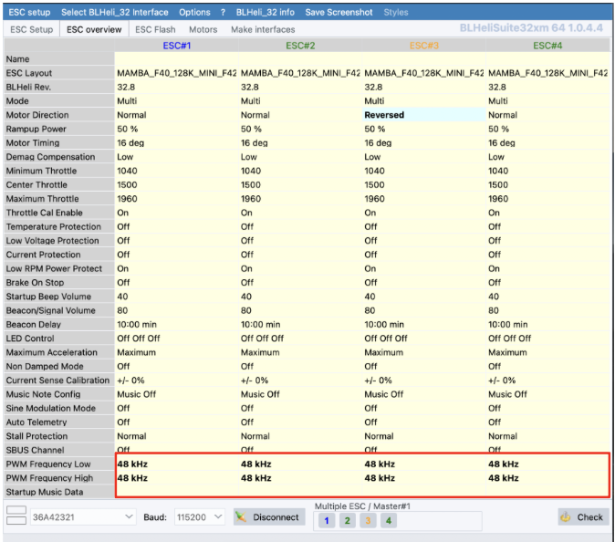

## ШАГ 2. Прошивка полетного контроллера

### 2.1 Установка ПО

Скачайте или откройте веб версию. Веб-версия доступна только в браузерах на базе Сhromium (Chrome, Chromium, Edge) и Яндекс Браузере.  

1. Ссылка для скачивания Betaflight configurator: https://github.com/betaflight/betaflight-configurator/releases
2. Веб версия Betaflight configurator: https://app.betaflight.com/

### 2.2 Подключение полетного контроллера к ПК

Запустите Betaflight Configurator

Подключите полетный контроллер к ПК используя кабель USB

### 2.3 Обновление прошивки FC

- Нажмите кнопку “Обновить прошивку”
- Нажмите кнопку “Автоопределение” (должен определиться FC “MAMBAF722_2022B”)
- Если FC не определился или определился некорректно - выберите “MAMBAF722_2022B” вручную

- В разделе “Прочие настройки” уберите пункт “OSD (Digital)”

- Нажмите “Загрузить прошивку [Online]”
- Затем нажмите “Прошить прошивку” -> “Игнорировать риск”

### 2.4 Калибровка акселерометра

- Разместите квадрокоптер на ровной горизонтальной поверхности/столе.
- Убедитесь, что нижняя площадка плотно прилегает к плоскости стола (ремешок может мешать на время калибровки рекомендуется оставить его в расстегнутом состоянии)
- Перейдите в раздел "Система" и нажмите кнопку “Калибровать Акселерометр”

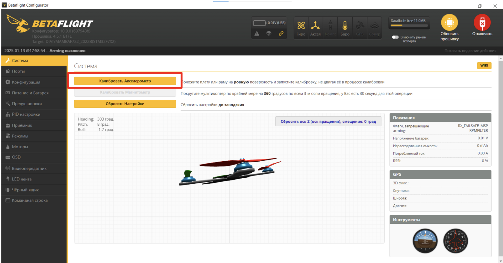

- Убедитесь, что UART порты назначены, как показано на скриншоте, установите в UART3 параметр VTX (IRC Tramp)
- Нажмите кнопку “Сохранить и перезагрузить”

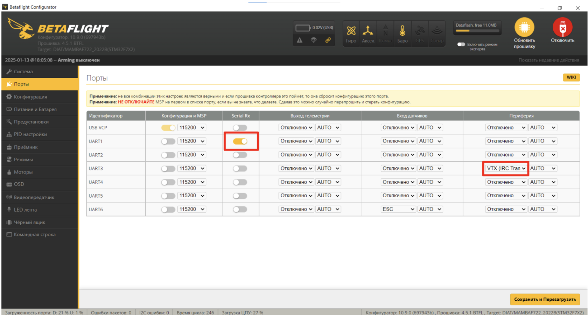

### 2.5 Настройка каналов

Перейдите на вкладку “Режимы”  
.Установите ARM на AUX1:  

- Нажмите “Добавить диапазон”
- Выберите AUX1

Остальные режимы вы можете настроить под свои задачи (например, переключение режимов)- для этого нажмите кнопку “Добавить диапазон” и выберите необходимый стик на пульте

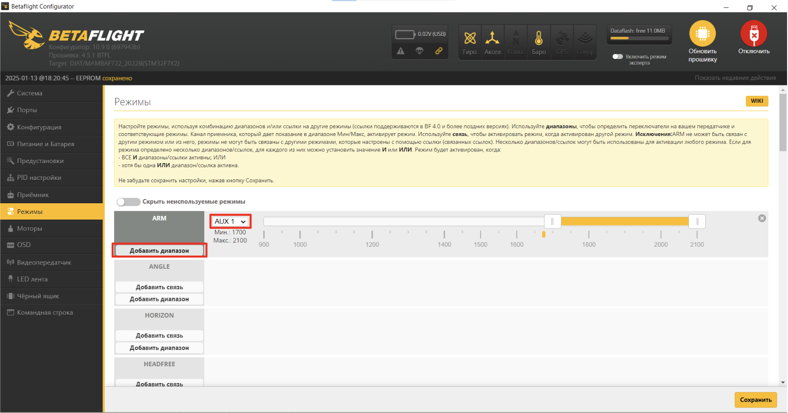

### 2.6 Настройка моторов

- Перейдите на вкладку “Моторы”
- В строке “Протокол ESC” выберите “DSHOT300”
- Включите “Двухсторонний DShot”
- Измените “Количество полюсов магнитов” до 12
- Для проверки корректности направления вращения моторов нажмите “Переназначить моторы”

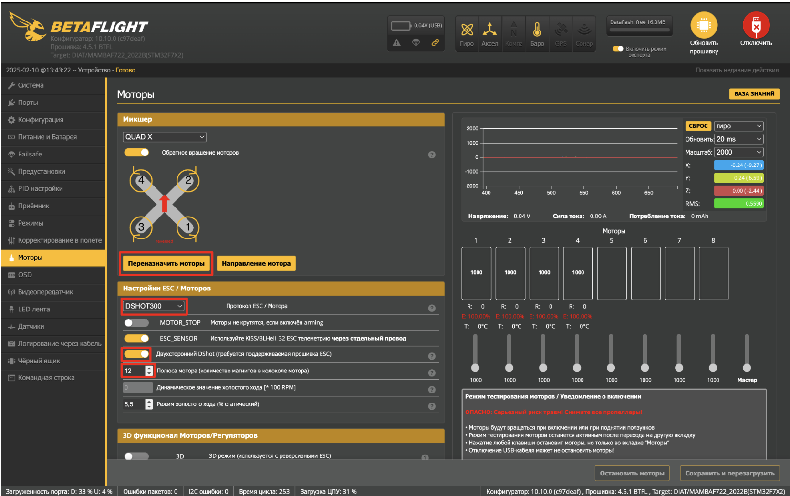

- Убедитесь, что пропеллеры сняты, поставьте галочку в пункте “Я понимаю риски”
- Подключите АКБ к гнезду XT-30 (после должна будет проиграть звуковая индикация моторов)
- Нажмите “Старт”

- Поочередно проверьте, что моторы вращаются в соответствии со схемой - следуйте инструкциям программы
- Проверьте еще раз порядок вращение двигателей и нажмите кнопку “Сохранить”

- Нажмите “Направление мотора”

- В открывшемся окне выберете пункт “Индивидуально ”

- Поочередно проверьте корректность направления вращения каждого мотора нажав на кнопки с номерами моторов - они должны вращаться в соответствии с иллюстрацией
- Если вращение мотора не совпадает, нажмите “Обратный”
- По завершении проверки нажмите “Закрыть”

### 2.7 Настройка PID

- Перейдите на вкладку “PID настройки”
- В разделе “Настройка профилей PID” измените значения:

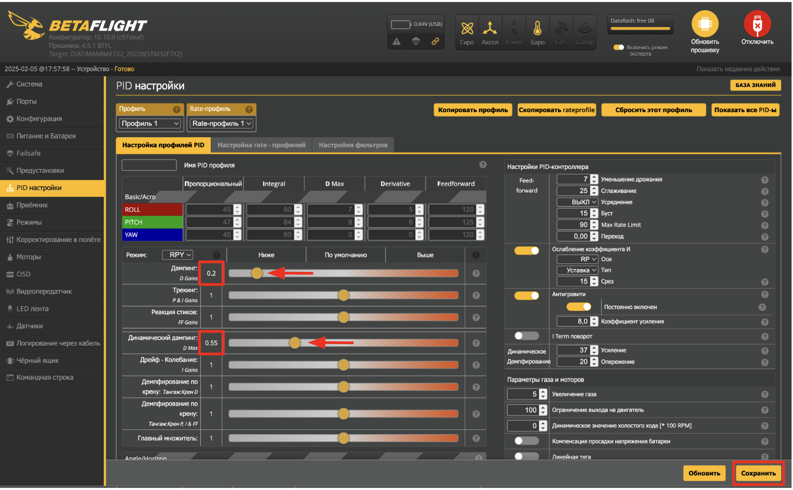

- Перейдите в раздел “Настройки фильтров”
- Отключите фильтр низких частот гироскопа “Lowpass”
- Измените значения “Минимальной частоты Gyro RPM фильтра” до 150Hz

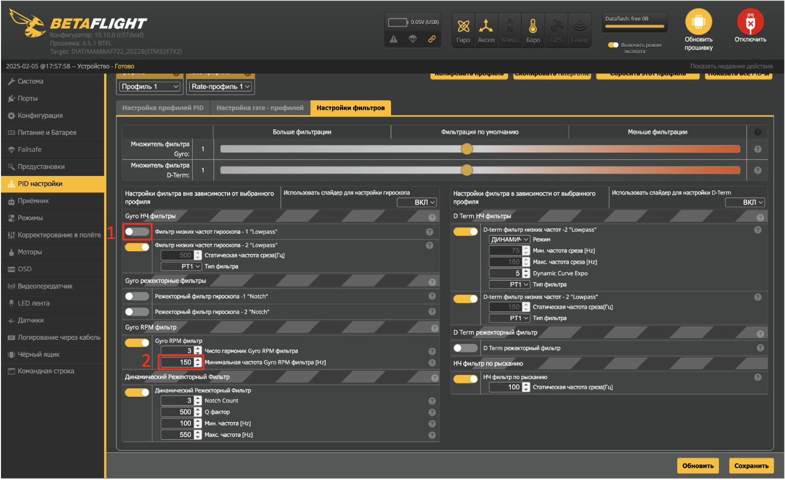

### 2.8 Настройка OSD

Перейдите на вкладку “OSD”  

- В левой части интерфейса в столбце “Профиль 1” проставьте галочки в пунктах: “Значения dBm RSSI”, “Значения RSSI”, “Израсходованная емкость батареи (mAh), “Качество подключения”, “Напряжение батареи”, “ Предупреждения”, “Таймер 1”, “Таймере 2”.
- Описание: Таймер 1 и Таймер 2 (первый показывает сколько времени дрон включен, второй - сколько он в arm)

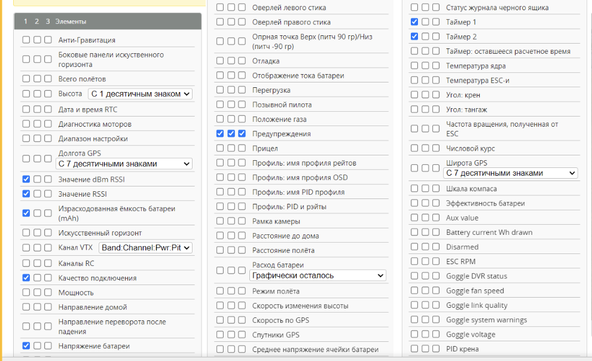

### 2.9 Настройка рабочих частот

Скачайте [файл](https://disk.yandex.ru/d/719IuVjkx8GJ4w)  
Перейдите на вкладку “Видеопередатчик”

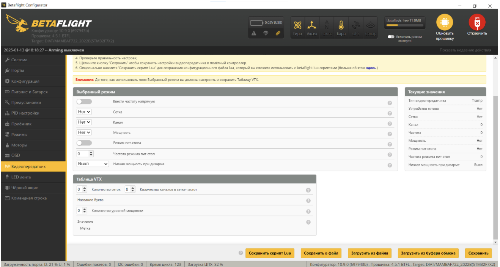

Нажмите “Загрузить из файла” в нижней части интерфейса  
Выберите скачанный ранее файл  
Нажмите “Сохранить”

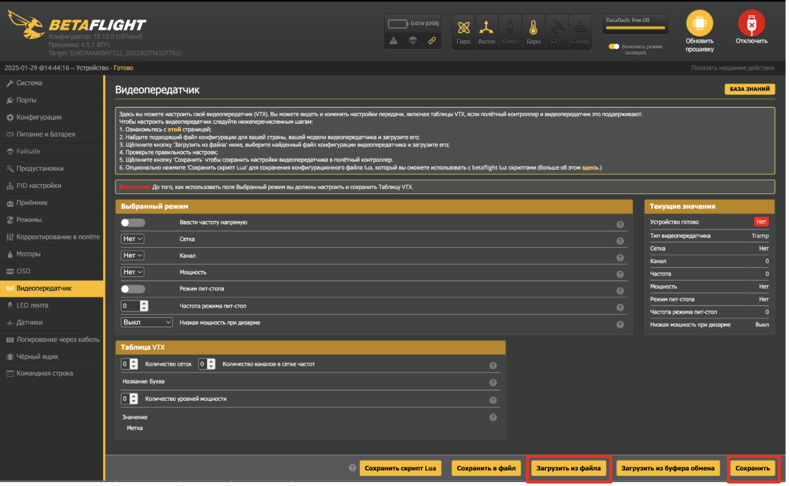

### 2.10 Настройка LED-модулей

Перейдите на вкладку “LED лента”  

- Нажмите “Режим назначения цепи”

- Выделите на панели со светодиодами 8 ячеек, как показано на скриншоте (обратите внимание, что нумерация начинается с нуля)
- Нажмите кнопку “Сохранить”

- Еще раз выделите выбранные ранее ячейки
- В разделе LED функции установите функцию “Арм состояние”
- В разделе Изменение цвета активируйте пункт “AUX 1”
- В группе настроек “Специальные цвета” нажмите “Disarmed” и выберите цвет, который будет отображать индикацию при дизарме, аналогично задайте цвет, который будет отображать режим арм (через кнопку “Включен”)
- Нажмите кнопку “Сохранить”

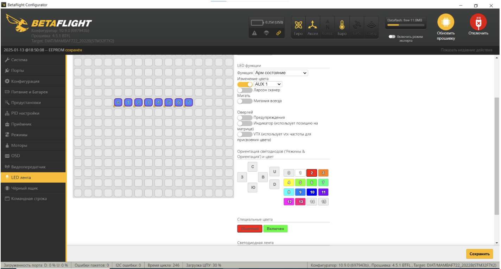

## ШАГ 3. Бинд приемника к пульту РУ (WiFi)

### 3.1 Первичная настройка приемника

Скачайте [файл](https://disk.yandex.ru/d/GS5RjnZALdUZVA) с прошивкой для приемника  

- Подключите полетный контроллер к ПК по USB
- Дождитесь когда приемник перейдет в режим “WiFi” (Примерно через 1 мин после подачи питания, приемник начнет быстро мигать зеленым светодиодом)
- Подключитесь к приемнику как к точке доступа WiFi:
- Сеть: ExpressLRS RX
- пароль: expresslrs
- В окне браузера введите адрес 10.0.0.1

Перейдите на вкладку “Update”  

- Выберите скачанный ранее файл с прошивкой
- Нажмите кнопку “Update” - приемник обновит прошивку и перезагрузится
- Повторно подключитесь к приемнику по WIFI и запустите окно настроек в браузере (пункты 4 и 5)

Перейдите на вкладку “Options”  

- В строке “Binding phrase” введите фразу (любое сообщение: не менее 6 символов, латинские буквы, заглавные буквы, спец. знаки, цифры)
- Нажмите кнопку “SAVE”

### 3.2 Настройка пульта РУ

1. Скачайте [файл](https://disk.yandex.ru/d/i6g7FJmZX07nkQ) с прошивкой для пульта
2. Включите пульт РУ зажав кнопку “Power”
3. Перейдите в меню нажав кнопку “SYS”
4. Далее в меню ExpressLRS ⭢ WiFi Connectivity ⭢Enable WiFi (для навигации по меню используйте кнопку “Menu”)
5. Далее нажмите “Enter”

После появления индикации “WiFi Running” пульт запустит точку доступа с названием “ExpressLRS TX”  
Повторите пункты 4-12 из главы с настройкой приемника. При выборе прошивки загрузите файл “Название файла”, а в поле “Binding phrase” введите ту же фразу, которую вводили при настройке приемника

### 3.3 Настройка приемника в BetaFlight

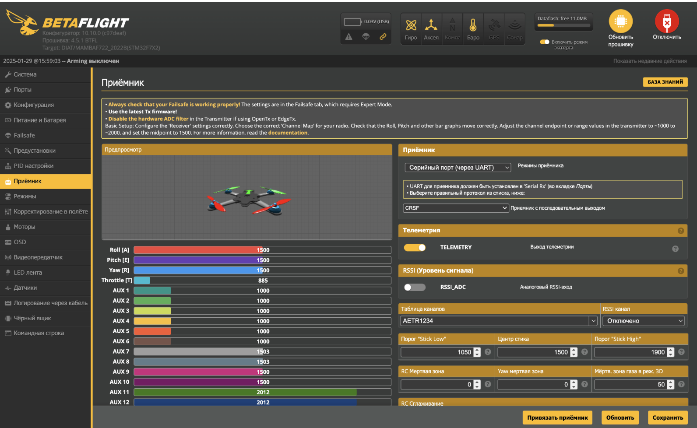

- Включите пульт РУ зажав кнопку “Power” (важно сначала включить пульт, а потом приемник т.к. при отсутствии сигнала пульта в течение 1 минуты приемник переходит в режим настройки)
- Подайте питание на приемник (подключить полетный контроллер к ПК по USB)
- Запустите Betaflight Configurator
- Перейдите в вкладку “Приемник”
- Проверьте, что FC распознает сигналы с пульта РУ

Поочередно отклоните левый и правый стик в крайние положения  

- при отклонение левого стика вниз-вверх (YAW) - ползунок Throttle (T) начнет двигаться влево-вправо при отклонение стика вниз-вверх соответсвенно 
- при отклонение левого стика влево-вправо (YAW) - анимация дрона в окне настройки должна начать вращаться в горизонтальной плоскости против часовой и по часовой стрелке соответственно
- при отклонении правого стика влево-вправо (ROLL) анимация дрона в окне настройки должна начать вращаться влево или вправо соответственно
- при отклонении правого стика ввех-вних (PITCH) анимация дрона в окне настройки