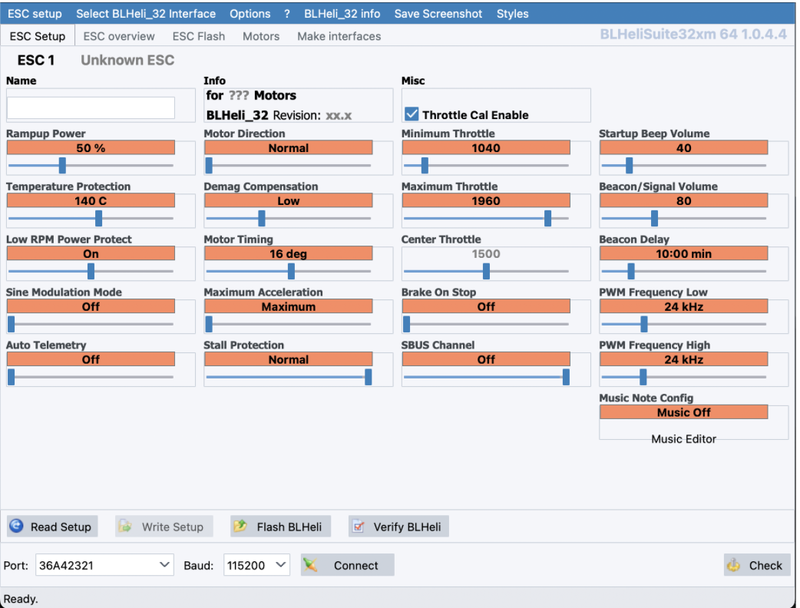
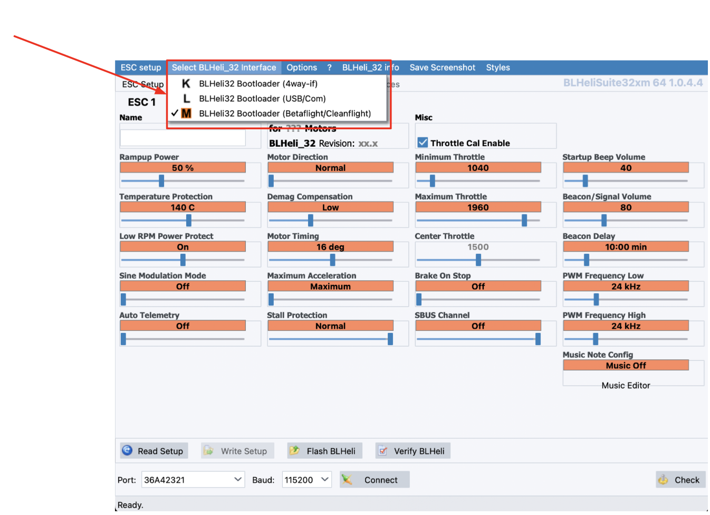
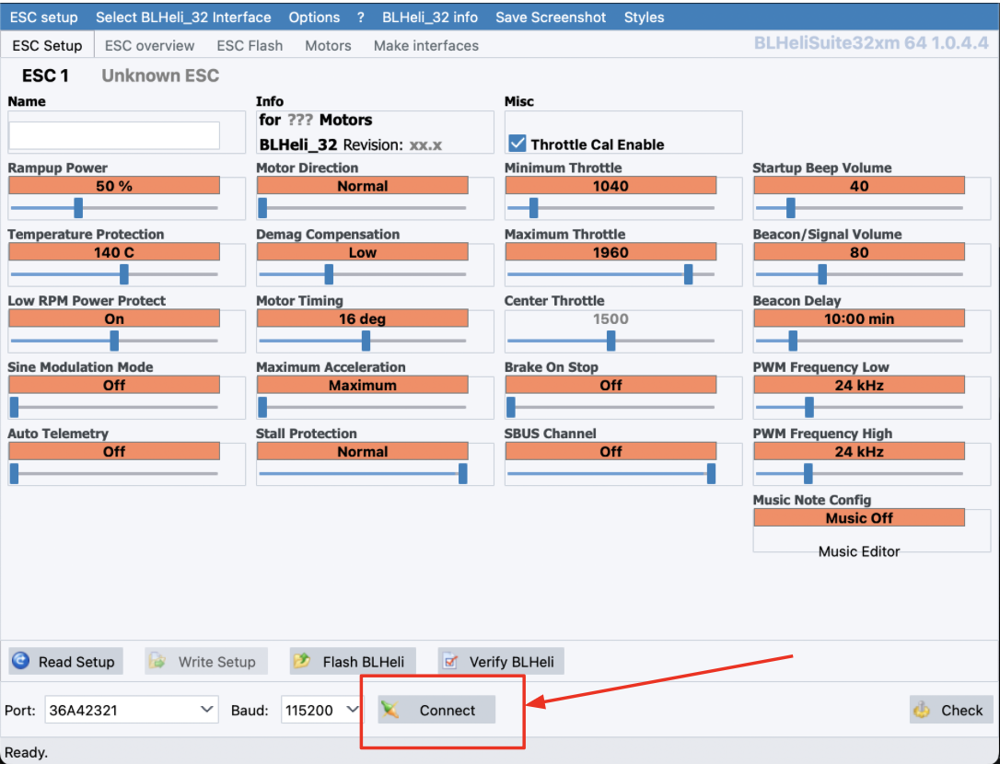
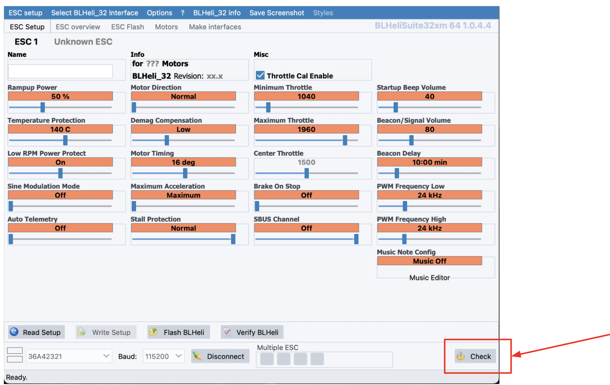
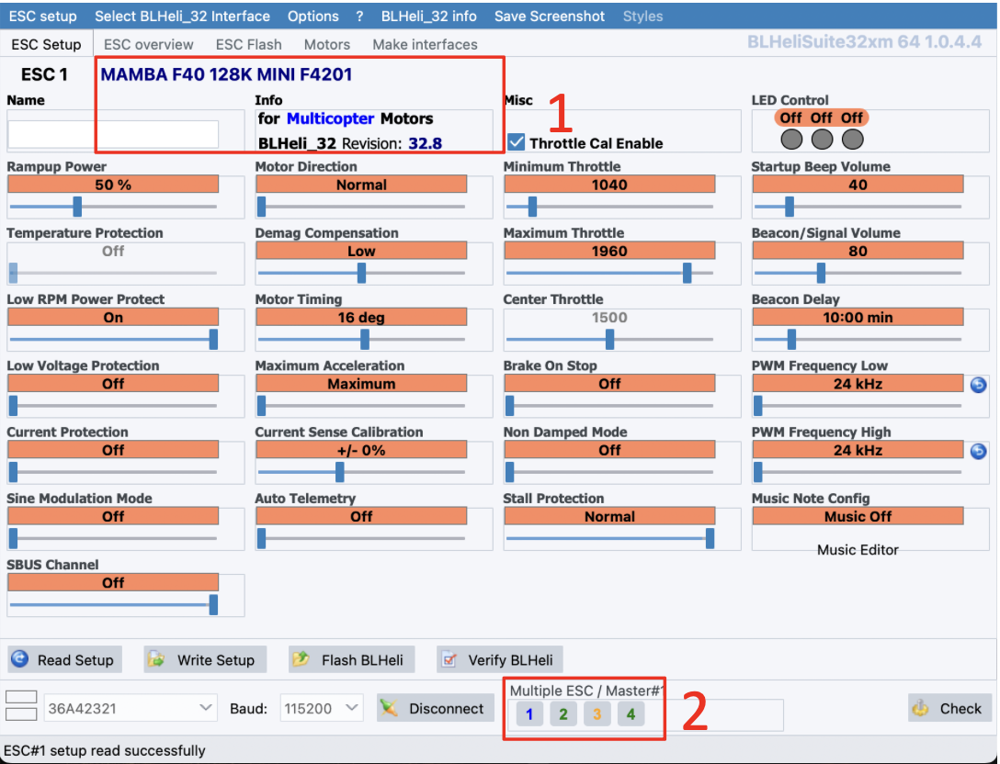
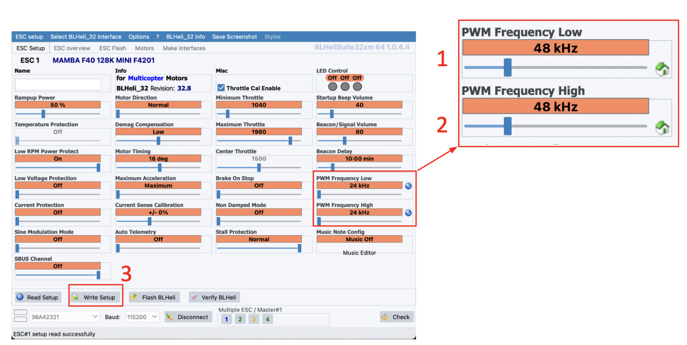
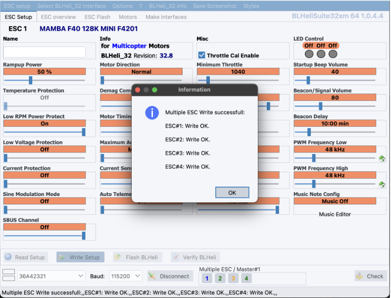
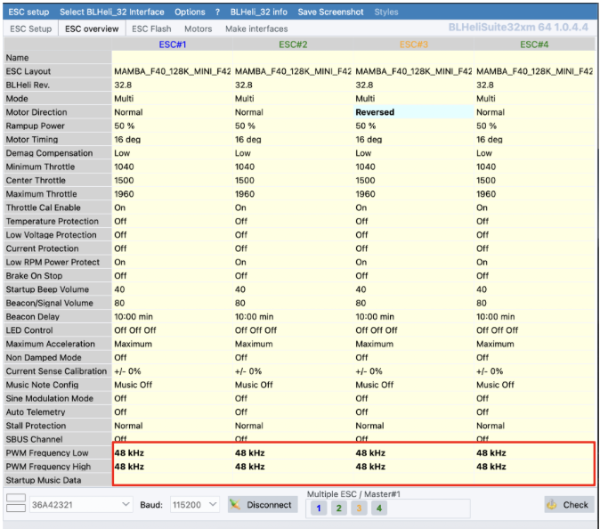

## ШАГ 1. Настройка регулятора 4в1

> Все инструкции по настройке носят рекомендательный характер. Вы можете использовать свои настройки или [скачать](https://disk.yandex.ru/d/__4K2z0MjHYXkg) готовый конфигурационный файл. 
### 1.1 Установка BLHeliSuite32

Скачайте и установите приложение BLHeliSuite32 с Gitghub.  
Ссылка для скачивания BLHeliSuite32: https://github.com/bitdump/BLHeli/releases

### 1.2 Подключение регулятора 4в1 на ПК

Запустите BLHeliSuite32

  

Подключите АКБ к Регулятору 4в1  
Подключите полетный контроллер к ПК используя кабель USB

  

Нажмите кнопку “Connect”

  

Нажмите кнопку “Check”

  

Программа BLHeli_32 определит модель Регулятора, версию прошивки и каждый из 4-х каналов

  

Измените значение PWM Frequency High с 24kHz на 48kHz  
Измените значение PWM Frequency Low с 24kHz на 48kHz

  

После успешной заливки параметров вы увидите окно “Multiple ESC Write seccessfull”

  

Перейдите в раздел “ESC overview” и убедитесь, что параметры “ESC Frequency” записались во все 4 регулятора

  

