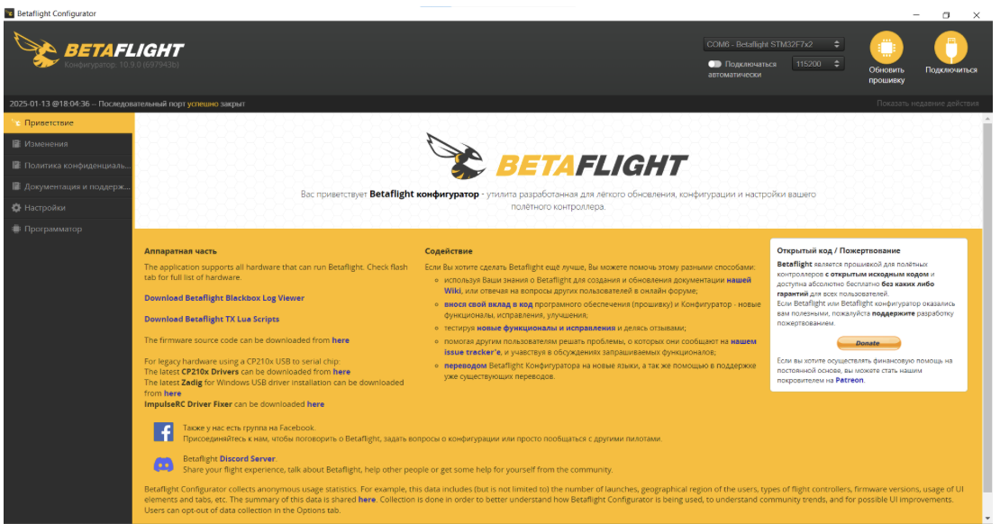
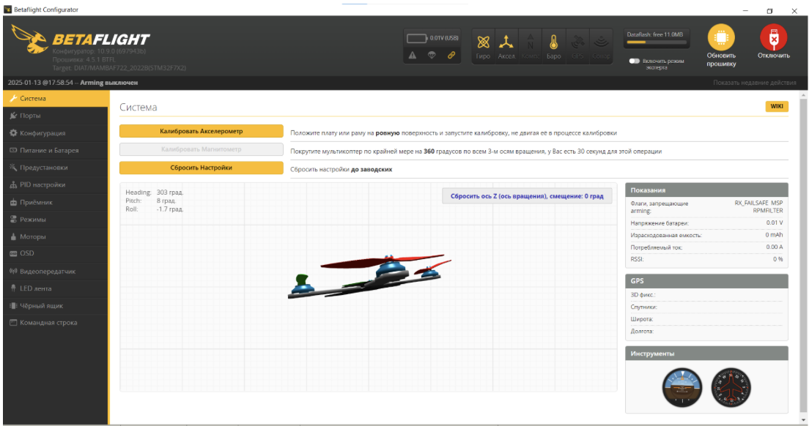

## ШАГ 2. Прошивка полетного контроллера

### 2.1 Установка ПО

Скачайте или откройте веб версию. Веб-версия доступна только в браузерах на базе Сhromium (Chrome, Chromium, Edge) и Яндекс Браузере.  

1. Ссылка для скачивания Betaflight configurator: [https://github.com/betaflight/betaflight-configurator/releases/tag/10.10.0](https://github.com/betaflight/betaflight-configurator/releases/tag/10.10.0)
2. Веб версия Betaflight configurator: https://app.betaflight.com/

### 2.2 Подключение полетного контроллера к ПК

Запустите Betaflight Configurator

  

Подключите полетный контроллер к ПК используя кабель USB

  

