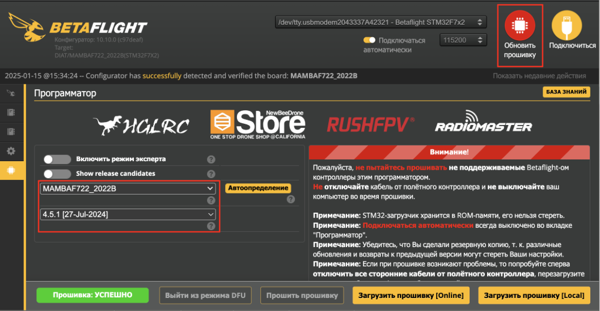
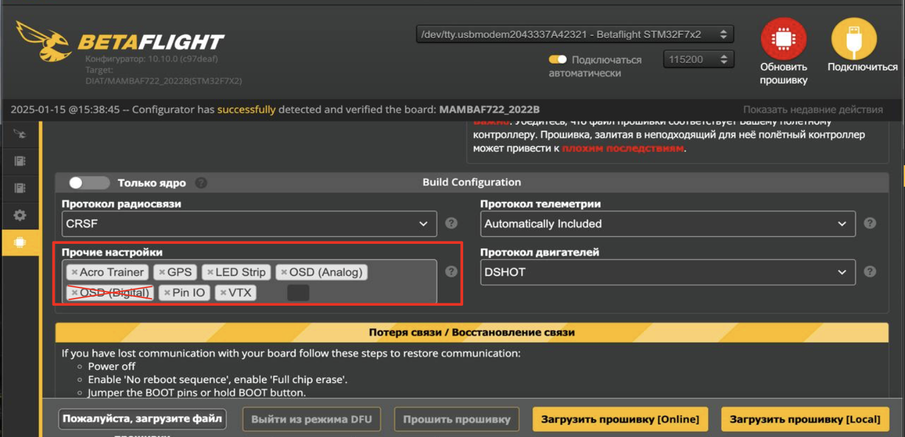
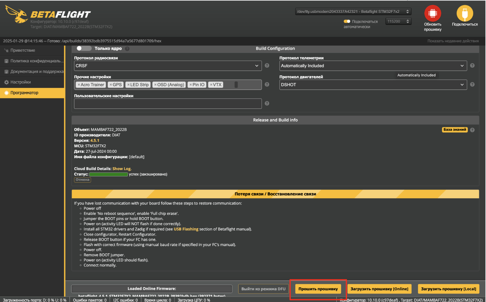
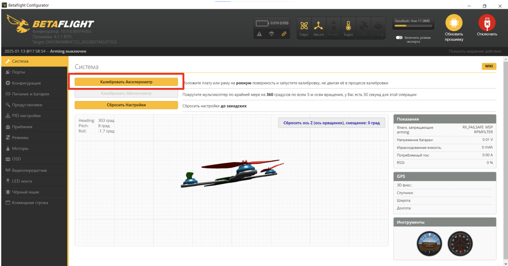
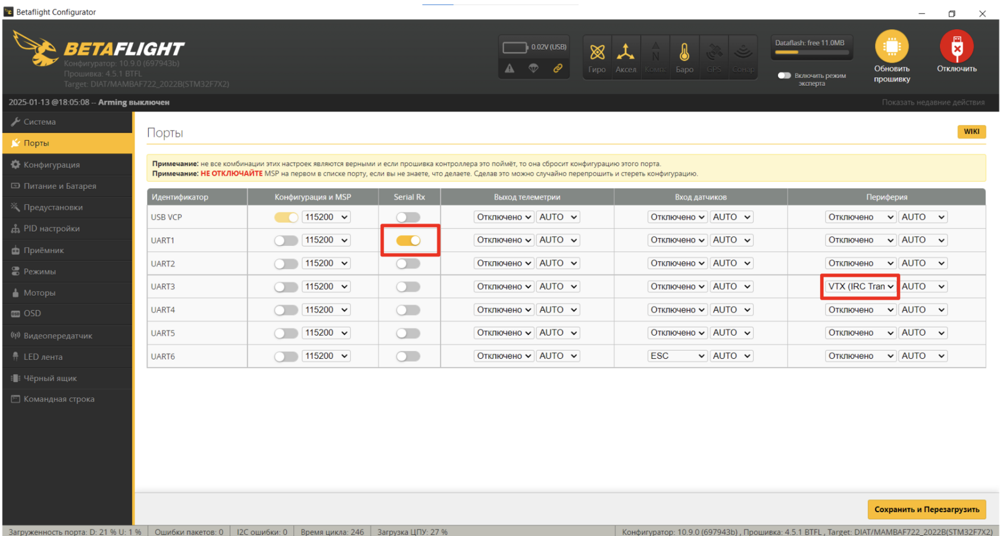

### 2.3 Обновление прошивки FC

- Нажмите кнопку “Обновить прошивку”
- Нажмите кнопку “Автоопределение” (должен определиться FC “MAMBAF722_2022B”)
- Если FC не определился или определился некорректно - выберите “MAMBAF722_2022B” вручную

  

- В разделе “Прочие настройки” уберите пункт “OSD (Digital)”

  

- Нажмите “Загрузить прошивку [Online]”
- Затем нажмите “Прошить прошивку” -> “Игнорировать риск”

  

### 2.4 Калибровка акселерометра

- Разместите квадрокоптер на ровной горизонтальной поверхности/столе.
- Убедитесь, что нижняя площадка плотно прилегает к плоскости стола (ремешок может мешать на время калибровки рекомендуется оставить его в расстегнутом состоянии)
- Перейдите в раздел "Система" и нажмите кнопку “Калибровать Акселерометр”

  

- Убедитесь, что UART порты назначены, как показано на скриншоте, установите в UART3 параметр VTX (IRC Tramp)
- Нажмите кнопку “Сохранить и перезагрузить”

  

