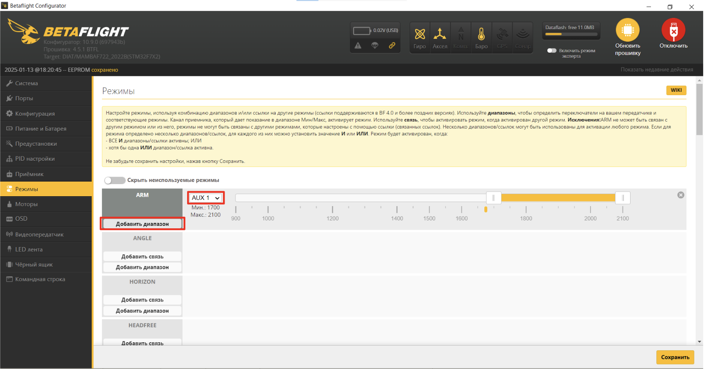
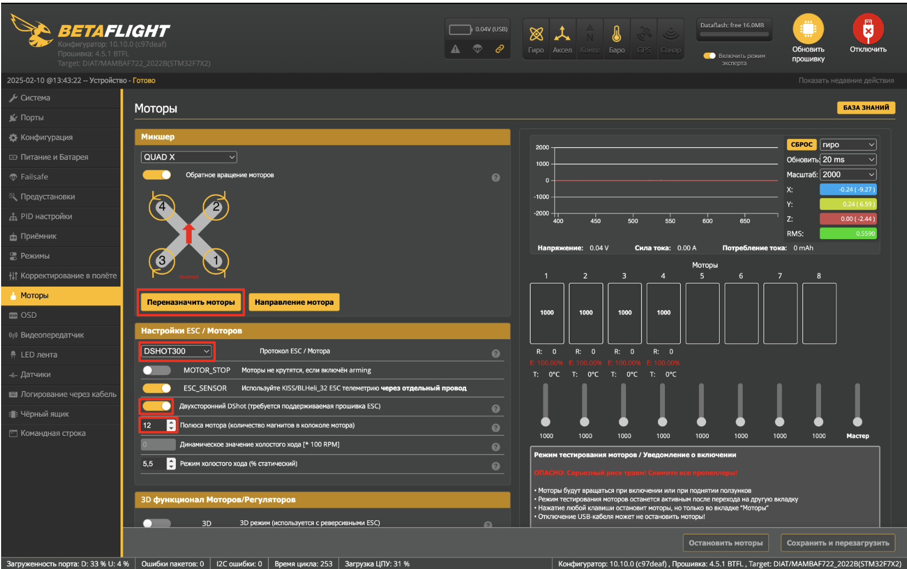
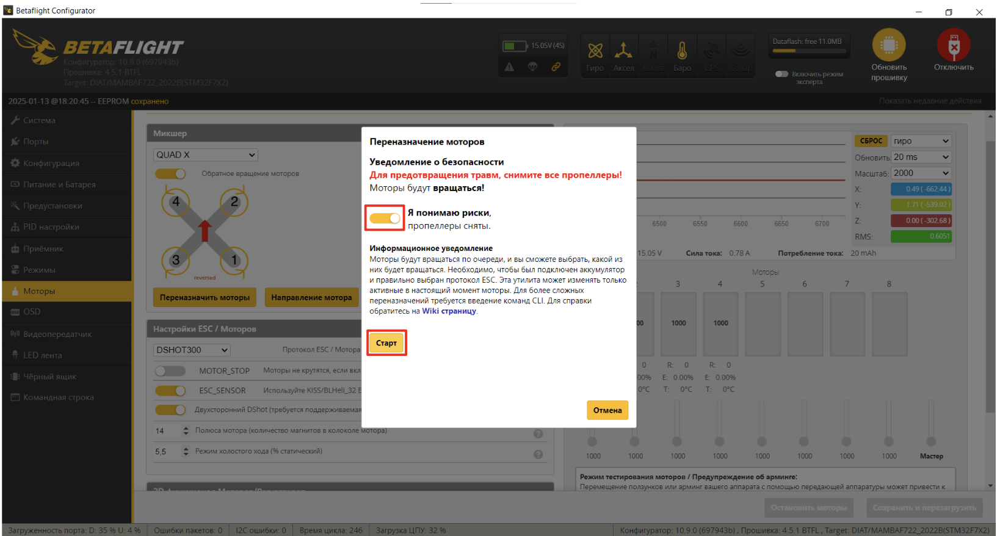
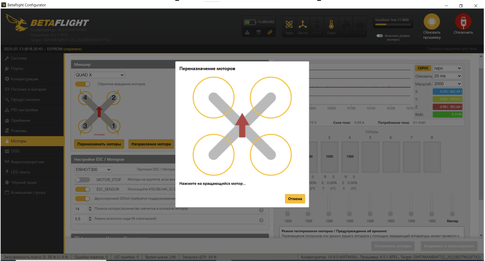
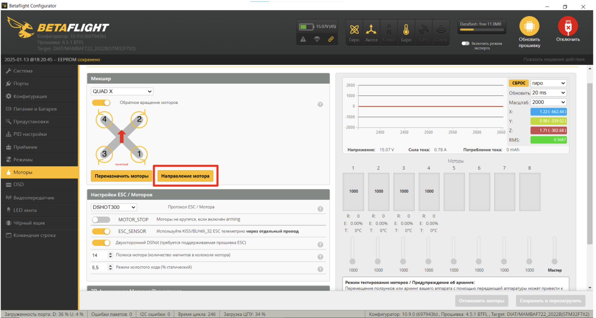
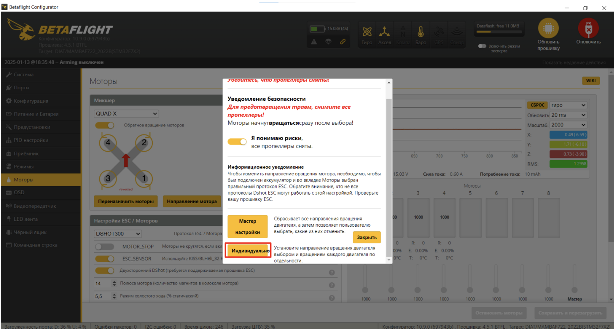
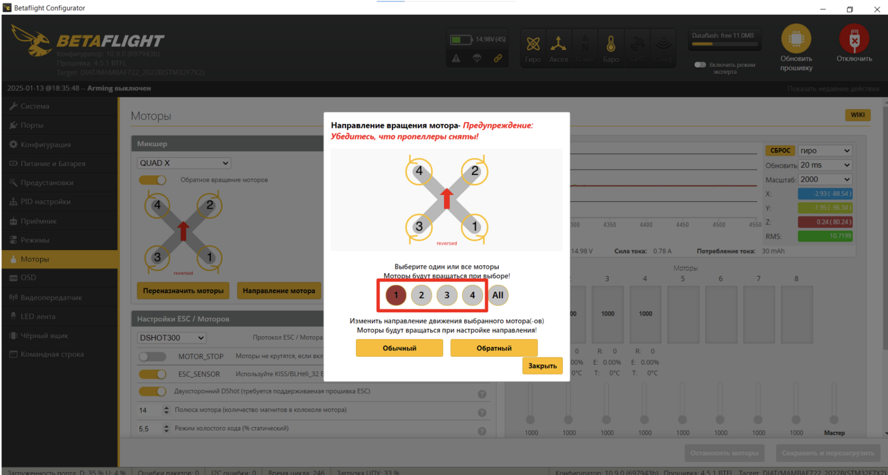

### 2.5 Настройка каналов

Перейдите на вкладку “Режимы”  
.Установите ARM на AUX1:  

- Нажмите “Добавить диапазон”
- Выберите AUX1

Остальные режимы вы можете настроить под свои задачи (например, переключение режимов)- для этого нажмите кнопку “Добавить диапазон” и выберите необходимый стик на пульте

### 2.6 Настройка моторов

- Перейдите на вкладку “Моторы”
- В строке “Протокол ESC” выберите “DSHOT300”
- Включите “Двухсторонний DShot”
- Измените “Количество полюсов магнитов” до 12
- Для проверки корректности направления вращения моторов нажмите “Переназначить моторы”

- Убедитесь, что пропеллеры сняты, поставьте галочку в пункте “Я понимаю риски”
- Подключите АКБ к гнезду XT-30 (после должна будет проиграть звуковая индикация моторов)
- Нажмите “Старт”

- Поочередно проверьте, что моторы вращаются в соответствии со схемой - следуйте инструкциям программы
- Проверьте еще раз порядок вращение двигателей и нажмите кнопку “Сохранить”

- Нажмите “Направление мотора”

- В открывшемся окне выберете пункт “Индивидуально ”

- Поочередно проверьте корректность направления вращения каждого мотора нажав на кнопки с номерами моторов - они должны вращаться в соответствии с иллюстрацией
- Если вращение мотора не совпадает, нажмите “Обратный”
- По завершении проверки нажмите “Закрыть”

