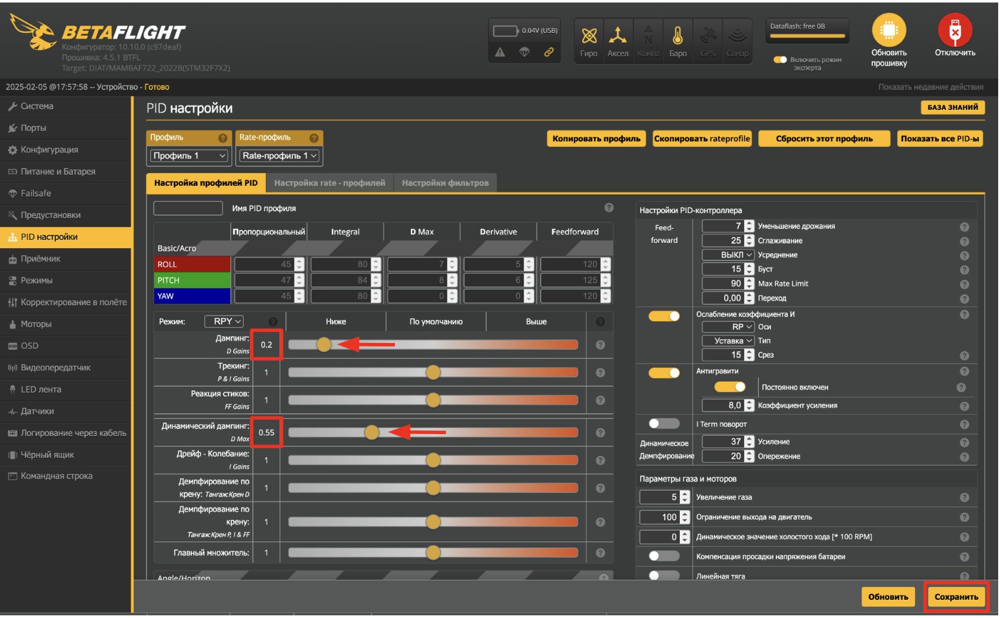
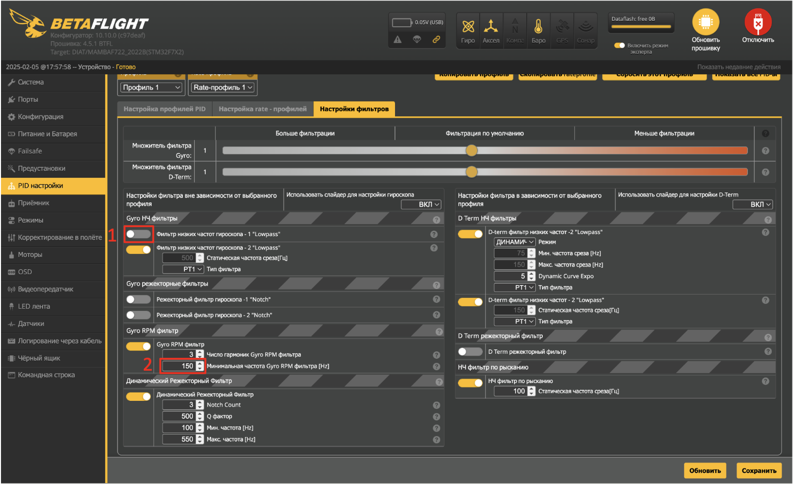
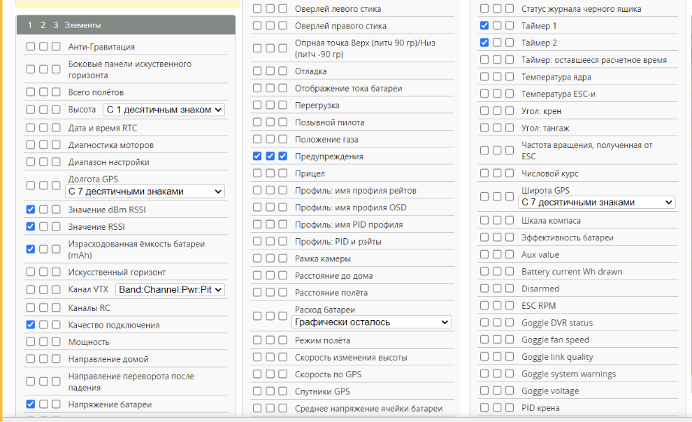

### 2.7 Настройка PID

- Перейдите на вкладку “PID настройки”
- В разделе “Настройка профилей PID” измените значения:

  

- Перейдите в раздел “Настройки фильтров”
- Отключите фильтр низких частот гироскопа “Lowpass”
- Измените значения “Минимальной частоты Gyro RPM фильтра” до 150Hz

  

### 2.8 Настройка OSD

Перейдите на вкладку “OSD”  

- В левой части интерфейса в столбце “Профиль 1” проставьте галочки в пунктах: “Значения dBm RSSI”, “Значения RSSI”, “Израсходованная емкость батареи (mAh), “Качество подключения”, “Напряжение батареи”, “ Предупреждения”, “Таймер 1”, “Таймере 2”.
- Описание: Таймер 1 и Таймер 2 (первый показывает сколько времени дрон включен, второй - сколько он в arm)

  

