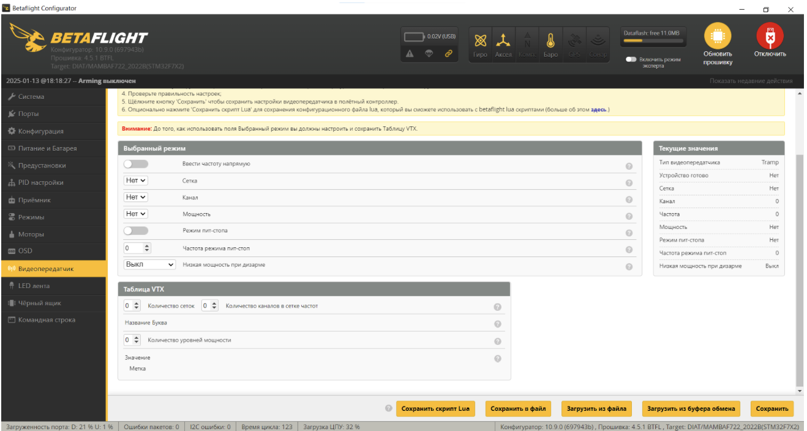
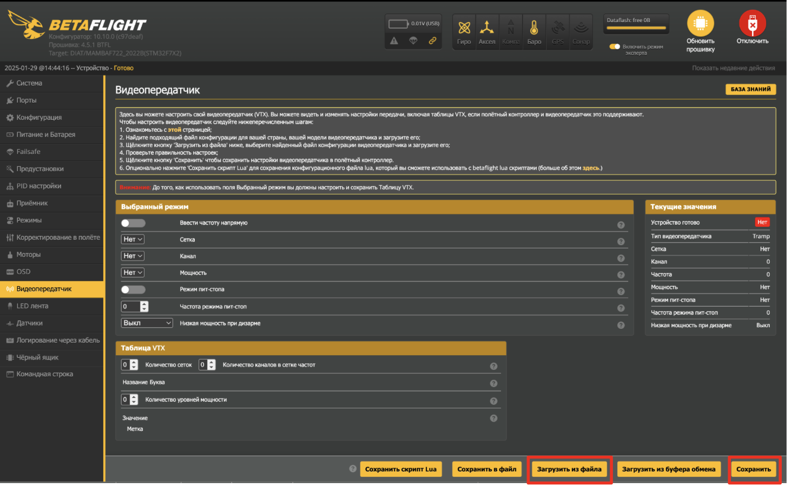
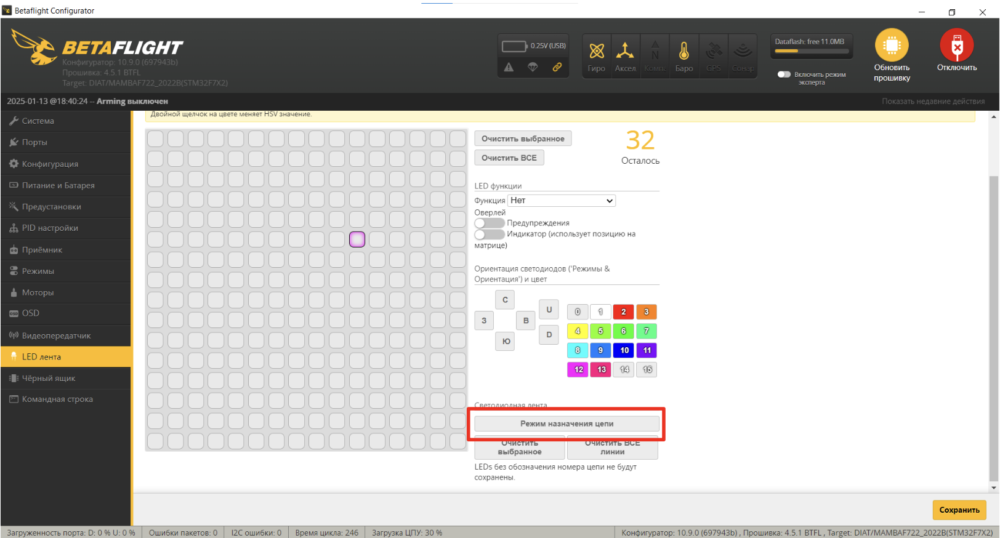
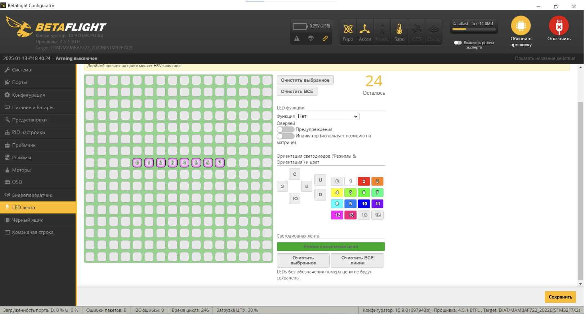
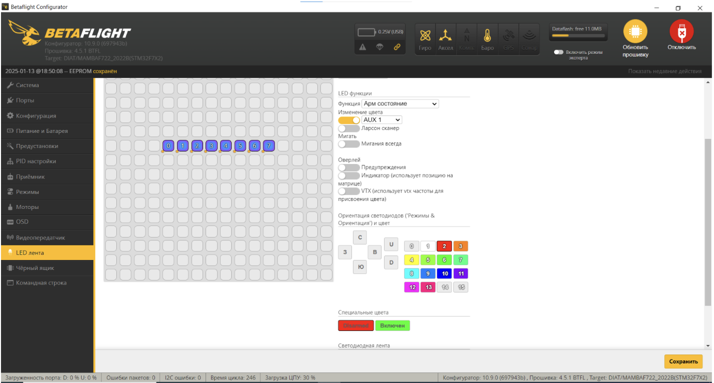

### 2.9 Настройка рабочих частот

Скачайте [файл](https://disk.yandex.ru/d/719IuVjkx8GJ4w)  
Перейдите на вкладку “Видеопередатчик”

  

Нажмите “Загрузить из файла” в нижней части интерфейса  
Выберите скачанный ранее файл  
Нажмите “Сохранить”

  

### 2.10 Настройка LED-модулей

Перейдите на вкладку “LED лента”  

- Нажмите “Режим назначения цепи”

  

- Выделите на панели со светодиодами 8 ячеек, как показано на скриншоте (обратите внимание, что нумерация начинается с нуля)
- Нажмите кнопку “Сохранить”

  

- Еще раз выделите выбранные ранее ячейки
- В разделе LED функции установите функцию “Арм состояние”
- В разделе Изменение цвета активируйте пункт “AUX 1”
- В группе настроек “Специальные цвета” нажмите “Disarmed” и выберите цвет, который будет отображать индикацию при дизарме, аналогично задайте цвет, который будет отображать режим арм (через кнопку “Включен”)
- Нажмите кнопку “Сохранить”

  

