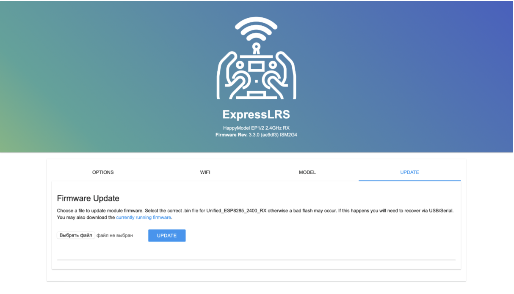
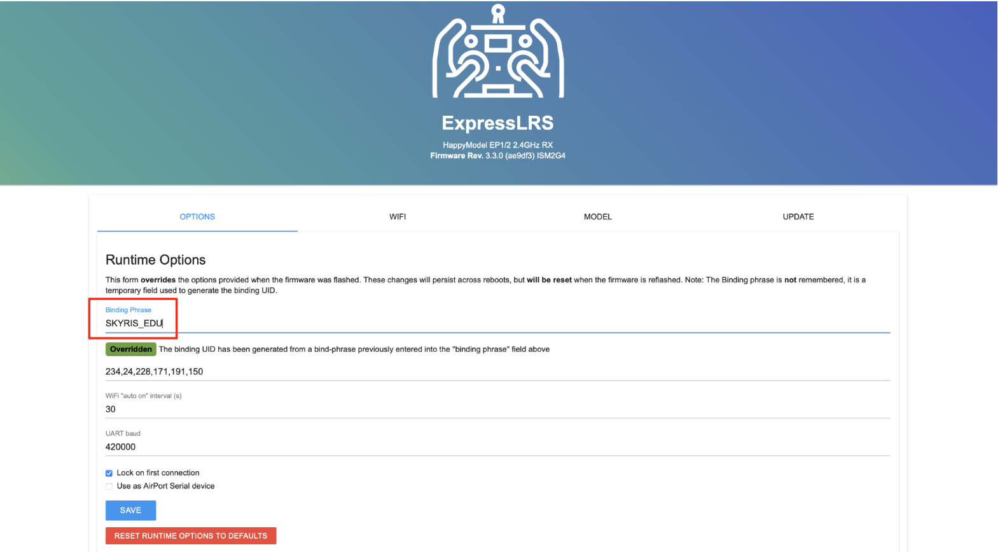
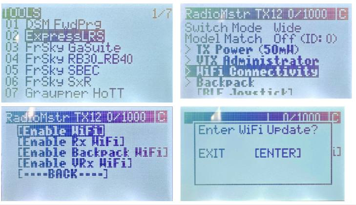
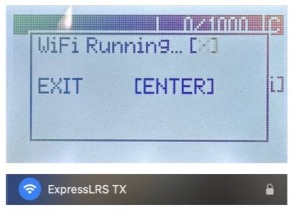

## ШАГ 3. Бинд приемника к пульту РУ (WiFi)

### 3.1 Первичная настройка приемника

Скачайте [файл](https://disk.yandex.ru/d/GS5RjnZALdUZVA) с прошивкой для приемника  

- Подключите полетный контроллер к ПК по USB
- Дождитесь когда приемник перейдет в режим “WiFi” (Примерно через 1 мин после подачи питания, приемник начнет быстро мигать зеленым светодиодом)
- Подключитесь к приемнику как к точке доступа WiFi:
- Сеть: ExpressLRS RX
- пароль: expresslrs
- В окне браузера введите адрес 10.0.0.1

Перейдите на вкладку “Update”  

- Выберите скачанный ранее файл с прошивкой
- Нажмите кнопку “Update” - приемник обновит прошивку и перезагрузится
- Повторно подключитесь к приемнику по WIFI и запустите окно настроек в браузере (пункты 4 и 5)

Перейдите на вкладку “Options”  

- В строке “Binding phrase” введите фразу (любое сообщение: не менее 6 символов, латинские буквы, заглавные буквы, спец. знаки, цифры)
- Нажмите кнопку “SAVE”

### 3.2 Настройка пульта РУ

1. Скачайте [файл](https://disk.yandex.ru/d/i6g7FJmZX07nkQ) с прошивкой для пульта
2. Включите пульт РУ зажав кнопку “Power”
3. Перейдите в меню нажав кнопку “SYS”
4. Далее в меню ExpressLRS ⭢ WiFi Connectivity ⭢Enable WiFi (для навигации по меню используйте кнопку “Menu”)
5. Далее нажмите “Enter”

После появления индикации “WiFi Running” пульт запустит точку доступа с названием “ExpressLRS TX”  
Повторите пункты 4-12 из главы с настройкой приемника. При выборе прошивки загрузите файл “Название файла”, а в поле “Binding phrase” введите ту же фразу, которую вводили при настройке приемника

