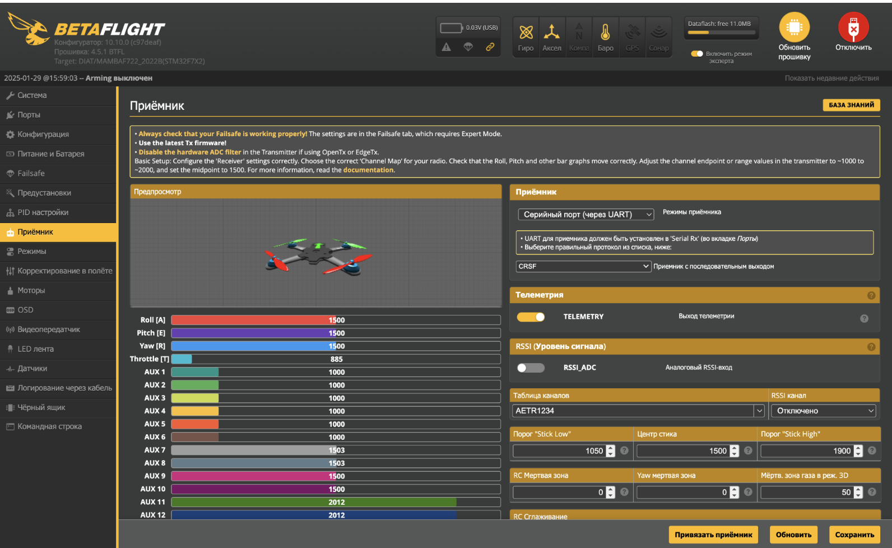

### 3.3 Настройка приемника в BetaFlight

  

- Включите пульт РУ зажав кнопку “Power” (важно сначала включить пульт, а потом приемник т.к. при отсутствии сигнала пульта в течение 1 минуты приемник переходит в режим настройки)
- Подайте питание на приемник (подключить полетный контроллер к ПК по USB)
- Запустите Betaflight Configurator
- Перейдите в вкладку “Приемник”
- Проверьте, что FC распознает сигналы с пульта РУ

Поочередно отклоните левый и правый стик в крайние положения  

- при отклонение левого стика вниз-вверх (YAW) - ползунок Throttle (T) начнет двигаться влево-вправо при отклонение стика вниз-вверх соответсвенно 
- при отклонение левого стика влево-вправо (YAW) - анимация дрона в окне настройки должна начать вращаться в горизонтальной плоскости против часовой и по часовой стрелке соответственно
- при отклонении правого стика влево-вправо (ROLL) анимация дрона в окне настройки должна начать вращаться влево или вправо соответственно
- при отклонении правого стика ввех-вних (PITCH) анимация дрона в окне настройки