# Сборка
## Шаг 1. Подготовка компонентов к сборке

### **1.1 Подготовка регулятора 4-в-1**

- Извлеките регулятор 4-в-1 из коробки (он находится вместе с полетным контроллером), убедитесь, что все компоненты целы и не имеют повреждений
- Аккуратно нанесите флюс на контактные площадки, предназначенные для пайки моторов и кабеля питания
- Разогрейте паяльник до рабочей температуры (320–350°C). Нанесите припой на подготовленные площадки, избегая образования перемычек между контактами

### **1.2 Подготовка полетного контроллера**

- Аккуратно извлеките полетный контроллер из коробки, где находился регулятор 4-в-1
- Нанесите флюс на контактные площадки, отмеченные красным цветом на приложенной схеме

### **1.3 Пайка силовых проводов к регулятору 4-в-1**

- Извлеките силовой провод с коннектором XT30 из набора ПИЛОТ FPV
- Нанесите флюс на контактные площадки регулятора 4-в-1, маркированные «+» (плюс) и «–» (минус)
- Припаяйте красный провод к площадке с обозначением «+», а черный провод — к площадке «–». Следите, чтобы припой равномерно покрыл контакты, а провода были надежно зафиксированы

### **1.4 Подготовка моторов**

- Аккуратно извлеките моторы из упаковки. Проверьте их на отсутствие внешних повреждений, а также убедитесь, что фазные провода не имеют дефектов изоляции
- С помощью бокорезов укоротите фазные провода на каждом моторе до длины 55 мм

- С помощью бокорезов или стриппера аккуратно снимите изоляцию с концов моторных проводов, оголив жилы на 1,5 мм
- Плотно скрутите зачищенные жилы каждого провода
- Нанесите небольшое количество флюса на оголённые концы проводов
- Разогрейте паяльник и нанесите припой на зачищенные участки

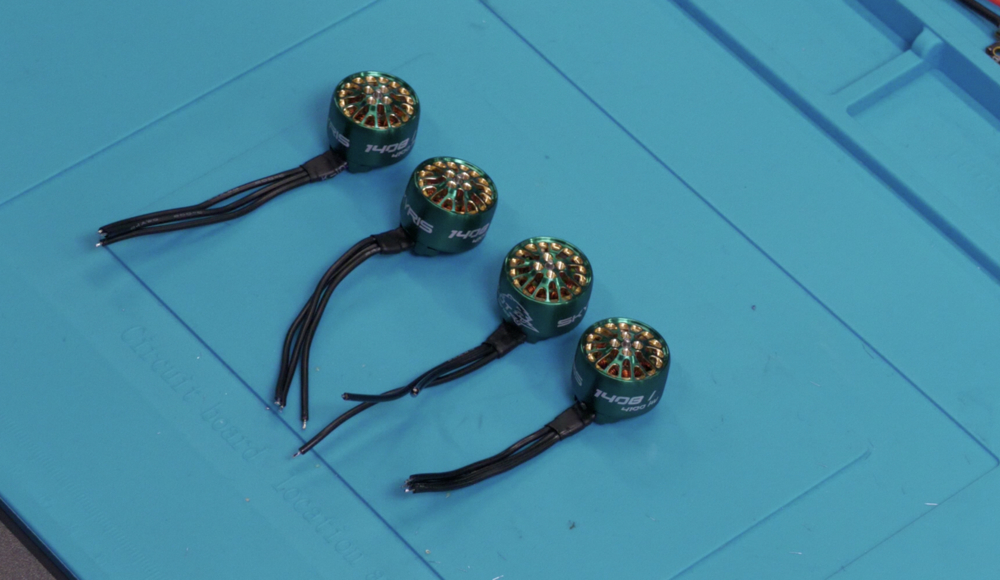

## Шаг 2. Пайка периферии к полетному контроллеру

На рисунке показана схема подключения видеопередатчика (VTX), Радиоприемника (RX), LED- ленты и камеры (СAM). Подробный алгоритм подключения каждого из этих модулей описан в инструкции ниже.

### 2.1 Подключение камеры

- Из коробки с камерой достаньте трехпиновый кабель с коннектором
- С помощью бокорезов аккуратно обрежьте один из коннекторов, оставив длину провода 50-60 мм
- Зачистите концы проводов на 2-3 мм, стараясь не повредить токоведущие жилы
- Разогретым паяльником (320 - 350°C) залудите каждый провод

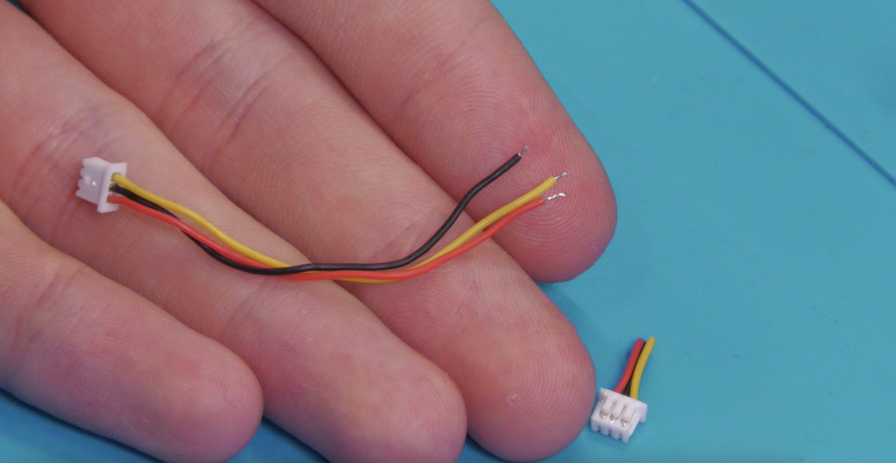

### **2.2 Подключение видеопередатчика (VTX)** 

- Достаньте жгут проводов из комплекта VTX. Аккуратно отделите 4 провода: черный, красный, желтый, белый
- Бокорезами обрежьте провода до длины 10-11 см. Зачистите концы проводов на 2-3 мм, нанесите флюс на зачищенные участки, залудите провода
- Достаньте видеопередатчик (VTX)
- Нанесите флюс и залудите площадки, отмеченные на схеме

Припаяйте провода к площадкам видеопередатчика (VTX) согласно схеме

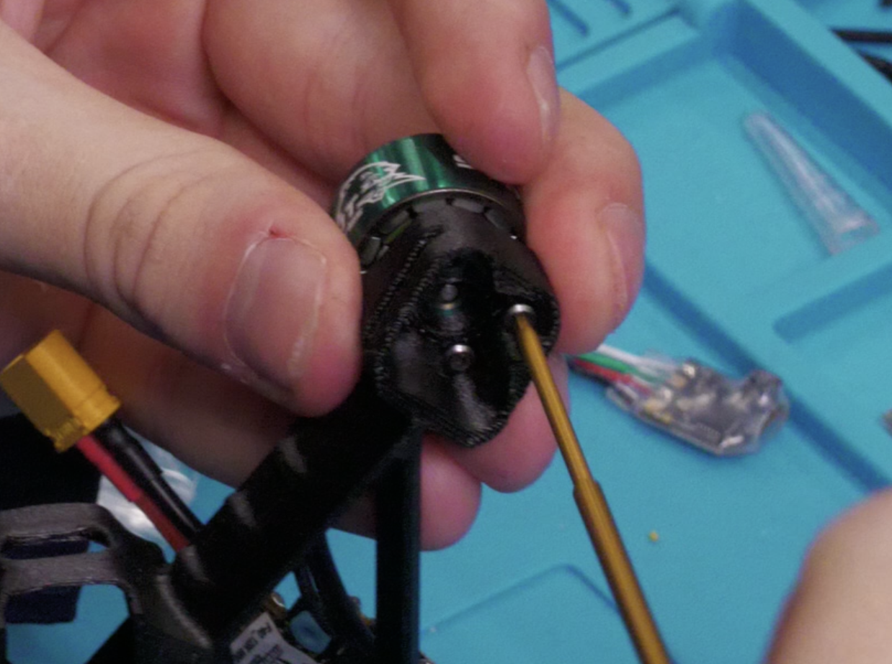

Из набора ПИЛОТ FPV достаньте антенну и установите ее гнездо UFL на видеопередтатчике (VTX)

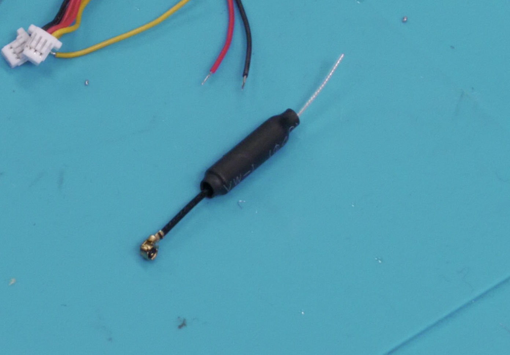

Из набора с видеопередатчиком (VTX) достаньте термоусадку. Наденьте термоусадку на видеопередатчик (VTX) и усадите ее при помощи фена. Рекомендуемая температура фена - 320 -350°C)

Припаяйте свободные концы проводов видеопередатчика (VTX) к площадкам полетного контроллера согласно схеме. 

### 2.3 Подключение Радиприемника (RX)

- Из набора с приемником достаньте провода, приемник и термоусадку
- Зачистите концы проводов на 2-3 мм, плотно скрутите жилы каждого провода, нанесите флюс на зачищенные участки, залудите провода
- Нанесите флюс на все контактные площадки, аккуратно залудите каждый контакт: Температура паяльника 320-350°C

Сверьтесь со схемой подключения, определив:  

- Назначение каждого провода
- Соответствующие контактные площадки
- Полярность соединений

Последовательно припаяйте подготовленные провода:

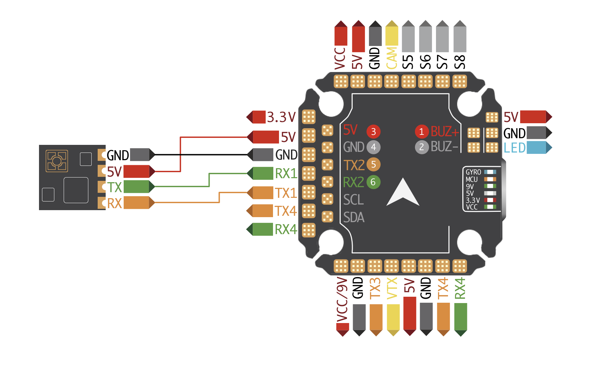

Наденьте термоусадку на радиоприемник, убедитесь, что термоусадка полностью покрывает контакты приёмника. Используйте термофен аккуратно прогрейте, добивайтесь равномерной усадки по всей поверхности

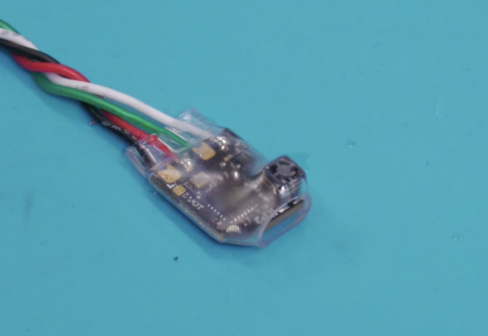

### 2.4 Подключение LED-модулей

Из набора ПИЛОТ FPV достаньте: светодиодную ленту и комплект предварительно залуженных соединительных проводов.  
Припаяйте провода к полетному контроллеру согласно схеме:

## Шаг 3. Установка электронных компонентов

### **3.1 Подготовка полетного контроллера и регулятора 4в1 к установке**

Извлеките из коробки с полетным контроллером:  

- Комплект силиконовых демпферов M3 (размер D6×H4.5)
- Комплект силиконовых демпферов M2

Вставьте демпферы M3 (D6 x H4,5) в разъемы полетного контроллера и силиконовые демпферы M2 в разъемы регулятора 4в1

Установите демпферы M3 в соответствующие разъемы:  

- Аккуратно вдавите демпферы в посадочные места полетного контроллера
- Убедитесь в плотной посадке без перекосов
- Проверьте равномерность установки всех четырех демпферов

  
.Установите демпферы M2 на плату регулятора 4-в-1:  

- Совместите демпферы с монтажными отверстиями
- Обеспечьте равномерное усилие при установке
- Проверьте перпендикулярность положения демпферов относительно платы

### **3.2 Установка моторов**

Расположите полетный контроллер и припаянные к нему двигатели так, как показано на схеме. Важно соблюсти ориентацию полетного контроллера относительно рамы (направление стрелок должно совпадать)

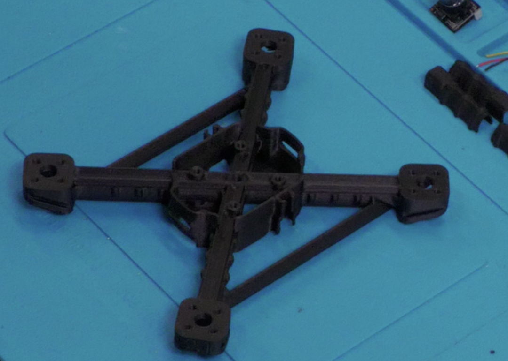

Достаньте из коробки с моторами комплект винтов М2×5 (4 шт. на каждый мотор)  

- Наживите все 4 винта на 1-2 оборота, не затягивая
- Убедитесь, что мотор правильно расположен на мотормаунте
- Отверстия должны совпадать без перекосов
- Зазор между мотором и рамой — равномерный
- Затягивайте винты крест-накрест (по диагонали), чтобы избежать перекоса
- Используйте дозированное усилие — мотор не должен деформироваться
- Проверьте, чтобы мотор не люфтил и сидел плотно

Установите крышки кабель-каналов на лучи

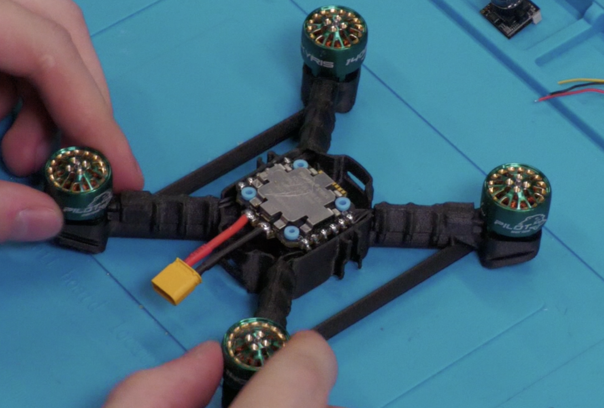

### **3.3 Подключение полетного контроллера к регулятору 4в1** 

Возьмите 4 черных винта М2×20 из набора ПИЛОТ FPV и цилиндрические демпферы М2 из коробки с полезным контроллером  

- Совместите монтажные отверстия полетного контроллера и регулятора 4-в-1
- Вставьте демпферы в отверстия и наживите винты на 1-2 оборота **(не затягивать!)**
- Убедитесь в правильной ориентации компонентов согласно схеме

Найдите шлейф в коробке от полетного контроллера. Осторожно подключите разъем шлейфа:  

- Сначала к разъему на плате регулятора 4-в-1
- Затем к соответствующему разъему на полетном контроллере
- Проверьте правильность положения ключа на разъемах

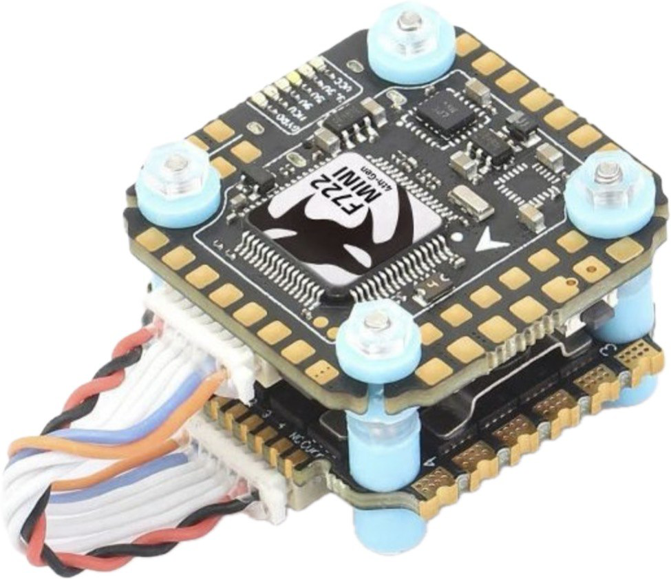

### 3.4 Установка LED-модулей 

Возьмите LED-модули из комплекта, установите каждый модуль в соответствующие посадочные места на раме

Выведите концы кабеля Y_LED вниз, соедините:  

- Коннектор LED1 → к первому LED-модулю
- Коннектор LED2 → ко второму LED-модулю

Проверьте:   

- Полярность подключения
- Плотность соединения
- Отсутствие перекручивания проводов

### 3.5 Вывод кабеля питания

1. Возьмите силовой кабель с коннектором XT-30 (красный "+" и черный "-") Убедитесь, что провода не перекручены и не повреждены
2. Проденьте кабель через технологическое отверстие в задней части рамы:

- Следите, чтобы изоляция не задиралась о края отверстия
- Оставьте запас провода для удобного подключения к регулятору 4-в-1

### 3.6 Установка полетного контроллера и регулятора 4-в-1

1.Аккуратно разместите провода от каждого мотора в кабель-каналах на лучах рамы:  

- Проложите их по схеме (позже будет добавлена иллюстрация)
- Избегайте резких перегибов и натяжения
- В центральной части рамы зафиксируйте провода стяжками, оставив небольшой запас у регулятора

2.Установите стек из регулятора 4-в-1 и полетного контроллера на раму:  

- Совместите монтажные отверстия с демпферами
- Вкрутите винты крест-накрест, начиная с противоположных углов
- Затягивайте винты постепенно и равномерно
- Следите, чтобы платы не перекашивались
- Не допускайте избыточного давления на демпферы

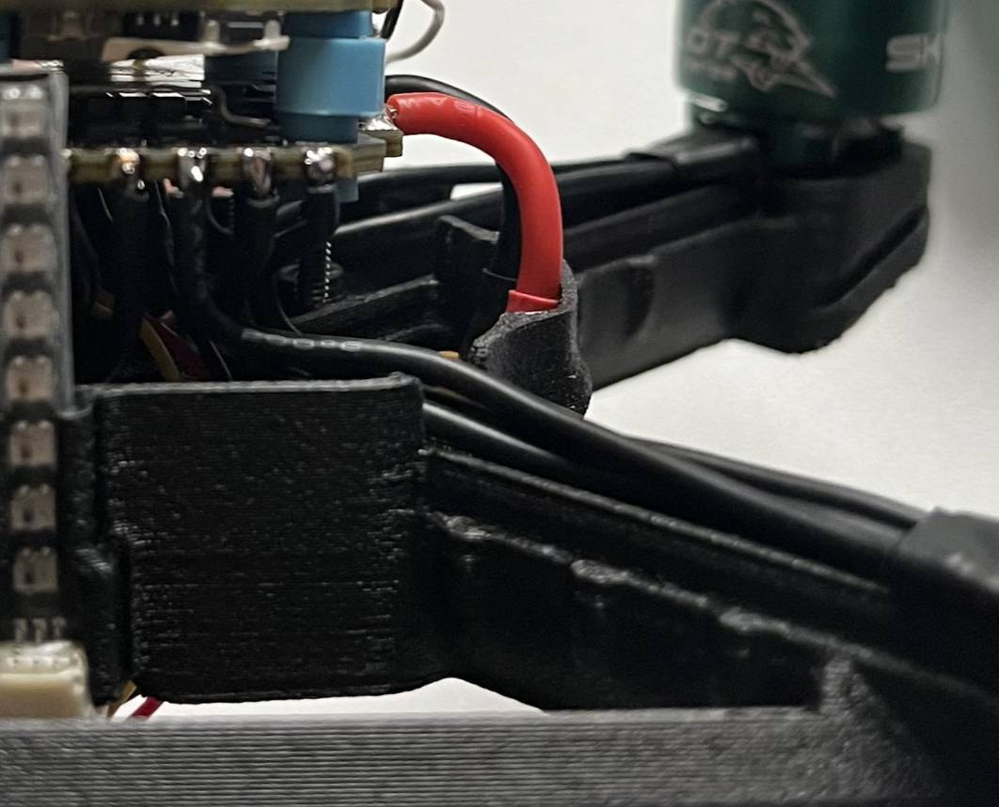

### 3.7 Установка видеопередатчика в канопу

- Аккуратно проденьте антенну VTX через специальное отверстие в канопе, установите передатчик в крепежные пазы на верхней части канопы
- Зафиксируйте VTX винтами из комплекта
- Установите радиоприемник RX на заднюю стенку используя 2-х сторонний скотч/в пазы на канопе (новая ревизизия!)

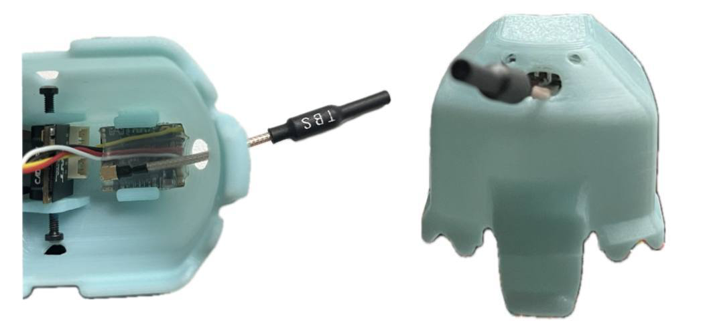

### 3.8 Установка камеры в канопу

1. Возьмите 3-пиновый кабель VTX, совместите разъем с 3pin гнездом на камере, соблюдая ключ. Плотно вставьте до щелчка, избегая перекосов
2. Установите камеру в канопу (корпус), совместив крепежные отверстия. Закрепите винтами М2×6 из комплекта, соблюдая порядок:

- Наживите оба винта на 1-2 оборота
- Проверьте ориентацию камеры
- Равномерно затяните, избегая перекоса

## Шаг 4. Установка канопы на раму

Совместите канопу с передней частью рамы, соблюдая правильную ориентацию:   

- Камера должна быть направлена вперед (по полетному направлению)
- Антенна VTX – развернута назад

## Шаг 5. Установка площадки под АКБ

Возьмите 4 самореза М3×8 из комплекта:  

- Приложите ремешок для АКБ к раме
- Совместите монтажные отверстия площадки АКБ с рамой так, чтобы ремешок оказался зафиксирован площадкой
- Закрепите площадку саморезами

Приклейте антискользящий стикер 20х15 мм в углубление на площадке АКБ

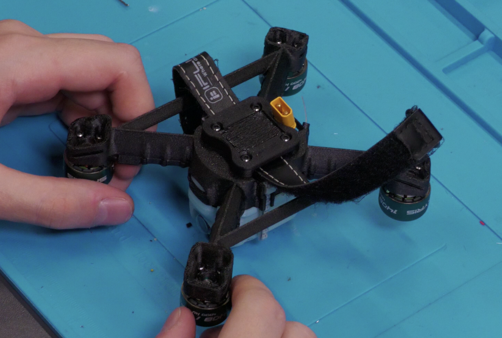

## Шаг 6. Установка защиты пропеллеров

Установите защиту пропеллеров на лучи

- Установите перемычки защиты лучей
- Установите короткие перемычки между защитными кольцами спереди и сзади рамы
- Соедините боковые защитные кольца длинными перемычками

## Шаг 7. Установка пропеллеров

Совместите пропеллеры с моторами согласно схеме  
**Устанавливайте пропеллеры только после:**  

- Полной калибровки полетного контроллера
- Проверки направления вращения моторов в ПО
- Тестового запуска без пропеллеров

## Собранный квадрокоптер

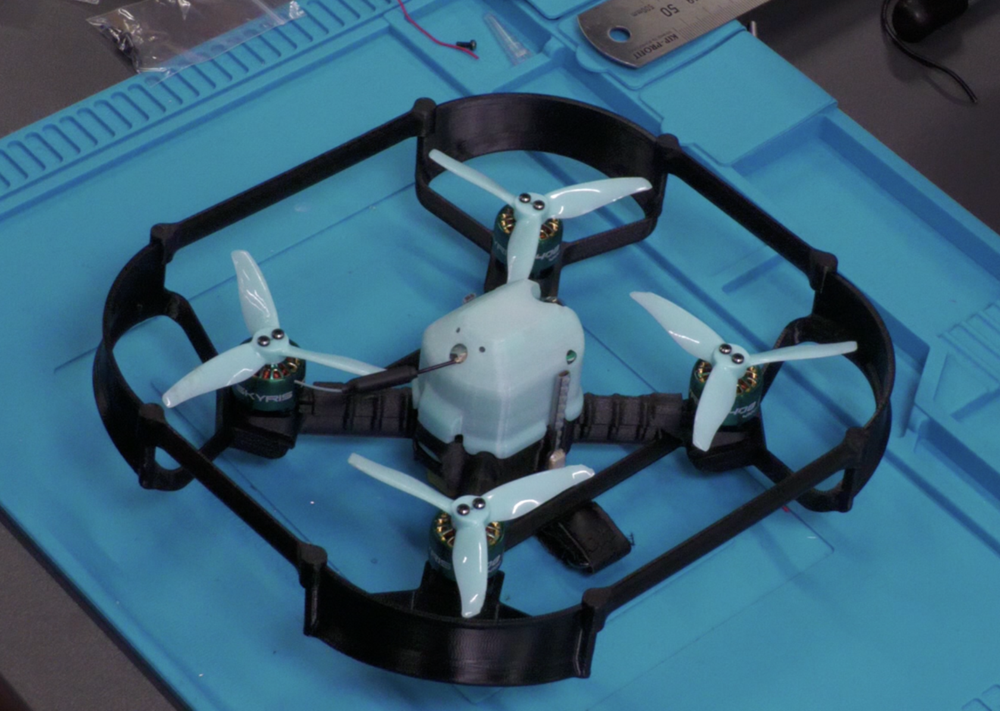

