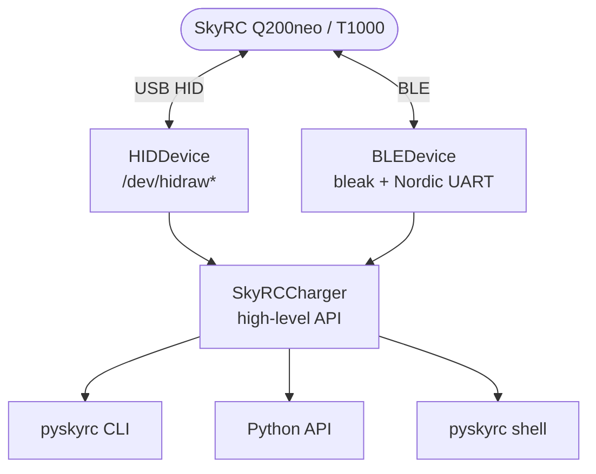

# PYSKYRC

**`pyskyrc`** — это библиотека на чистом Python для управления и телеметрии зарядных устройств **SkyRC Q200neo** и **T1000** через **USB HID** и **Bluetooth Low Energy**. Протокол восстановлен методом обратной разработки из официального приложения **Charge Master 1.55.E207** — работа с зарядником возможна **без оригинального ПО и без SkyRC app**.

Библиотека предоставляет **единый высокоуровневый API** для обоих транспортов, поддержку **всех четырёх портов** (A / B / C / D), **семи типов аккумуляторов** и **всех режимов заряда**. В комплекте — CLI, интерактивная оболочка, документация протокола и 37 модульных тестов.



Основной сценарий использования — **автоматизация зарядного процесса, интеграция с системами мониторинга и телеметрии, построение собственных GUI и веб-интерфейсов**. Исходный код, документация протокола и примеры использования открыты и [доступны на GitHub](https://github.com/Arlequin-AI/pyskyrc), а готовый пакет — [опубликован на PyPI](https://pypi.org/project/pyskyrc/).

## Возможности

- **Два транспорта** — USB HID и BLE с идентичным API.
- **Четыре порта** — A / B / C / D с независимой телеметрией.
- **Живые ячейки** — 6 × напряжение, температура, суммарное V, дельта баланса.
- **Полное управление** — START / STOP заряда с заданием химии, числа ячеек, токов и порогов.
- **Семь химий** — LiPo, LiIo, LiFe, LiHV, NiMH, NiCd, Pb.
- **Все режимы** — BAL.CHG, CHARGE, DISCHARGE, STORAGE, RE-PEAK, CYCLE, NORMAL, AGM, COLD CHARGE.
- **Auto-discovery** (BLE) — поиск зарядника по сервису `0xFFE0`, независимо от имени.
- **Кэш MAC** — быстрое переподключение после первой сессии.
- **Интерактивная оболочка** — одно соединение, множество команд.
- **Чистый Python** — для BLE нужен только `bleak`, для USB зависимостей нет.

## Установка

```bash
# USB HID (без дополнительных зависимостей)
pip install pyskyrc

# С поддержкой Bluetooth Low Energy
pip install "pyskyrc[ble]"

# Для разработки
git clone https://github.com/Arlequin-AI/pyskyrc
cd pyskyrc
pip install -e ".[ble,dev]"
```

## Быстрый старт

### Подключение по USB и чтение телеметрии со всех портов:

```python
from pyskyrc import SkyRCCharger, Port
with SkyRCCharger(transport="usb") as charger:
    for port, info in charger.read_telemetry().items():
        if info.has_battery:
            print(port.name, info.total_v, info.temperature_c)
```
### Запуск балансировочного заряда на порту B через BLE:

```python
from pyskyrc import (
    SkyRCCharger, ChargeParameters, Port, Chemistry, LiMode,
)
params = ChargeParameters(
    chemistry=Chemistry.LiPo,
    cells=6,
    mode=LiMode.BALANCE_CHARGE,
    charge_current_a=2.0,
    charge_cutoff_mv=4200,
    discharge_cutoff_mv=3000,
)
with SkyRCCharger(transport="ble") as charger:
    charger.start_charge(Port.B, params)
    charger.stop_charge(Port.B)
```

## Командная строка

Библиотека устанавливает CLI-утилиту `pyskyrc` со всеми основными операциями:

```bash
# Снимок состояния всех портов
pyskyrc status
# Непрерывный мониторинг
pyskyrc monitor
# Запуск и остановка заряда
pyskyrc start B --chem LiPo --cells 6 --current 2.0
pyskyrc stop B
# То же самое по Bluetooth
pyskyrc --transport ble status
pyskyrc --transport ble start B --chem LiPo --cells 6 --current 2.0
```
Интерактивная оболочка удерживает **одно соединение** и позволяет выполнять команды без переподключения:
```bash
pyskyrc> status
  A: --
  B: idle     25.04V  Δ17mV  T=30°C  [4.176 4.174 4.171 4.163 4.176 4.180]
  C: --
  D: --
pyskyrc> start B --chem LiPo --cells 6 --current 2.0
OK
pyskyrc> monitor
pyskyrc> stop B
OK
pyskyrc> exit
```
## Документация

- [Протокол обмена](https://github.com/Arlequin-AI/pyskyrc/blob/main/docs/protocol.md) — полное описание HID/BLE кадров, checksum, enum-ов и команд.
- [Транспорт BLE](https://github.com/Arlequin-AI/pyskyrc/blob/main/docs/bluetooth.md) — работа с `bleak`, auto-discovery, MAC-кэш, особенности BlueZ.
- [USB HID](https://github.com/Arlequin-AI/pyskyrc/blob/main/docs/usb.md) — `/dev/hidraw*`, права доступа, polling.
- [Примеры](https://github.com/Arlequin-AI/pyskyrc/tree/main/examples) — готовые скрипты в каталоге `examples/`.
- [FAQ](https://github.com/Arlequin-AI/pyskyrc/blob/main/docs/faq.md) — частые проблемы и решения.

## Архитектура

```text
pyskyrc/
├── protocol.py        построение пакетов START / STOP / polling
├── telemetry.py       парсинг 0f2255XX, событий 0f04XX
├── device.py          USB HID транспорт (hidraw)
├── transport_ble.py   BLE транспорт через bleak
├── discovery.py       поиск зарядников и MAC-кэш
├── charger.py         высокоуровневый API SkyRCCharger
├── charge.py          одноразовые START/STOP
├── cli.py             командная строка и shell-режим
└── enums.py           Port, Chemistry, Mode, State
```
## Совместимость

| Компонент                       | Linux            | macOS      | Windows          |
| ------------------------------- | ---------------- | ---------- | ---------------- |
| USB HID (`/dev/hidraw*`)        | ✅                | ❌          | ❌                |
| BLE через `bleak`               | ✅                | ✅          | Не тестировалось |
| Auto-discovery (paired devices) | ✅ `bluetoothctl` | ❌          | ❌                |
| CLI / shell                     | ✅                | Только BLE | Только BLE       |

Планы: macOS/Windows поддержка USB — через `hidapi`, что требует
переписать `HIDDevice`. PR welcome.

## Безопасность

Библиотека управляет **реальным зарядным устройством с реальным током**. Ответственность за соответствие химии, числа ячеек и токов вашей батарее лежит на пользователе. Не оставляйте процесс заряда без присмотра.

## Лицензия

Проект распространяется под лицензией **MIT**. Полный текст — в файле [LICENSE](https://github.com/Arlequin-AI/pyskyrc/blob/main/LICENSE).