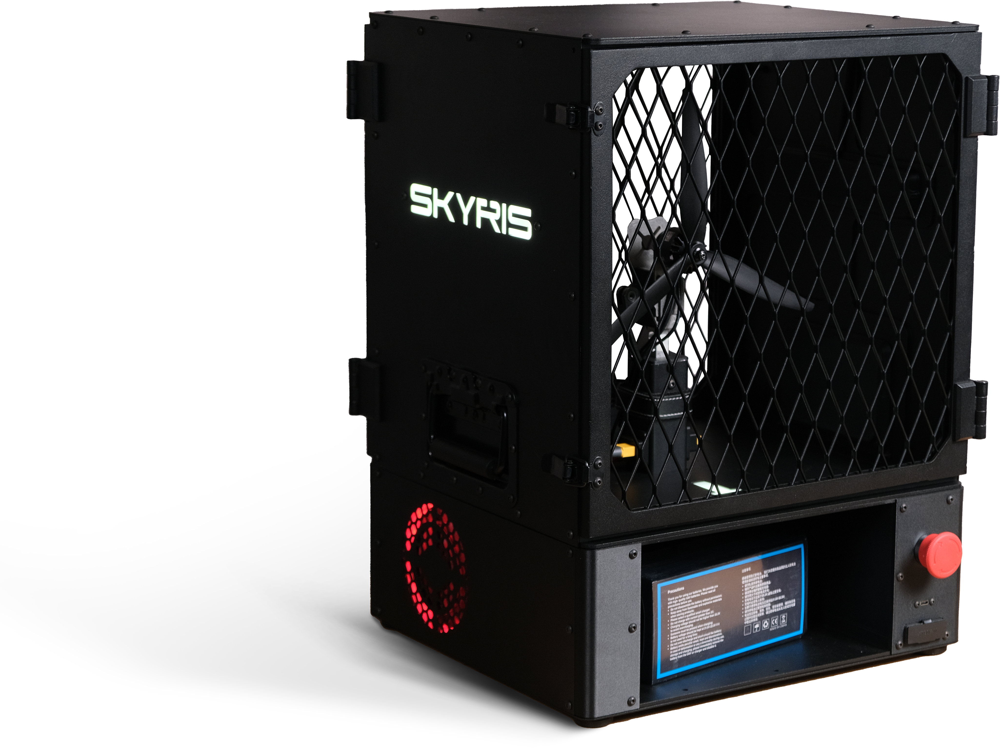

# Стенд испытания винтомоторной группы Skyris

Стенд Skyris предназначен для проверки и измерения характеристик винтомоторной группы: электродвигателя, регулятора оборотов (ESC) и воздушного винта.

  

Он позволяет испытывать один или два канала одновременно. Во время работы стенд измеряет напряжение и ток, определяет общую тягу, рассчитывает мощность и эффективность винтомоторной группы.

Испытание можно проводить в ступенчатом или непрерывном режиме, наблюдая за показаниями и графиками в реальном времени. Полученные данные сохраняются и используются для создания отчётов и сравнения разных конфигураций двигателей, регуляторов и пропеллеров.

За безопасностью следит система контроля защитных дверей, кнопки аварийной остановки и напряжения аккумулятора.

Стенд питается от сети переменного тока 220 вольт и подключается к компьютеру через USB. Для питания двигателей можно использовать аккумулятор с разъёмом XT90 или внешний блок питания.

