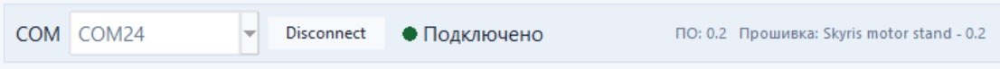
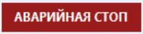

## Общие элементы интерфейса

  

Верхняя панель доступна на всех страницах.

- **COM** — список обнаруженных последовательных портов.
- **Connect** — нажмите, чтобы подключиться к выбранному порту.
- **Disconnect** — нажмите, чтобы отключиться.
- Состояние соединения видно по цветному индикатору и тексту рядом.
- Отображаются версии программы и прошивки стенда.

  

- **АВАРИЙНАЯ СТОП** — нажмите эту кнопку, чтобы немедленно остановить все каналы.
- Клавиша `Esc` выполняет ту же аварийную остановку.

> **Подсказка** Если отсоединить USB-кабель во время работы, программа перестанет обмениваться данными, освободит порт и снова будет готова к подключению.