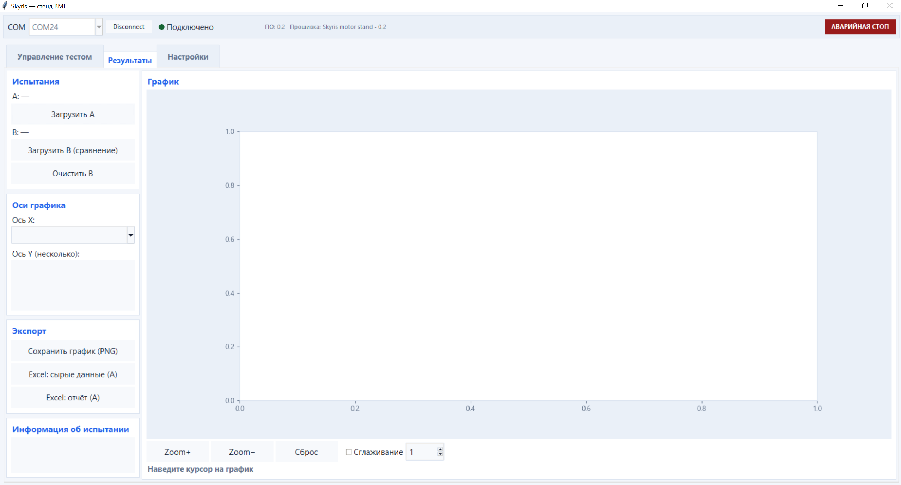

## Страница Результаты

На этой странице можно открыть ранее проведённое испытание, подробно изучить его результаты, сравнить с другим испытанием и сохранить данные в удобном формате.

  

  

### Загрузка данных

Кнопка «Загрузить A» открывает основной результат испытания. Можно выбрать всю папку результата, файл `data.csv` или Excel-файл с исходными измерениями.

Для сравнения нажмите «Загрузить B» и выберите второе испытание. Оба набора появятся на одном графике и будут отличаться цветом и стилем линий. Кнопка «Очистить B» убирает сравниваемый результат, не затрагивая основной.
  
### Настройка графика

В поле «Ось X» выбирается параметр горизонтальной оси. Для вертикальной оси можно отметить один или несколько показателей, например тягу, ток, напряжение или мощность.

Кнопки Zoom+ и Zoom− изменяют масштаб графика, а «Сброс» возвращает исходный вид. Функция сглаживания помогает сделать линии более ровными и наглядными. Размер окна сглаживания задаётся в соседнем поле.

При перемещении указателя по графику появляется курсор, который показывает значения загруженных испытаний в выбранной точке.
### Информация об испытании

После загрузки программа показывает название и дату испытания, его продолжительность, диапазоны напряжения и тока, значения мощности и тяги. Здесь же отображаются сохранённые сведения о двигателе, ESC, пропеллере и аккумуляторе.

### Экспорт

Кнопка «Сохранить график (PNG)» сохраняет текущее изображение графика.

«Excel: сырые данные (A)» экспортирует все измерения основного испытания без усреднения. Кнопка «Excel: отчёт (A)» формирует более компактный отчёт, в котором результаты сгруппированы и усреднены по уровням газа.