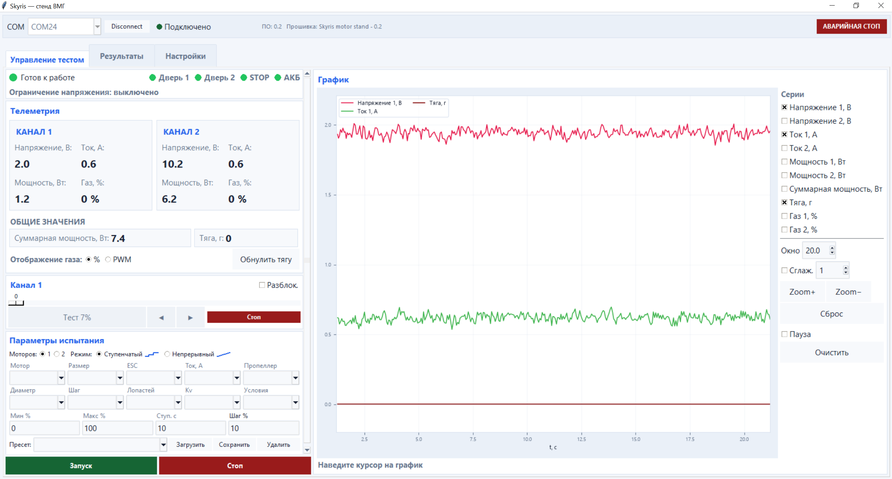
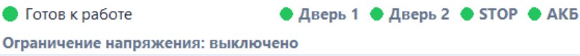
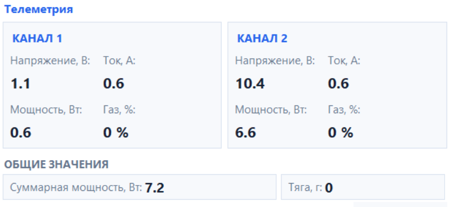
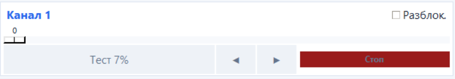
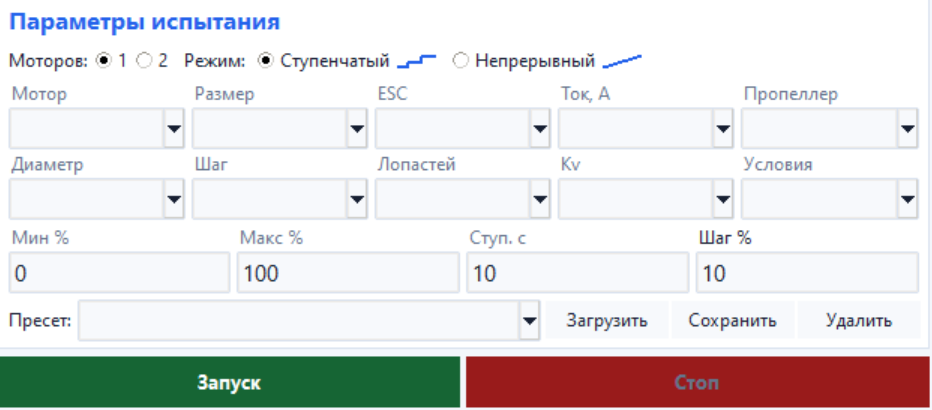
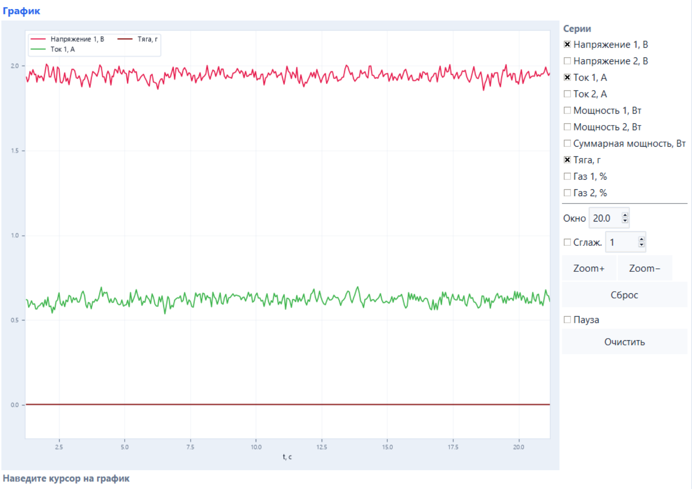

## Страница «Управление тестом»

Это основная рабочая страница программы. Здесь можно следить за состоянием стенда, просматривать телеметрию, управлять моторами вручную и запускать автоматические испытания. Основные элементы управления находятся слева, а график телеметрии — справа.

  

### Строка состояния

В верхней части страницы отображается готовность стенда к работе. Серый индикатор означает, что соединение отсутствует, зелёный — стенд готов к запуску, красный — испытание заблокировано.

Отдельные индикаторы показывают состояние обеих защитных дверей, кнопки STOP и защиты аккумулятора. Зелёный цвет означает нормальное состояние, красный — наличие блокировки. Здесь же отображается установленное ограничение по минимальному напряжению АКБ. Если защита отключена, программа сообщает об этом.

### Телеметрия

Показания разделены на два канала. Для каждого канала отображаются напряжение, ток, мощность и текущий уровень газа. Общая тяга и суммарная мощность выводятся ниже.

- напряжение, В;

- ток, А;

- мощность, Вт;

- уровень газа.

Ниже отображаются общие значения:

- суммарная мощность, Вт;

- тяга, г.

Уровень газа можно просматривать в процентах от 0 до 100 или во внутренней шкале стенда от 0 до 1000. Переключение между режимами выполняется кнопками % / PWM и не влияет на фактическую команду управления.

- `%` — диапазон 0–100 %;

- `PWM` — командная шкала стенда 0–1000.

> **Подсказка** Кнопка «Обнулить тягу» принимает текущее показание датчика за нулевое. Использовать её можно только при остановленных моторах.
  
### Ручное управление каналами

Для каждого активного канала предусмотрена отдельная панель. Перед ручным управлением канал необходимо разблокировать. Если открыта защитная дверь, нажата кнопка STOP или сработала другая защита, разблокировка будет недоступна.

Ползунок задаёт уровень газа от 0 до 100 %. Кнопка «Тест 7%» запускает мотор на небольшом газу и работает только пока её удерживают. Кнопки `◀` и `▶` задают обычное или обратное направление вращения. Изменять направление можно только после полной остановки мотора. Кнопка «Стоп» сбрасывает газ выбранного канала.

> **Подсказка** Направление разрешается изменять только при остановленном моторе.

### Параметры испытания

Программа позволяет испытывать один или два канала одновременно. В ступенчатом режиме газ увеличивается с заданным шагом и удерживается на каждом уровне указанное время. В непрерывном режиме он плавно повышается от минимального до максимального значения.

Пользователь задаёт начальный и конечный уровень газа, продолжительность испытания и шаг для ступенчатого режима. Газ можно установить в пределах от 0 до 100 %, время — до 100 000 секунд, шаг — от 1 до 100 %.

Перед запуском можно указать данные установленной винтомоторной группы: название и размер двигателя, его `Kv`, модель и допустимый ток ESC, а также название, диаметр, шаг и количество лопастей пропеллера. При необходимости можно добавить описание условий проведения испытания.

Эти сведения сохраняются вместе с результатами и затем отображаются в отчётах.
  
### Пресеты

Чтобы не вводить одинаковые настройки перед каждым испытанием, их можно сохранить в виде пресета. В него входят сведения об оборудовании, режим и параметры испытания, а также настройки защиты аккумулятора.

- **Загрузить** — применить выбранный пресет.

- **Сохранить** — создать или обновить пресет.

- **Удалить** — удалить выбранный пресет.

> **Подсказка** Старые пресеты автоматически преобразуются в актуальную структуру при загрузке.
  
### Запуск и остановка

Кнопка «Запуск» проверяет состояние защитных систем и начинает автоматическое испытание. Если открыта дверь, нажата кнопка STOP или сработала защита АКБ, запуск будет заблокирован. Причину можно определить по красным индикаторам в строке состояния.

Кнопка «Стоп» завершает активное испытание и останавливает моторы.

### График реального времени

График показывает изменение напряжения, тока, мощности, тяги и уровня газа во времени. Нужные параметры выбираются в разделе «Серии»

Поле «Окно» задаёт видимый временной интервал. Функция «Сглаж.» помогает убрать мелкие колебания и «пилу» на линиях. Размер окна сглаживания задаётся в соседнем поле. Фильтр изменяет только отображение графика и не влияет на сохранённые исходные данные.

Кнопки Zoom+ и Zoom− изменяют масштаб, а «Сброс» возвращает автоматическое отображение последних данных. «Пауза» временно останавливает обновление графика, а «Очистить» удаляет накопленные точки с экрана.

При перемещении указателя по графику появляется вертикальная линия. Под графиком отображаются время и значения выбранных параметров в ближайшей точке.
