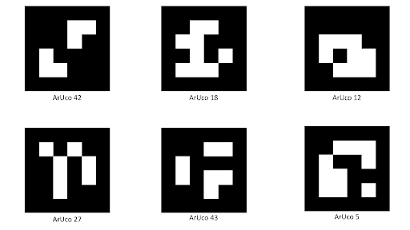

# ArUco-маркеры

[ArUco-маркеры](https://docs.opencv.org/3.2.0/d5/dae/tutorial_aruco_detection.html) — распространённый инструмент компьютерного зрения, применяемый для определения положения робототехнических систем.

> **Подсказка** Для печати маркеров лучше выбирать как можно более матовую бумагу — глянец создаёт блики и заметно ухудшает качество их обнаружения.

Быстро создать маркеры для печати можно с помощью онлайн-генератора: [http://chev.me/arucogen/](http://chev.me/arucogen/).

В [образе Technic для OPi](ImageOPI.md) заранее установлен пакет `aruco_pose`, обеспечивающий работу с ArUco-маркерами.

### Режимы работы

В Technic предусмотрено несколько готовых режимов взаимодействия с ArUco-маркерами:

- [распознавание отдельных маркеров и навигация по ним](ArucoMarker.md);
    
- [распознавание карт маркеров и навигация по ним](ArucoMap.md).

> **Подсказка** Подробную англоязычную документацию по пакету `aruco_pose` можно найти [на GitHub](https://github.com/LLC-SKYRIS/technic6S).
