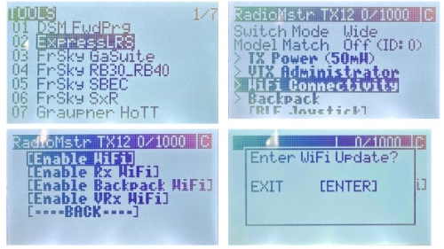

# Бинд приемника 

 

1. Далее в меню ExpressLRS ⭢ WiFi Connectivity ⭢Enable WiFi (для навигации по меню используйте кнопку “Menu”)
    
2. Далее нажмите “Enter”
      
3. После появления индикации “WiFi Running” пульт запустит точку доступа с названием “ExpressLRS TX” 
    
4. Повторите пункты 4-12 из главы с настройкой приемника. При выборе прошивки загрузите файл “Название файла”, а в поле “Binding phrase” введите ту же фразу, которую вводили при настройке приемника
