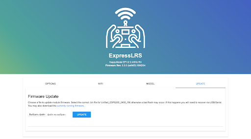
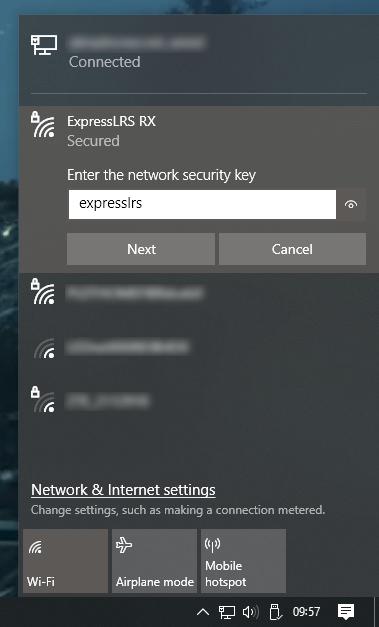
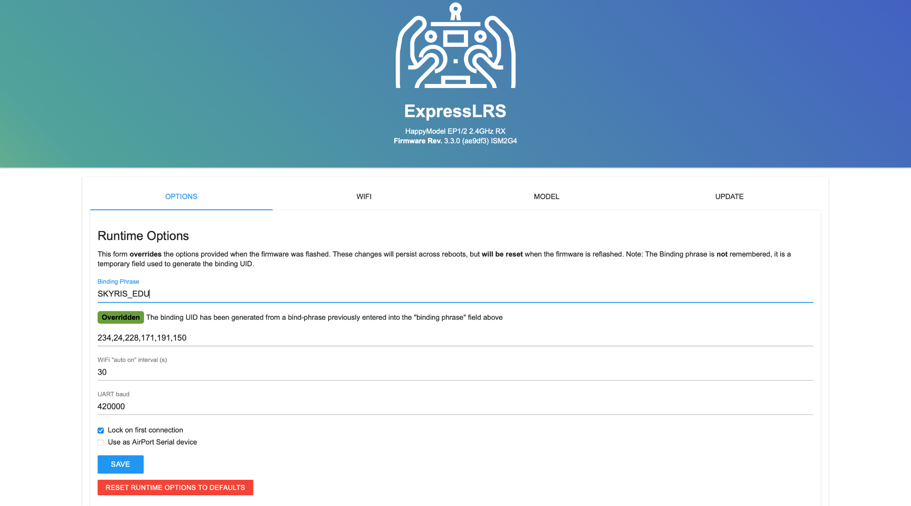

# Бинд приемника 

  

  

1. Скачайте файл с прошивкой для приемника __________
    
2. Подключите полетный контроллер к ПК по USB 
    
3. Дождитесь когда приемник перейдет в режим “WiFi” (Примерно через 1 мин после подачи питания, приемник начнет быстро мигать зеленым светодиодом)
    
4. Подключитесь к приемнику как к точке доступа WiFi:
    
	1. сеть ExpressLRS RX
    
	2. пароль: expresslrs
    
5. В окне браузера введите адрес 10.0.0.1

  

6. Перейдите на вкладку “Update”

7. Выберите скачанный ранее файл с прошивкой

8. Нажмите кнопку “Update” - приемник обновит прошивку и перезагрузится

  

9. Повторно подключитесь к приемнику по WIFI и запустите окно настроек в браузере (пункты 4 и 5)

10. Перейдите на вкладку “Options”

11. В строке “Binding phrase” введите фразу (любое сообщение: не менее 6 символов, латинские буквы, заглавные буквы, спец. знаки, цифры)

12. Нажмите кнопку “SAVE”
