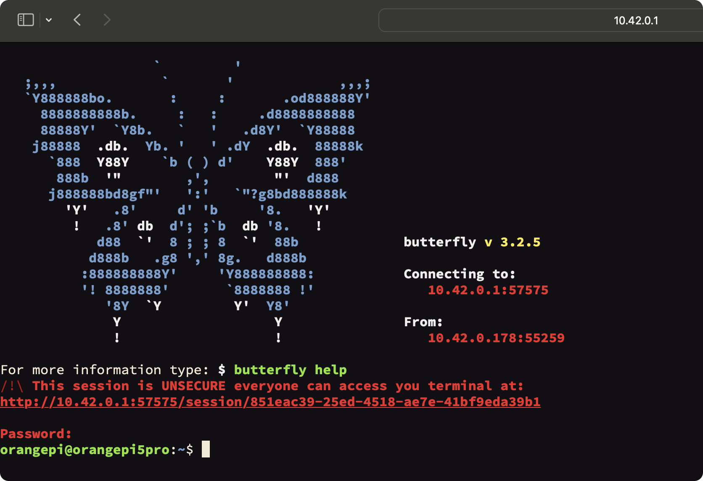

# Доступ к терминалу на OrangePi 5 Pro

 Для редактирования файлов, ввода команд и работы с файлами можно воспользоваться Butterfly Web Terminal. Он представляет собой полный аналог  [ssh-подключения](SSH.md) терминала, но при этом удобнее, так как находится среди остального функционала web terminal 

### ***Butterfly Web Terminal***

Доступ к терминалу доступен через веб-браузер (с использованием [Butterfly](https://github.com/paradoxxxzero/butterfly)). Для доступа откройте страницу http://10.42.0.1:8000/technic и выберите на ней ссылку *Open web terminal*

 Пароль: 
 ```bash 
 orangepi
 ```


