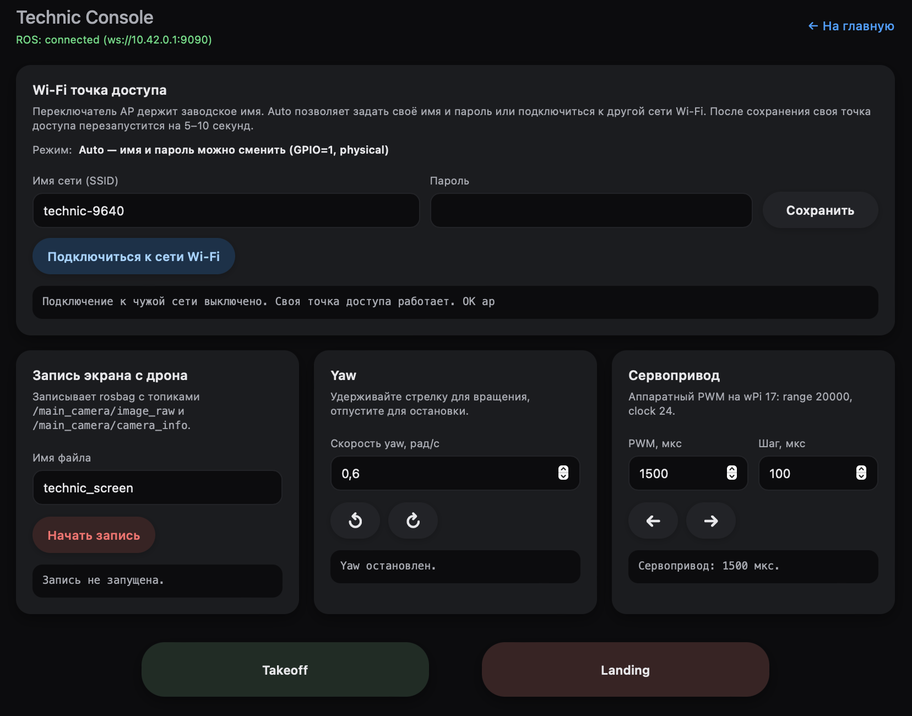

# Запись видео с камеры Technic 6S

Для записи с камеры можно воспользоваться утилитой rosbag. Rosbag - утилита окружения ROS, после записи с камеры в результате получается файл в формате .bag. Далее с помощью утилит можно конвертировать файл .bag в любой другой формат, подходящий для видео или нарезать на кадры. 

Чтобы использовать утилиту rosbag вы можете воспользоваться вкладкой "Запись экрана с дрона" на странице Console в веб-интерфейсе

<div class="img-figure">
  
</div>

Обратите внимание, что запись производится с камеры /main_camera/image_raw. Если вам необходимо получить запись со второй камеры, то вам нужно настроить это в console.html в пакете technic 

Также второй способ по записи файла .bag через терминал с помощью команды:

```bash
rosbag record /second_camera/second_camera/image_raw /second_camera/second_camera/camera_info
```

Обратите внимание, что файл .bag сохранится в той директории, где вы запускаете эту команду

После того как вы записали видео с дрона и у вас есть .bag файл вы можете его скопировать себе на ноутбук с помощью команды:

```bash 
scp orangepi@10.42.0.1:/home/orangepi/путь_до_файла /путь_на_ноутбуке_куда_сохранять
```
