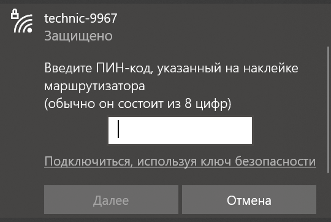
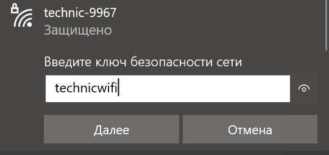

# Подключение по Wi-Fi

> **Подсказка** Перед началом убедитесь, что eMMC с обрзом вставлена в OPi

На [образе для Orangepi 5 pro](ImageOPI.md) преднастроена раздача Wi-Fi с SSID `technic-xxxx`, где xxxx – 4 случайных цифры, назначаемых при первом включении Orangepi 5 pro.

1. Подсоедините аккумулятор к Technic
2. Дождитесь загрузки OPi
3. Подключитесь к Wi-Fi, используя пароль `technicwifi`.

  

### Если вы используете операционную систему Windows:
1. Дождитесь загрузки OPi
2. Подключитесь к Wi-Fi
3. Нажмите «Подключиться, используя ключ безопасности»
4. В поле введите пароль `technicwifi`, и нажмите кнопку далее

  
  
  

Для изменения настроек Wi-Fi или получения более детальной информации о устройстве сети на Orangepi 5 pro прочитайте статью [настройка Wi-Fi](NetworkSettings.md).
