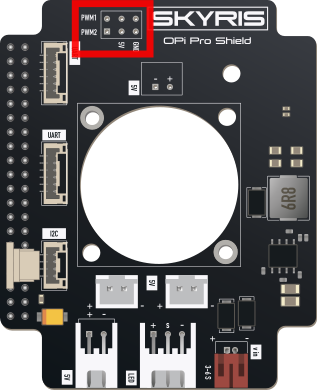

# GPIO

GPIO (General-Purpose Input/Output) – это тип пинов на OPi, напряжение на которых можно программно подавать и измерять. Также на некоторых пинах реализован аппаратный <abbr title="Широтно-импульсная модуляция">ШИМ</abbr> (<abbr title="Pulse-width modulation">PWM</abbr>). Интерфейс GPIO может быть использован для управления различной периферией: светодиодами, электромагнитами, электромоторами, сервоприводами и т. д.

> **Info** Используйте [распиновку](http://www.orangepi.org/html/hardWare/computerAndMicrocontrollers/details/Orange-Pi-5-Pro.html), чтобы понять, какие из пинов на OPi поддерживают GPIO и ШИМ.

> **Info** Для того, чтобы не создавалось конфликтов при использовании портов *GPIO* в образе закрыт доступ для портов 0, 1, 2, 3, 14, 15, на которые выведены интерфейсы подключения I2C и UART.

Для определения номера пина используйте [распиновку Orange Pi](http://www.orangepi.org/html/hardWare/computerAndMicrocontrollers/details/Orange-Pi-5-Pro.html).

#### Подключение полезной нагрузки (Сервопривод/Магнитный захват и т.д.)
Для того чтобы подключить сервопривод или другую полезную нагрузку подсоедините пины сервопривода к контактам на плате

<div class="img-figure">
	
</div>
## Управление сервоприводом через PWM
Сервопривод управляется PWM-сигналом с Orange Pi. В текущей конфигурации используется pin 17 утилиты gpio.

Перед использованием необходимо убедиться, что сервопривод подключен правильно:
- сигнальный провод серво подключен к PWM pin 17;
- питание серво подключено к внешнему источнику 5V;
- земля GND сервопривода соединена с GND Orange Pi/Technic;
- не рекомендуется питать сервопривод от 3.3V Orange Pi.

#### Управление через терминал:
Перед отправкой команд положения необходимо один раз инициализировать PWM.

```bash
sudo gpio mode 17 pwm
sudo gpio pwmr 17 20000
sudo gpio pwmc 17 24
```

Назначение команд:
- gpio mode 17 pwm переводит pin 17 в режим PWM;
- gpio pwmr 17 20000 задает диапазон PWM, соответствующий периоду;
- gpio pwmc 17 24 задает делитель частоты;
- вместе pwmr=20000 и pwmc=24 дают частоту около 40 Гц.
После инициализации можно задавать положение сервопривода:

```bash
sudo gpio pwm 17 1000
sudo gpio pwm 17 1500
sudo gpio pwm 17 2000
```

Обычно значения означают:
- 1000 - одно крайнее положение;
- 1500 - среднее положение;
- 2000 - другое крайнее положение.

Некоторые сервоприводы могут иметь другой допустимый диапазон. Если серво упирается, дрожит или сильно греется, нужно уменьшить диапазон, например использовать 1100...1900.

Пример проверки

 ```bash
sudo gpio mode 17 pwm
sudo gpio pwmr 17 20000
sudo gpio pwmc 17 24
sudo gpio pwm 17 1000
sleep 1
sudo gpio pwm 17 1500
sleep 1
sudo gpio pwm 17 2000
sleep 1
sudo gpio pwm 17 1500
 ```

Если сервопривод подключен правильно, он должен последовательно повернуться в разные положения.

Управление из Python
Для управления из Python можно вызывать те же команды через subprocess.

```bash
import subprocess
import time

PWM_PIN = 17
PWM_RANGE = 20000
PWM_CLOCK = 24

def run_gpio(*args):
subprocess.run(['gpio', *map(str, args)], check=False)
def servo_init():
run_gpio('mode', PWM_PIN, 'pwm')
run_gpio('pwmr', PWM_PIN, PWM_RANGE)
run_gpio('pwmc', PWM_PIN, PWM_CLOCK)
def servo_write(value):
run_gpio('pwm', PWM_PIN, value)
servo_init()
servo_write(1000)
time.sleep(1)
servo_write(1500)
time.sleep(1)
servo_write(2000)
time.sleep(1)
servo_write(1500) 
```

Для ROS-скрипта вместо time.sleep() можно использовать rospy.sleep().

Пример использования в ROS-скрипте

```bash
import subprocess
import rospy

PWM_PIN = 17
PWM_RANGE = 20000
PWM_CLOCK = 24

def run_gpio(*args):
subprocess.run(['gpio', *map(str, args)], check=False)
def servo_init():
run_gpio('mode', PWM_PIN, 'pwm')
run_gpio('pwmr', PWM_PIN, PWM_RANGE)
run_gpio('pwmc', PWM_PIN, PWM_CLOCK)
def servo_write(value):
run_gpio('pwm', PWM_PIN, value)
# Инициализация PWM
servo_init()
# Перевод серво в начальное положение
servo_write(1500)
# Пример движения
rospy.sleep(1)
servo_write(1000)
rospy.sleep(1)
servo_write(2000)
rospy.sleep(1)
servo_write(1500)
```

### Частые проблемы
Если появляется ошибка:

gpio: CCR should be less than or equal to ARR
значит значение в команде gpio pwm 17 ... больше текущего диапазона PWM.
Нужно заново выполнить:

```bash
sudo gpio pwmr 17 20000
sudo gpio pwmc 17 24
```

Если сервопривод пищит, но не двигается, проверьте:
- подключено ли внешнее питание 5V;
- соединена ли земля серво с землей Orange Pi;
- правильно ли выбран pin 17;
- не перепутаны ли провода питания, земли и сигнала;
- хватает ли тока источника питания.
Если сервопривод дергается или греется, используйте более узкий диапазон:

```bash
sudo gpio pwm 17 1100
sudo gpio pwm 17 1500
sudo gpio pwm 17 1900
```