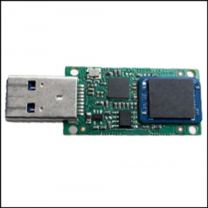
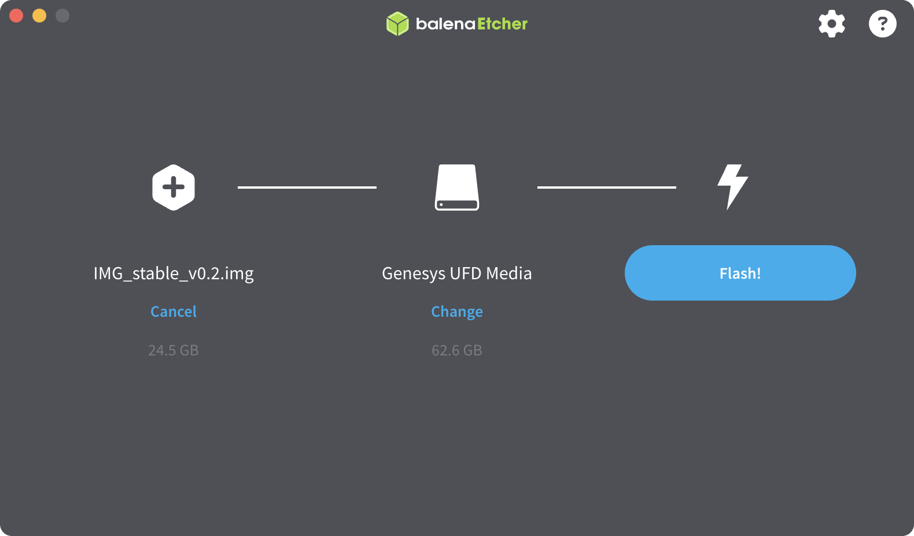

# Образ для OPi

Для полноценной работы с Technic 6S необходимо установить образ для OPi через eMMC, идущий в комплекте с квадрокоптером. 

Система Technic построена на базе операционной системы [Ubuntu](https://drive.google.com/drive/folders/11tj_ivEBwvJx4vdNtK91YQeGOKDC4JNy) и робототехнической платформы [ROS](ROS.md).  

### Как установить

1. Перейдите на страницу [релизов проекта](https://disk.yandex.ru/d/Xf_tzTiELMYQZQ) и скачайте актуальный стабильный образ.

2. Загрузите и установите приложение [Etcher](https://www.balena.io/etcher/), доступное для всех популярных операционных систем (Windows, Linux, macOS).

3. Подключите модуль eMMC к компьютеру, при необходимости используйте адаптер.

  

4. С помощью Etcher выполните запись загруженного образа на eMMC.
	- В появившемся окне нажмите "Flash from file"
	-  Выберите скачанный образ файла
	- Нажмите "Select Target" и выберите ваш eMMC
	- Нажмите "Flash!" чтобы начать запись образа на карту

5. После записи установите модуль в **OPi.

  

После того как образ будет записан на eMMC, подключите EMMC в Technic 6S

Далее можно подключаться к [Technic по Wi-Fi](ConnectingToWi-Fi.md), использовать [беспроводное подключение к QGroundControl](QGroundControlViaWi-Fi.md), получать [SSH-доступ](SSH.md) и пользоваться всеми функциями системы.  
