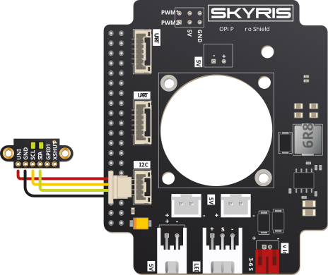
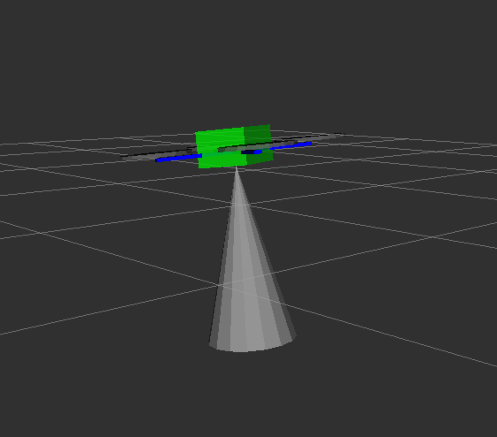

# Дальномер VL53L1X

Рекомендуемая для Technic модель дальномера – STM VL53L1X. Это дальномер может измерять расстояния от 0 до 4 м, при этом обеспечивая высокую точность измерений.

На [образе для OPi](ImageOPI.md) предустановлен соответствующий ROS-драйвер.

### Подключение к OPi

> **Подсказка** Перед включением дальномера необходимо снять с него защитную пленку.

Подключите дальномер в порт I²C платы расширения Skyris Шилд

<div class="img-figure">
  
</div>

> **Подсказка** По интерфейсу I²C возможно подключать несколько периферийных устройств одновременно. Используйте для этого параллельное подключение.

### Включение

[Подключитесь по SSH](SSH.md) и отредактируйте файл `~/technic_ws/src/technic/technic/launch/technic.launch` так, чтобы драйвер VL53L1X был включен:

```xml
<arg name="rangefinder_vl53l1x" default="true"/>
```

По умолчания драйвер дальномера передает данные в Pixhawk (через топик `/rangefinder/range`). Для просмотра данных из топика используйте команду:

```bash
rostopic echo /rangefinder/range
```

### Настройки PX4

> **Подсказка** Для корректной работы лазерного дальномера с полетным контроллером рекомендуется использование [специальной сборки PX4 для Technic](firmware.md#прошивка-для-клеверa).

Для использования данных с дальномера в [PX4 должен быть сконфигурирован](Parameters.md).

При использовании EKF2 (`SYS_MC_EST_GROUP` = `ekf2`):

* `EKF2_HGT_MODE` = `2` (Range sensor) – при полете над горизонтальным полом;
* `EKF2_RNG_AID` = `1` (Range aid enabled) – в остальных случаях.

### Получение данных из Python

Для получения данных из топика создайте подписчика:

```python
import rospy
from sensor_msgs.msg import Range

rospy.init_node('flight')

def range_callback(msg):
    # Обработка новых данных с дальномера
    print('Rangefinder distance:', msg.range)

rospy.Subscriber('rangefinder/range', Range, range_callback)

rospy.spin() # дальнейший код программы
```

Также существует возможность однократного получения данных с дальномера:

```python
from sensor_msgs.msg import Range

# ...

dist = rospy.wait_for_message('rangefinder/range', Range).range
```

### Визуализация данных

Для построения графика по данным с дальномера может быть использован rqt_multiplot.

Для визуализации данных может быть использован rviz. Для этого необходимо добавить топик типа `sensor_msgs/Range` в визуализацию:

<div class="img-figure">
  
</div>

См. [подробнее об rviz и rqt](Rviz.md).
