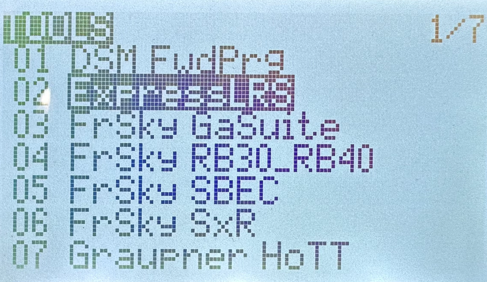
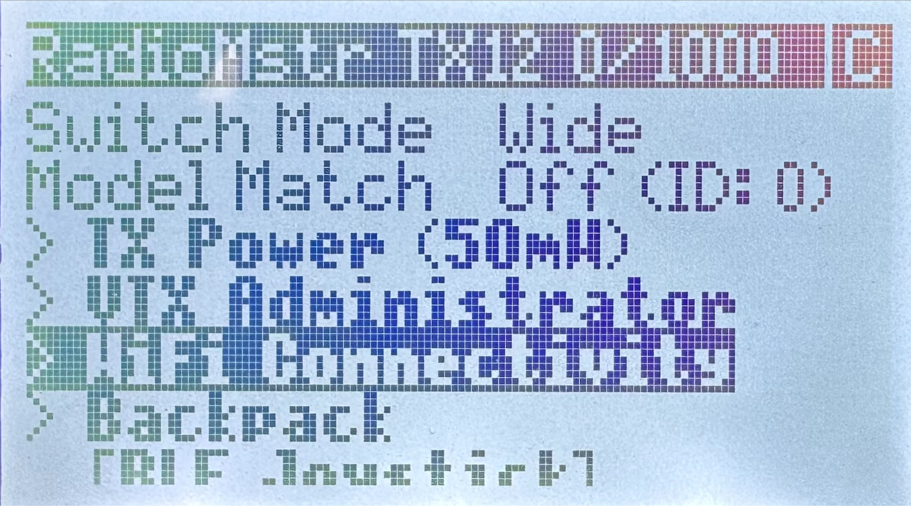
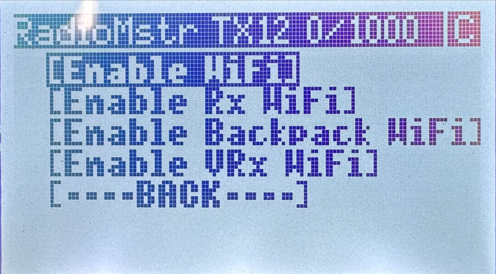
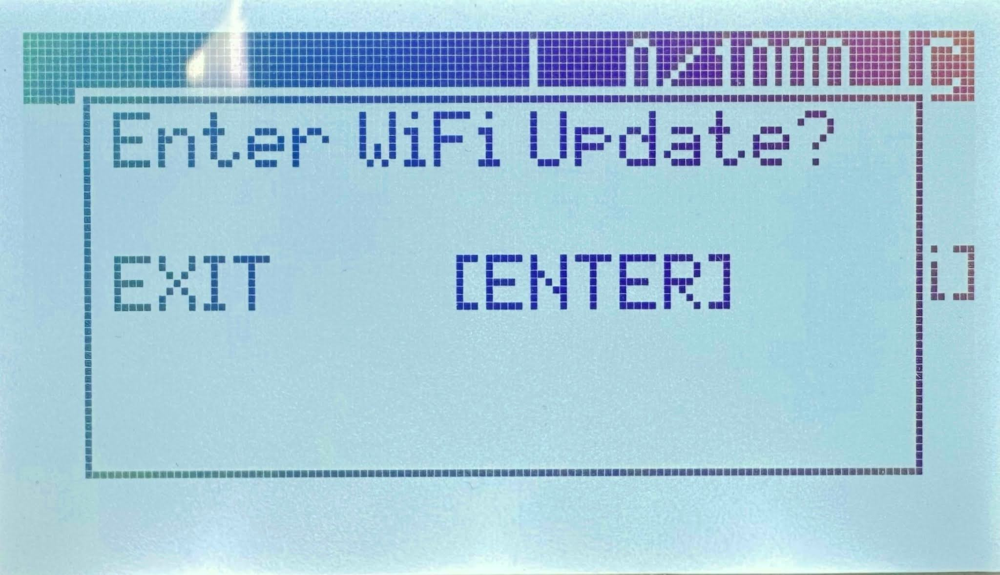
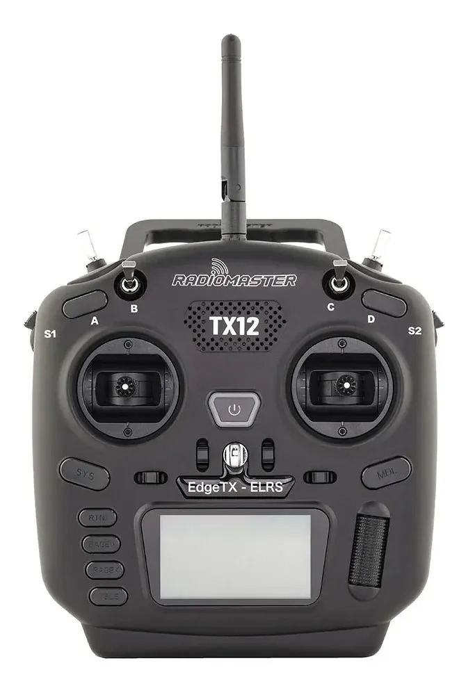
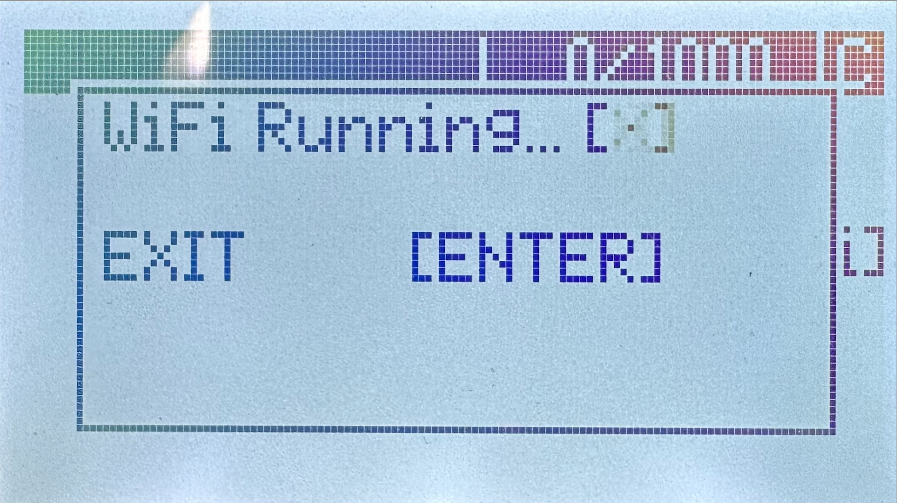
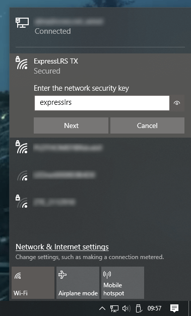

# Настройка пульта

  

    
  

  

    
  

  

    
  

  

    
  

1. Скачайте файл с прошивкой для пульта [ExpressLRS](https://drive.google.com/file/d/1V1ruk2lFeO_-U9p1VlDZJ6izxK5nqMBj/view?usp=sharing)

  

2. Включите пульт РУ зажав кнопку “Power” 
    
3. Перейдите в меню нажав кнопку “SYS” 
    
4. Далее в меню ExpressLRS ⭢ WiFi Connectivity ⭢Enable WiFi (для навигации по меню используйте кнопку “Menu”)
    
5. Далее нажмите “Enter”

  

  
 
6. После появления индикации “WiFi Running” пульт запустит точку доступа с названием “ExpressLRS TX” 
7. Подключитесь к приемнику как к точке доступа WiFi:
    
	1. сеть ExpressLRS TX
    
	2. пароль: expresslrs
    
8. В окне браузера введите адрес 10.0.0.1

9. Перейдите на вкладку “Update”

10. Выберите скачанный ранее файл с прошивкой

11. Нажмите кнопку “Update” - пульт обновит прошивку и перезагрузится

12. Повторно подключитесь к пульту по WIFI и запустите окно настроек в браузере (пункты 4-8)

13. Перейдите на вкладку “Options”

14. В строке “Binding phrase” введите фразу (любое сообщение: не менее 6 символов, латинские буквы, заглавные буквы, спец. знаки, цифры)

15. Нажмите кнопку “SAVE”