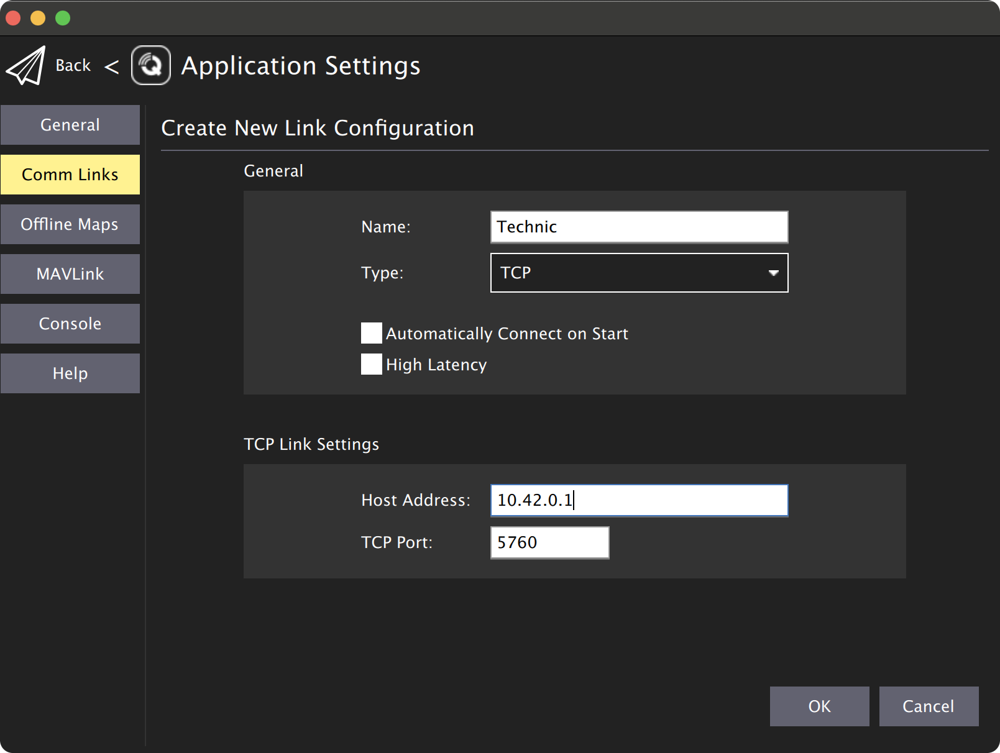

# Подключение QGroundControl по Wi-Fi

Возможны контроль, управление, калибровка и настройка полетного контроллера квадрокоптера с помощью программы QGroundControl по Wi-Fi. Для этого необходимо [подключиться к Wi-Fi](ConnectingToWi-Fi.md) сети `technic-xxxx`.

### Подключение

По умолчанию на Technic настроена возможность подключения QGroundControl по протоколу TCP.

1. На первой вкладке QGroundControl нажмите на иконку QGroundControl в верхней левой части
2. Нажмите application settings.
3. Выберите меню *Comm Links*.
4. Нажмите кнопку *Add*, чтобы добавить новое подключение.
5. Введите параметры подключения:
    * Name: *Technic*.
    * Type: *TCP*.
    * Host Address: *10.42.0.1*.
    * TCP Port: *5760*.
6. Нажмите *OK* для сохранения параметров.
7. Выберите созданное подключение и нажмите *Connect*.

<div class="img-figure">
  
</div>
### UDP

Также возможна настройка подключения по протоколу UDP. Для выбора различных вариантов подключения по UDP необходимо отредактировать параметр `gcs_bridge` в launch-файле `/home/orangepi/technic_ws/src/technic/technic/launch/technic.launch`.

После изменения launch-файла необходимо перезагрузить сервис technic:

```(bash)
sudo systemctl restart technic
```

### UDP-бридж с автоматическим подключением

1. Измените параметр `gcs_bridge` на `udp-b`.
2. При открытии программы QGroundControl соединение должно установиться автоматически.

### UDP-бридж без автоматического подключения

1. Измените параметр `gcs_bridge` на `udp`.
2. В QGroundControl создайте подключение со следующими настройками:
3. Выберите созданное подключение и нажмите *Connect*.

### ***UDP broadcast-бридж***

> **Подсказка** Особенностью UDP broadcast-бриджа является возможность просмотра телеметрии дрона одновременно с нескольких устройств (например с телефона и компьютера). Также он хорошо подходит для организации сети из устройств при помощи роутера.

1. Измените параметр `gcs_bridge` на `udp-pb`.
2. При открытии программы QGroundControl соединение должно установиться автоматически.


