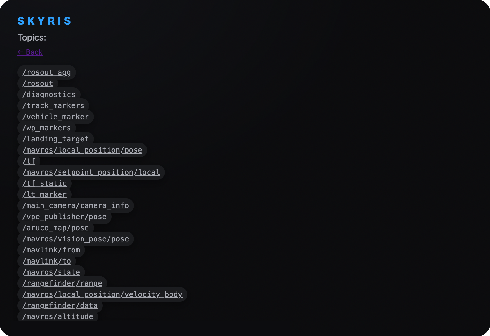
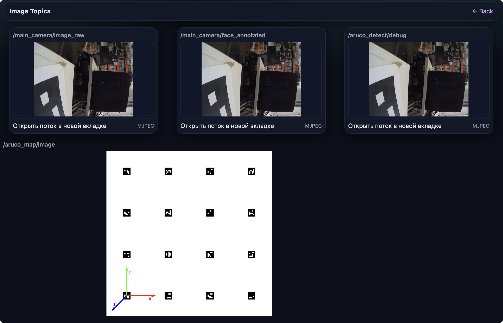

# ROS-система в Веб-интерфейсе

The Robot Operating System (ROS) — это набор программных библиотек и инструментов, помогающих создавать приложения для роботов.

> **Hint** для того чтобы увидеть список  всех ros пакетов доступных в этом приложении перейдите в браузере по пути http://10.42.0.1:8000

Пункт View Topics позволяет увидеть список всех доступных топиков

Пункт View Image Topics (web_video_server) позволяет увидеть [просмотр изображений с камер](CameraImages.md), [детекцию аруко меток](ArucoMarker.md), а также детекцию объектов используя [нейронные сети](CNN.md). 

