# Сборка

### Этап 1: Сборка базового коптера

### Шаг 1. Сборка карбоновой рамы

Используется: 
- Центральная пластина верхняя - 1шт; 
- Центральная пластина нижняя - 1шт;
- Луч - 4шт;
- Стойка алюминиевая L-35мм - 4шт;
- Винт М3х14 - 4шт;
- Винт М3х18 - 4шт.

Соедините детали, как показано на рисунке 1:

- в центральных отверстиях (отмечены красным) используются винты М3х14 - 4шт;
    
- во внешних отверстиях (отмечены синим) используются винты М3х18 - 4шт.

  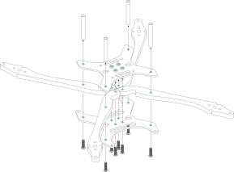

Рис. 1

> **Подсказка** Обратите внимание на расположение выреза детали “Луч”, он должен совпадать продолговатыми отверстиями на деталях ”Центральная пластина нижняя” и “Центральная пластина верхняя” как показано на рисунке 2.

  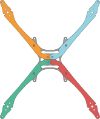

Рис. 2

> **Подсказка** Обрати внимание на расположение гаек (выделены синим на рис №) на детали “Центральная пластина нижняя». Они должны быть расположены сверху.

### Шаг 2. Установка моторов

Используется: 
- Карбоновая рама, собранная на шаге 1; 
- Мотор - 4шт; 
- Винт М3х8 - 8шт.

Установите моторы на лучи, как показано на рисунке 3:

- на данном этапе моторы крепятся на 2 винта М3х8 в боковые отверстия (полукруглые вырезы с торцевой стороны) на лучах. 

> **Подсказка** На этом шаге НЕ НУЖНО крепить моторы на 4 винта. К установке еще 2-х винтов мы вернемся на Шаге 3. Установка маунтов шасси.

  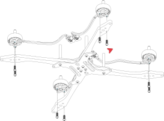

Рис. 3

> **Подсказка** Обратите внимание на расположение фазных проводов, моторов. Они должны располагаться с внутренней части (торца)  лучей слева и справа, относительно направления дрона. (указано красной стрелкой на рисунке 4).

  

Рис. 4

### Шаг 3. Установка маунтов шасси

Используется: 
- Карбоновая рама с установленными моторами, собранная на шаге 2; 
- Маунт шасси - 4шт;
- Проставка маунта шасси - 4шт;
- Винт М3х20 - 8шт.

Установите маунты шасси с помощью 8 винтов М3х20, как показано на рисунке 5.

  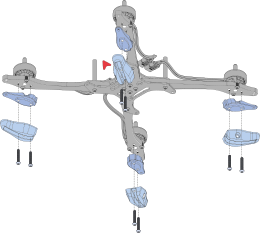

Рис. 5

Если все собрано верно, между проставкой и маунтом образуется зазор, необходимый для дальнейшей фиксации элементов защиты.

### Шаг 4. Установка полетного контроллера и Регулятора 4в1 (стека)

Иcпользуется: 
- Рама с установленными моторами и маунтами шасси, собранная на шаге 3;
- Полетный контроллер - 1шт;  
- Регулятор 4в1 - 1шт; 
- Стойка нейлоновая (мама-мама) М3х8мм - 4шт; 
- Cтойка нейлоновая (мама-папа) М3х6мм - 4шт; 
- Винт М3х5 - 4шт;
- Винт М3х8 - 4шт;
- Демпфер для полетного контроллера - 4шт; 
- Кабель ESC 4in1 to FC - 1шт.

Установите регулятор 4в1 и полетный контроллер как показано на рисунке 6: 
(металлическая пластина-радиатор должна быть расположена сверху):

- установите 4 винта М3х5 в отверстия детали “Центральная пластина верхняя” снизу-вверх и вкрутите их в 4 стойки (мама-папа) М3х6мм;
    
- установите регулятор 4в1 на стойки (мама-папа) М3х6мм. Силовой кабель должен располагаться сзади, относительно направления дрона (красная стрелка);
    
- установите 4 стойки (мама-мама) М3х8мм для фиксации регулятора 4в1;

  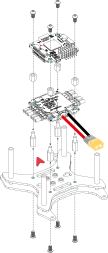

Рис. 6

- установите 4 Демпфера полетного контроллера в отверстия на полетном контроллере;

  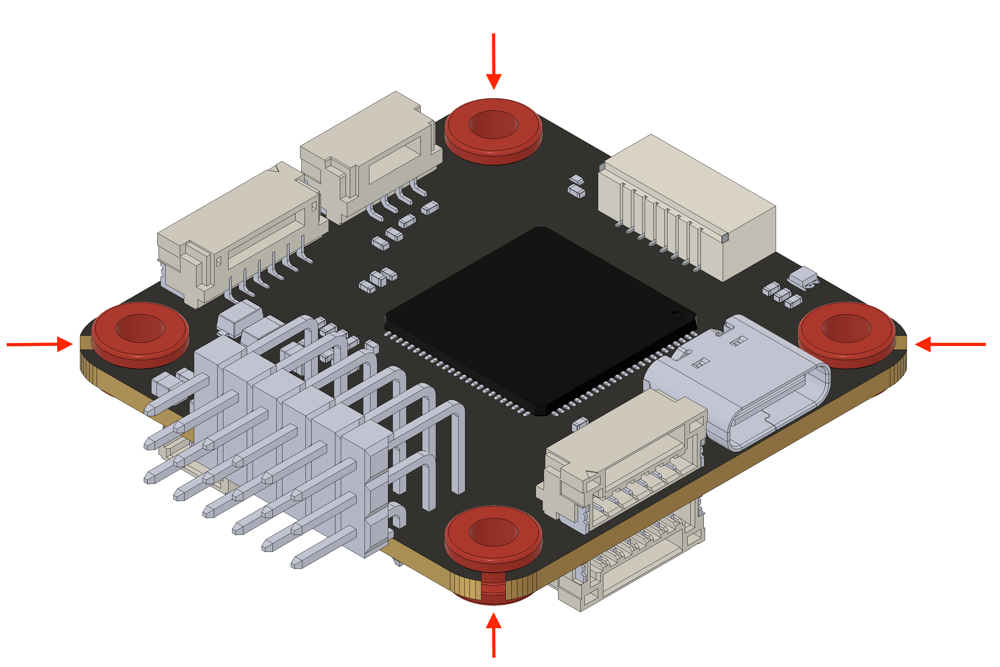

Рис. 7

- установите Полетный контроллер на стойки (мама-мама) М3х8мм (стрелка направления на полетном контроллере должны совпадать с направлением дрона);
    
- зафиксируйте полетный контроллер с помощью 4-х винтов М3х8 , вкрутив их в стойки.

  

Рис. 8

* Соедините Регулятор 4в1 с Полетным контроллером с помощью кабеля «ESC 4in1 to FC» как показано на рисунке 7 (ВАЖНО подключить кабель правильно, не перепутав полярность, для этого на кабеле есть стикер со стрелкой и маркировкой «FC», этой стороной кабель подключается в гнездо полетного контроллера).

  

Рис. 9

  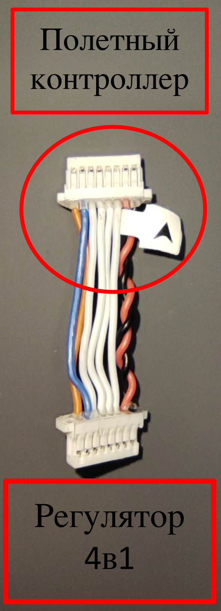

Рис. 9

* Подключите фазные провода моторов к Регулятору 4в1 (коннекторы MR-30) выделить цветом коннекторы.

  

Рис. 10

* Зафиксируйте фазные провода на лучах с помощью пластиковых хомутов ( в центре луча) как показано на рисунке.

  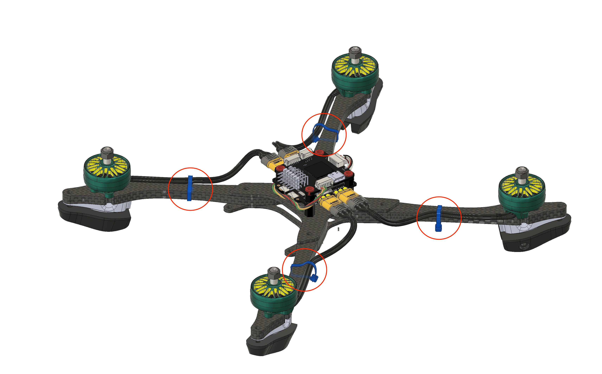

Рис. 11

### Шаг 5. Установка Приемника и Пластины АКБ

Используется: 
- Рама с установленными моторами и стеком;
- Приемник - 1 шт; 
- Пластина АКБ - 1шт;  
- Маунт XT-60 (верх) - 1шт;  
- Маунт XT-60 (низ) - 1шт; 
- Ремешок для АКБ - 1шт; 
- Силиконовая антискользящая наклейка - 1шт; 
- Клейкая лента двухсторонняя - 1шт; 
- Винт М3х5 - 4шт; 
- Винт М3х14 - 2шт.

Установите приемник на деталь “Центральная пластина верхняя” с помощью клейкой двухсторонней ленты как показано на рисунке 12.

  

Рис. 12

  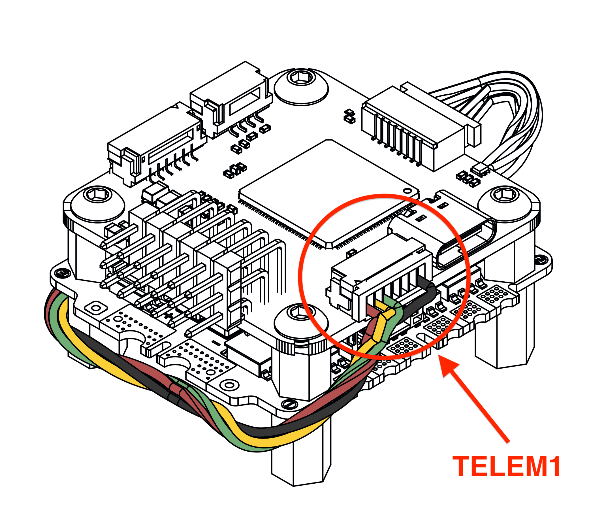

Рис. 13

Подключите приемник в гнездо “TELEM1” на полетном контроллере.

  

Рис. 14

Приклейте силиконовую антискользящую наклейку на деталь “Пластина АКБ”, как показано на рисунке 14.

  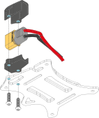

Рис. 15

Зафиксируйте коннектор XT-60 кабеля питания на детали “Пластина АКБ” с помощью Маунта XT-60 и 2 Винтов М3х14.

  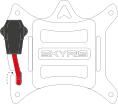

Рис. 16

Проденьте силовые провода в паз на детали “Пластина АКБ”, как показано на рисунке 16.

  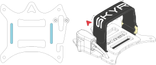

Рис. 17

Проденьте ремешок для АКБ в пазы на детали “Пластина АКБ”, как показано на рисунке 17.

  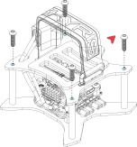

Рис. 18

Установите деталь “Пластина АКБ” на 4 алюминиевые стойки  L35мм и зафиксируйте ее с помощью 4 винтов М3х5. (Стрелка на детали “Пластина АКБ” должна совпадать со стрелкой на полетном контроллере и направлением дрона) как показано на рисунке 18.

### Шаг 6. Установка шасси

Используется: 
- Ножка (мал) - 4шт;
- Винт М3х14 - 4шт.

Установите детали Ножка (мал) 4шт в пазы как показано на рисунке 19.

  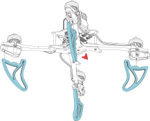

Рис. 19

Установите 4 винта М3х14 в отверстия на деталях «Маунт шасси» для фиксации ножек.

  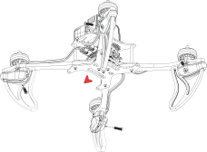

Рис. 20

Установите 4 винта М3х14 в отверстия на деталях “Маунт шасси” для фиксации ножек.

### Шаг 7. Установка защиты и пропеллеров

Используется: 
- Защита пропеллера - 4шт; 
- Перемычка (мал) - 2шт; 
- Перемычка (бол) - 2шт; 
- Комплект пропеллеров (2CW + 2ССW); 
- Гайка М5 - 4шт; 
- Винт М3х8 - 8шт (опционально).
- Винт М3х12 - 4шт (опционально).

Установите детали “Защита пропеллера” на лучи, как показано на рисунке 21.
- “Защита пропеллера” вставляется в паз с торца луча с усилием, до щелчка.

  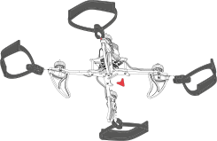

Рис. 21

Установите детали «Перемычка (мал)» и «Перемычка (бол)» как показано на рисунке 22.
- Перемычки защелкиваются на деталь «Защита пропеллера» с усилием, до характерного щелчка.

  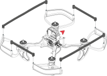

Рис. 22

Дополнительно можно зафиксировать Перемычки с помощью 8 Винтов М3х8 как показано на рисунке 23 (если требуется увеличить жесткость защиты). 

Аналогичную процедуру можно проделать с деталями “Защита пропеллера” зафиксировав их винтами М3х12.

  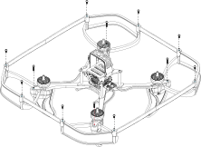

Рис. 23

 Установите пропеллеры на моторы как показано на рисунке 24:

- Передний левый и задний правый моторы вращается по часовой стрелке (CW)
    
- Передний правый и задний левый моторы вращаются против часовой стрелки (CCW)

  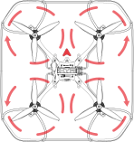

Рис. 24

Зафиксируйте пропеллеры на моторах с помощью 4 гаек М5 как показано на рисунке 25.

  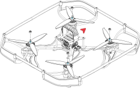

Рис. 25

