# ЭТАП 2. Установка вычислительного модуля

### ***Шаг 1. Подготовка Orange Pi***

Используется: 
Orange Pi - 1шт; 
Комплект радиаторов - 2шт; 
Стойка нейлоновая HTP-311 - 1шт;
Винт М3х5 - 1шт.

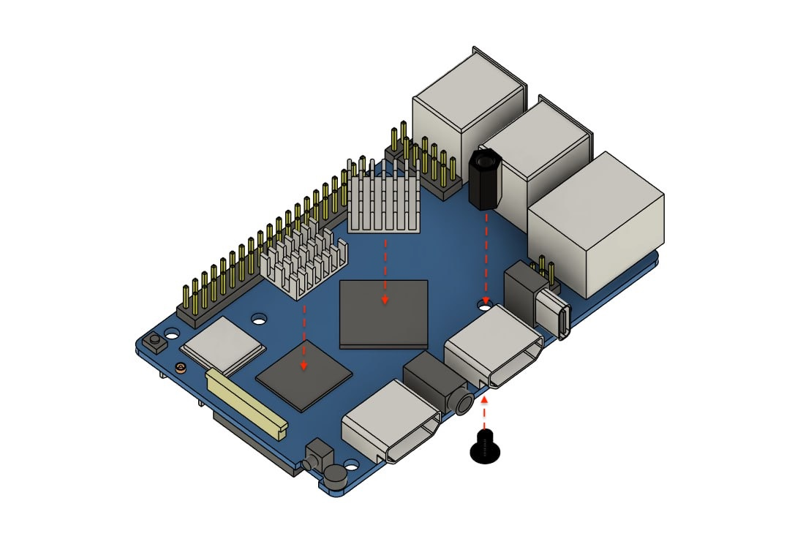
                                 Рис. 1

Установите радиаторы охлаждение и нейлоновую стойку HTP-311 на Orange Pi как показано на рисунке 1.

### ***Шаг 2. Подготовка SKYRIS шилд***

Используется: SKYRIS шилд - 1шт; 
Кулер - 1шт; 
Винт М3х10 - 2шт.

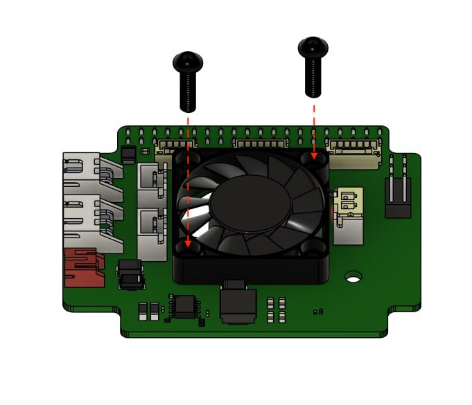
                                 Рис. 2

Установите кулер на плату «SKYRIS шилд», как показано на рисунке 2 

> **Подсказка** Обратите внимание на ориентацию кулера, надписями вниз.

Зафиксируйте кулер с помощью 2 винтов М3х10, установленных диагонально.

### ***Шаг 3. Установка SKYRIS шилд на Orange Pi***

Используется: Orange Pi - 1шт; 
SKYRIS шилд - 1шт; 
Винт М3х5 - 1шт.

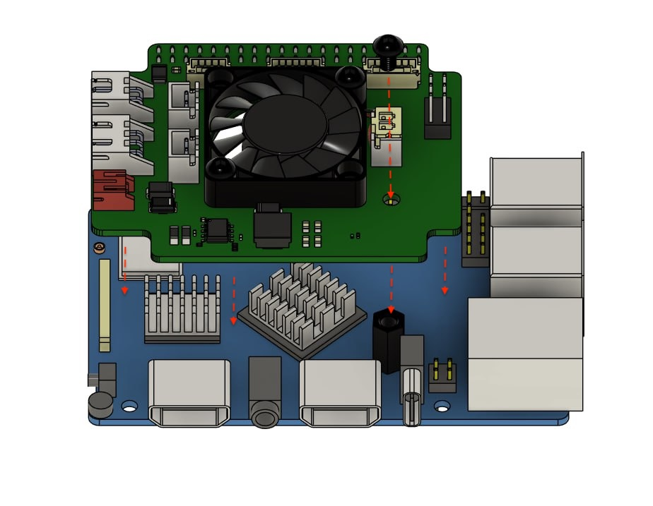
                                 Рис. 3

Установите SKYRIS шилд на одноплатный компьютер Orange Pi, как показано на рисунке 3. 

Зафиксируйте с помощью Винта М3х5.

### ***Шаг 4. Установка Маунта Orange Pi на карбоновую раму***

Используется: Маунт OrangePi - 1шт; 
Винт М3х14 - 4шт; 
Стойка нейлоновая HTP-335 - 4шт.

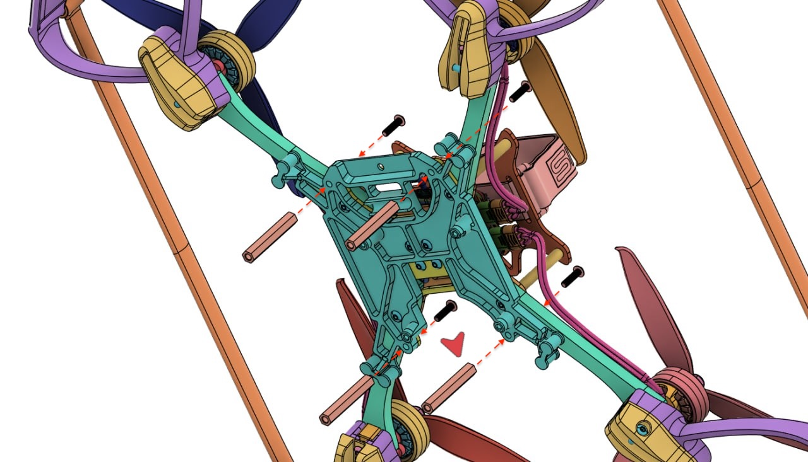
                                 Рис. 4
  
Соедините детали как показано на рисунке 4:

- совместите 4 отверстия на детали «Маунт Orange Pi» с ответными отверстиями на детали «Центральная пластина нижняя». 

> **Подсказка** Обратите внимание на расположение выреза в детали «Маунт Orange Pi» при совмещении с рамой, вырез должен располагаться с передней части дрона (направление указано красной стрелкой.

- установите 4 винта М3х14 в отверстия сверху-вниз и вкрутите их в 4 нейлоновые стойки HTP-335.

### ***Шаг 5. Установка Orange Pi***

Используется: Orange Pi - 1шт; 
Кабель UART - 1шт; 
Винт М2.5х5 - 4шт.

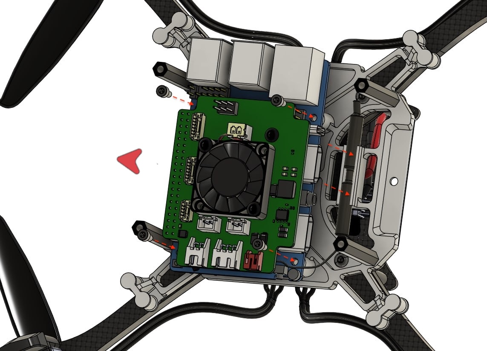
                                 Рис. 5
  
Установите Orange Pi на деталь «Маунт Orange Pi» с помощью 4 винтов М2.5х5:

- совместите монтажные отверстия на одноплатном компьютере Orange Pi cо стойками на детали «Маунт Orange Pi».

> **Подсказка** Обратите внимание на ориентацию Orange Pi. Гнезда HDMI ориентированы назад относительно направления дрона (указано красной стрелкой на рисунке 5).

- Зафиксируйте Orange Pi с помощью 4 Винтов М2.5х5.
    
- Установите WiFi антенну в держатель антенны, расположенном в задней части детали «Маунт Orange Pi». 

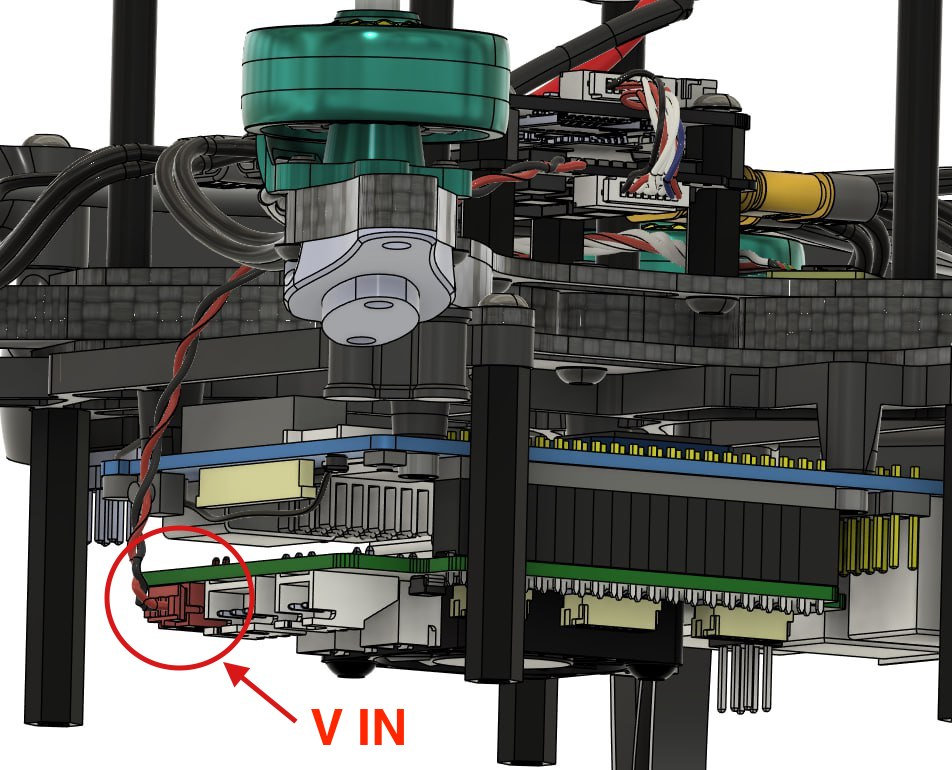
                                 Рис. 6

Подключите кабель питания (двухжильный кабель с красным коннектором PH2.0) в красное гнездо «V IN» на SKYRIS шилд, как на рисунке 6.

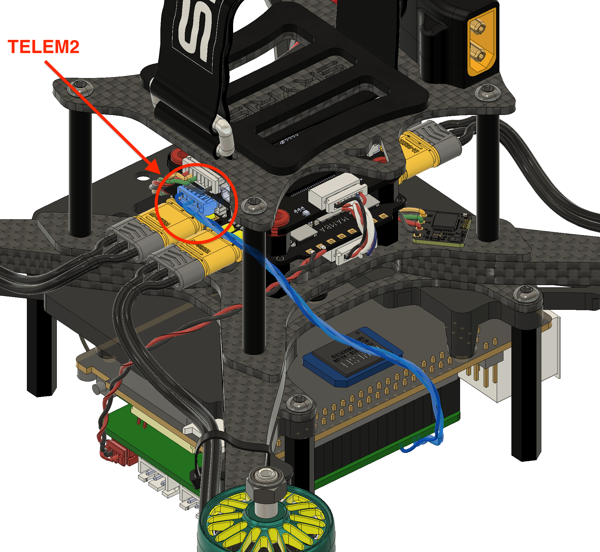
                                 Рис. 7

Подключите кабель UART в гнездо TELEM2 на полетном контроллере (иллюстрация 7) 

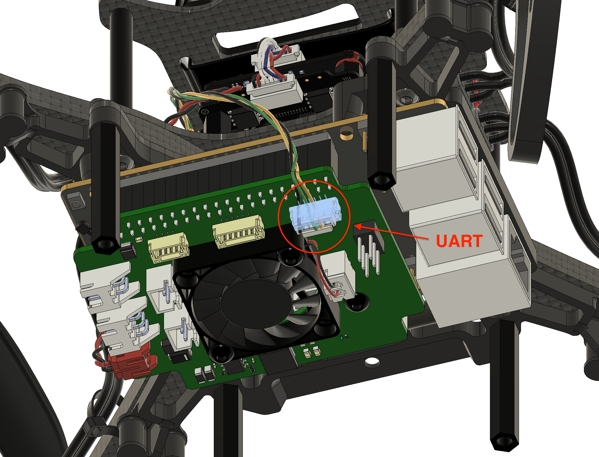
                                 Рис. 8

Подключите кабель UART во внешнее гнездо UART на плате SKYRIS шилд (иллюстрация 8).

### ***Шаг 6. Установка LED-ленты***

Используется: Маунт LED - 4шт; 
Адресная LED-лента - 1шт; 
Пластиковый хомут - 1шт.

  

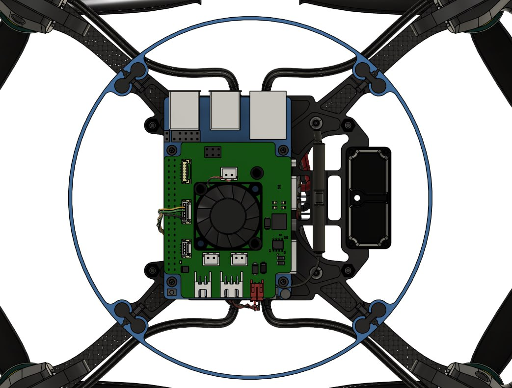
                                 Рис. 9
  

Установите 4 детали «Маунт LED» на деталь «Маунт Orange Pi», как показано на рисунке 9. 

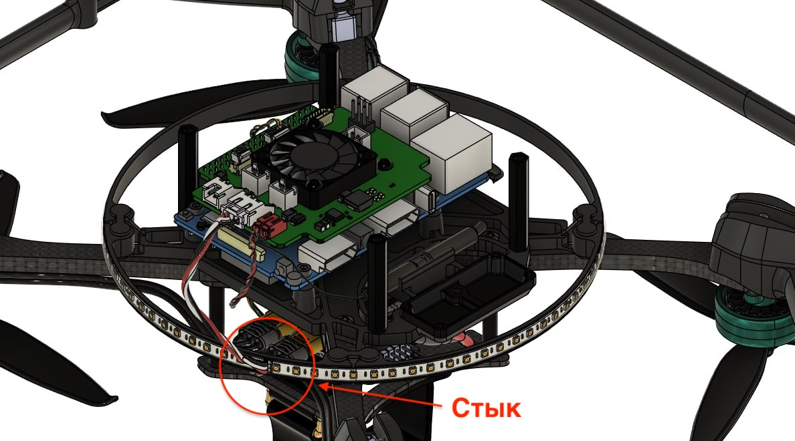
                                 Рис. 10

Установите LED-ленту на обруч, полученный в результате установки Маунтов LED.

> **Подсказка** Обратите внимание на расположение стыка концов ленты. (иллюстрация 10).

Зафиксируйте стык ленты с помощью пластикового хомута. Подключите коннектор LED-ленты в гнездо LED, которое располагается на SKYRIS шилд.  

### ***Шаг 7. Установка камеры OPi***

Используется: Маунт камеры - 1шт; 
Камера OPi - 1шт; 
Cтойка нейлоновая HTP-2.5 20мм - 4шт; 
Винт М2.5х5.

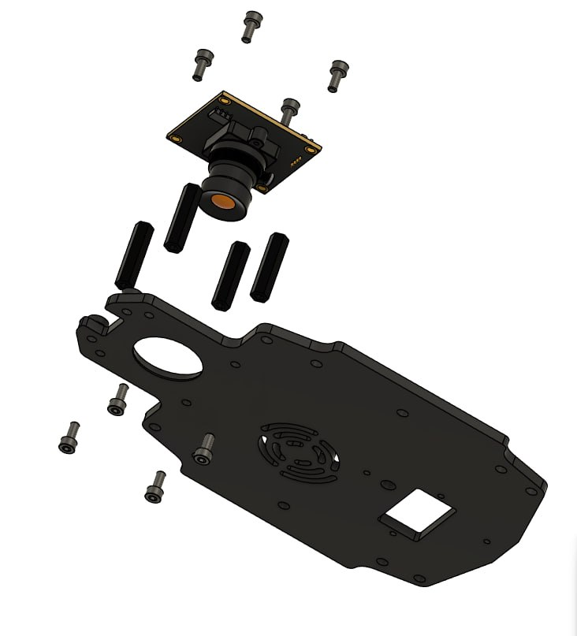
                                 Рис. 11

Установите камеру OPi, как показано на рисунке 11:

- установите 4 винта М2.5х5 в отверстия на детали «Маунт камеры» снизу-вверх, вкрутив их в нейлоновые стойки HTP-2.5 20мм.
    
- совместите монтажные отверстия на камере OPi с отверстиями на стойках и зафиксируйте камеру с помощью 4 винтов М2.5х5.

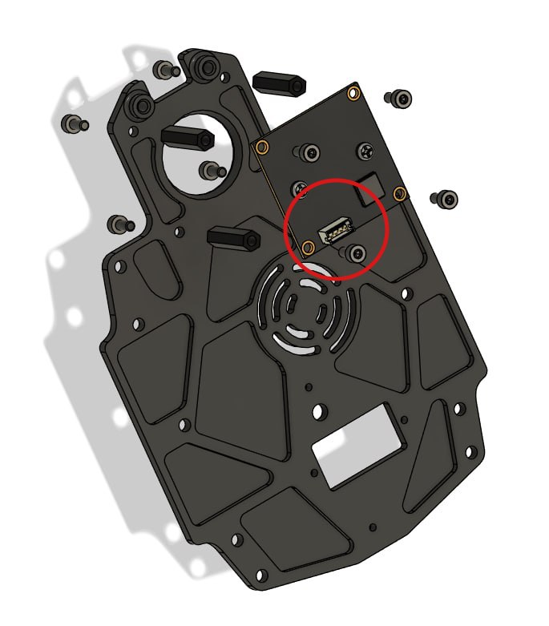
                                 Рис. 12

> **Подсказка** Обратите внимание на ориентацию камеры OPi. Гнездо подключения кабеля расположено внутрь, как на рисунке 12.
### ***Шаг 8. Установка лазерного дальномера***

Используется: Маунт камеры, с установленной камерой OPi; 
Лазерный дальномер - 1шт; 
Винт М3х5 - 2шт.

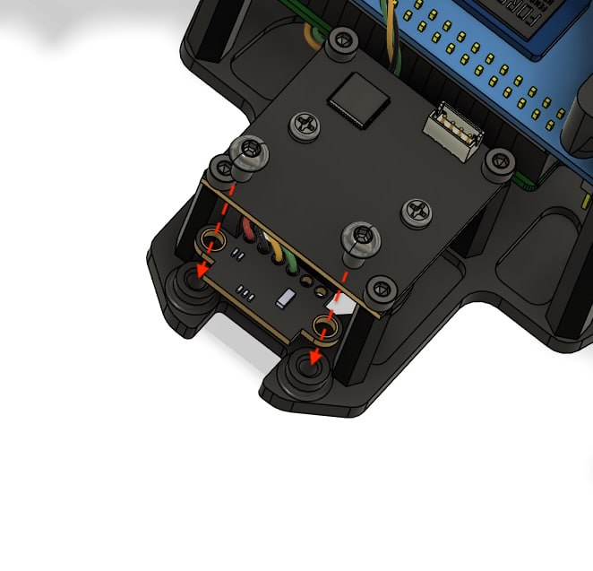
                                 Рис. 13

Установите лазерный дальномер, как показано на рисунке 13:

- совместите монтажные отверстия на лазерном дальномере с монтажными отверстиями на детали «Маунт камеры» (провода ориентированы внутрь)
    
- зафиксируйте лазерный дальномер с помощью 2 винтов М3х5.
    

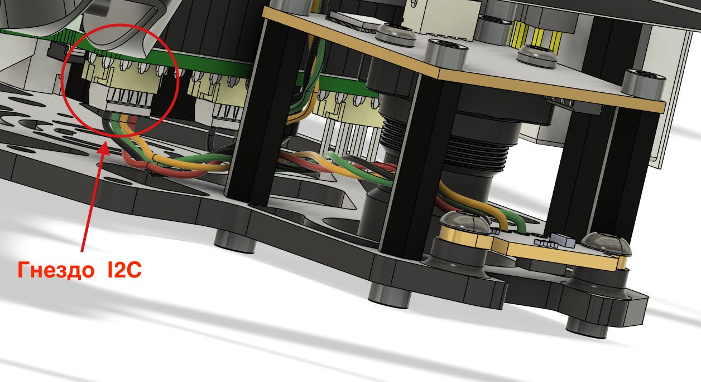
                                 Рис. 14
  
Проложите кабель лазерного дальномера между объективом камеры OPi и нейлоновыми стойками HTP-2.5 20мм, как показано на рисунке 14.

Подключите коннектор лазерного дальномера в гнездо I2C, расположенное на SKYRIS шилд.
### ***Шаг 9. Установка Маунта камеры***

Используется: 
Маунт камеры, с установленной Камерой OPi и Лазерным дальномером; 
Кабель камеры OPi - 1шт; 
Винт М3х14 - 4шт.

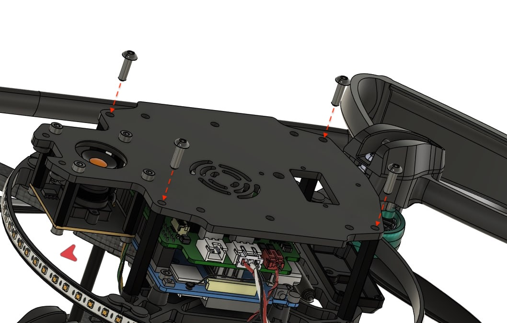
                                 Рис. 15
  

Установите Маунт камеры на дрон, как показано на рисунке 15:

- совместите 4 монтажных отверстия на Маунте камеры с отверстиями на нейлоновых стойках HTP-335.

> **Подсказка** Обратите внимание на ориентацию Маунта камеры относительно носа дрона (красная стрелка). Камера OPi находится в передней части дрона.

- зафиксируйте Маунт камеры с помощью 4 винтов М3х14.

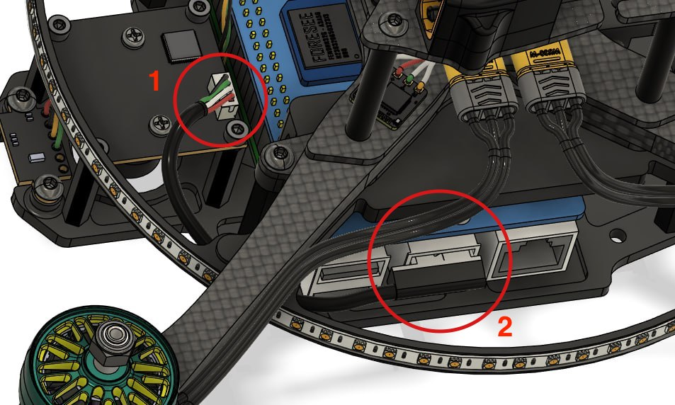
                                 Рис. 16
  

Подключите камеру OPi к одноплатному компьютеру Orange Pi, как на рисунке 16:

- Кабель камеры OPi в гнездо камеры OPi (отмечено «1»)
    
- Кабель камеры OPi в гнездо USB-A на одноплатном компьютере Orange Pi (отмечено «2»)