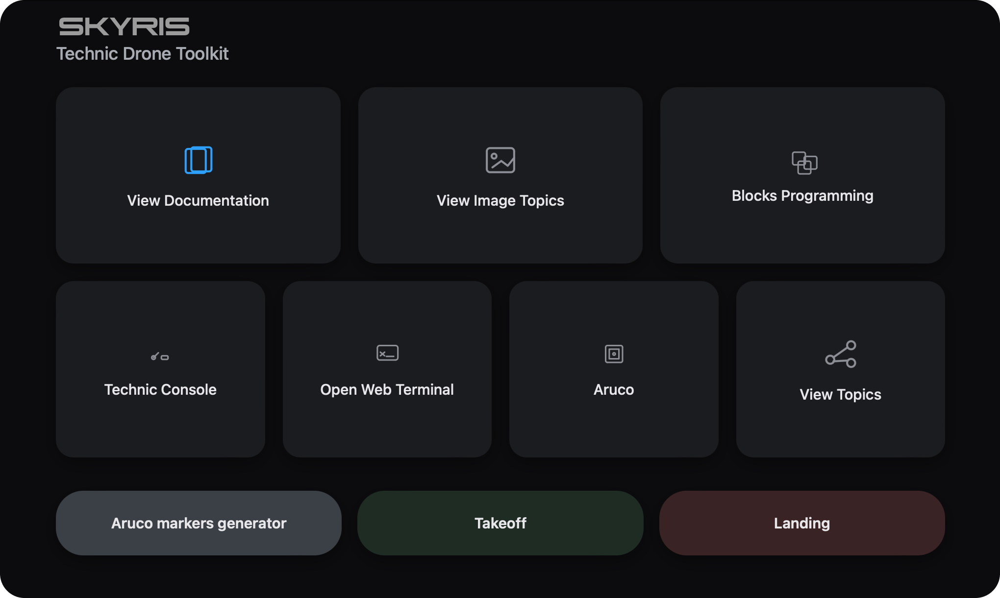

# Веб-интерфейс

Веб-интерфейс - это инструмент для визуальной работы с инструментами Technic

> **Подсказка** Веб-интерфейс открывается только после подключения по [wi-fi](ConnectingToWi-Fi.md) к сети Technic

Он будет доступен после подключения к Technic по адресу http://10.42.0.1:8000/technic. В нем собраны основные веб-инструменты Technic: просмотр топиков с изображениями, блочное программирование, веб-терминал (Butterfly) а также полная копия данной документации.

> **Подсказка** Наберите в браузере http://10.42.0.1:8000/technic чтобы открыть веб-интерфейс

  

