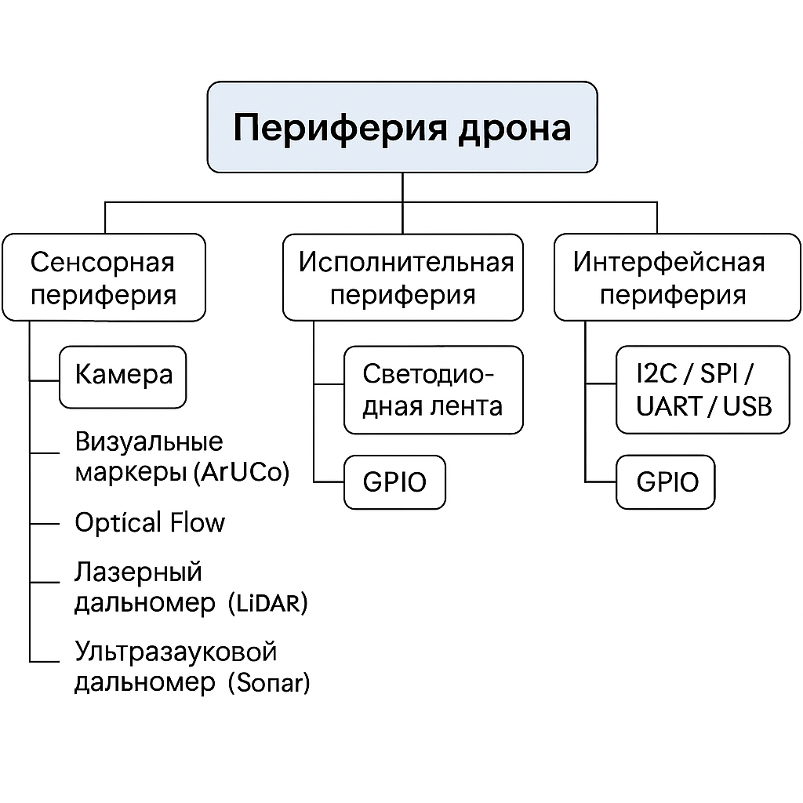

# Периферия

**Периферия** — это любые внешние устройства, подключённые к [OrangePi 5 Pro](OrangePi.md), которые:

- **собирают данные** из окружающей среды (сенсоры),
    
- **передают команды** или **выполняют действия** (актуаторы),
    
- **расширяют функциональность** компьютера.

В Technic6S в периферию включены:

  

