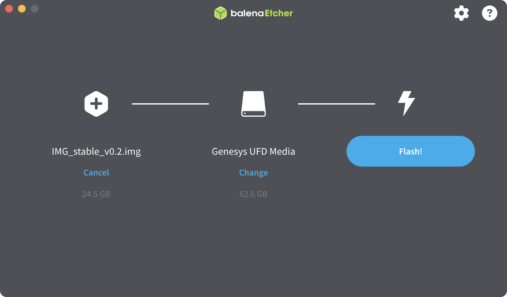

# Образ для OPi

Для полноценной работы с Technic 6S необходимо установить образ для OPi через eMMC, идущий в комплекте с квадрокоптером. 

Система Technic построена на базе операционной системы [Ubuntu](https://www.raspberrypi.org/downloads/raspbian/) и робототехнической платформы [ROS](ros.md).  

## Как установить

1. Перейдите на страницу [релизов проекта](https://github.com/CopterExpress/clover/releases) и скачайте актуальный стабильный образ.

2. Загрузите и установите приложение [Etcher](https://www.balena.io/etcher/), доступное для всех популярных операционных систем (Windows, Linux, macOS).

3. Подключите модуль eMMC к компьютеру, при необходимости используйте адаптер.

4. С помощью Etcher выполните запись загруженного образа на eMMC.
	1. В появившемся окне нажмите "Flash from file"
	2. Выберите скачанный образ файла
	3. Нажмите "Select Target" и выберите ваш eMMC
	4. Нажмите "Flash!" чтобы начать запись образа на карту

5. После записи установите модуль в **OPi.

После того как образ будет записан на eMMC, можно подключаться к [Technic по Wi-Fi](wifi.md), использовать [беспроводное подключение к QGroundControl](gcs_bridge.md), получать [SSH-доступ](ssh.md) и пользоваться всеми функциями системы.  
